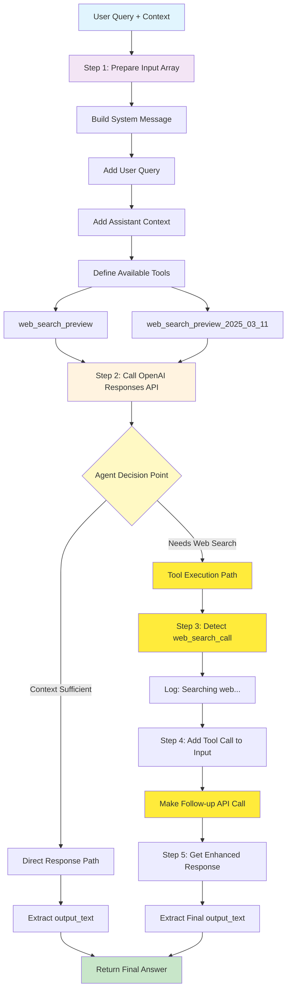
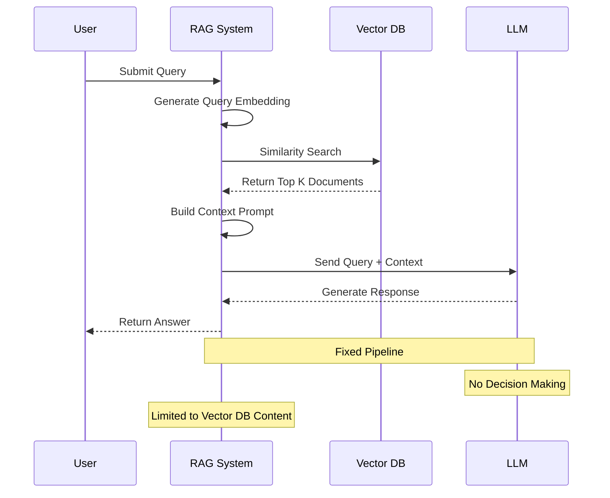
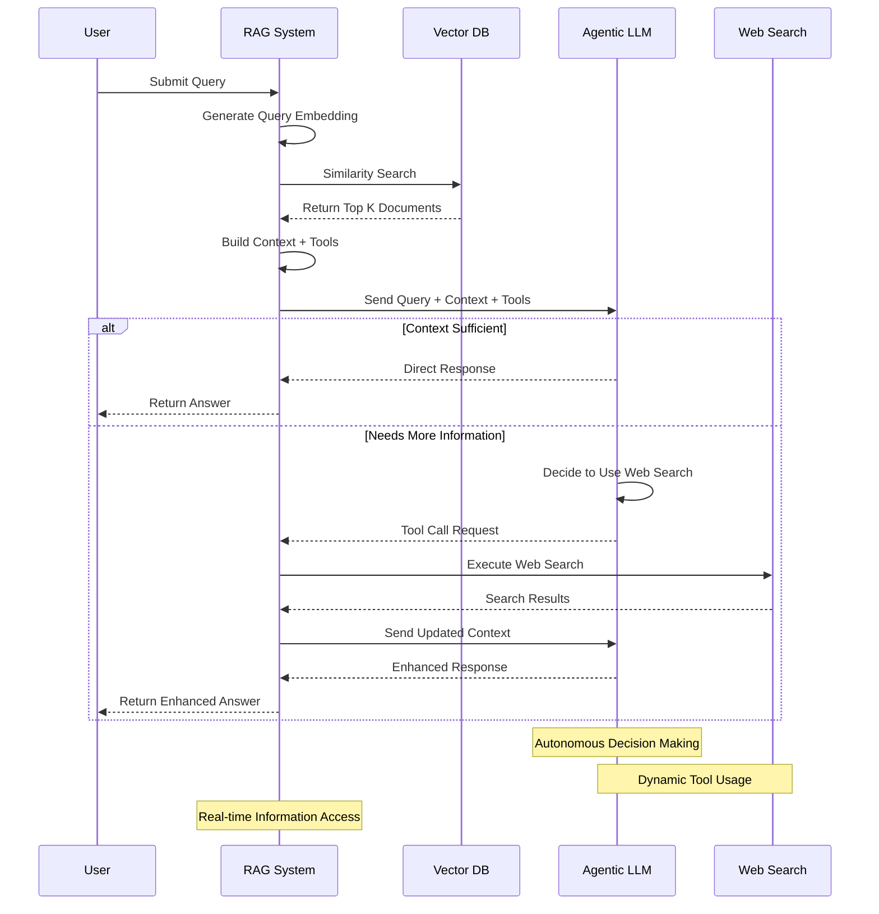
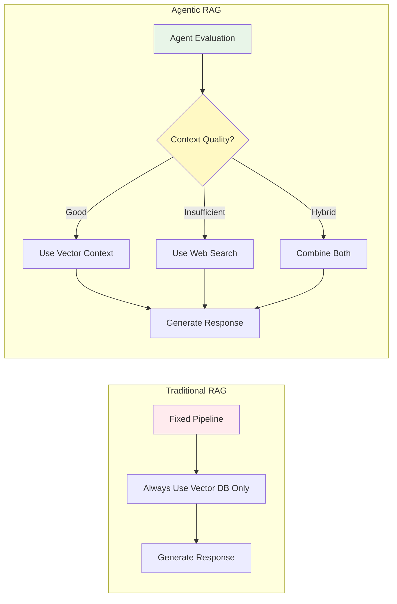
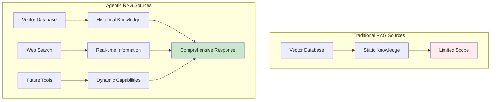
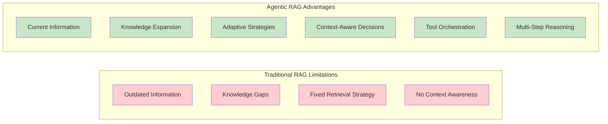
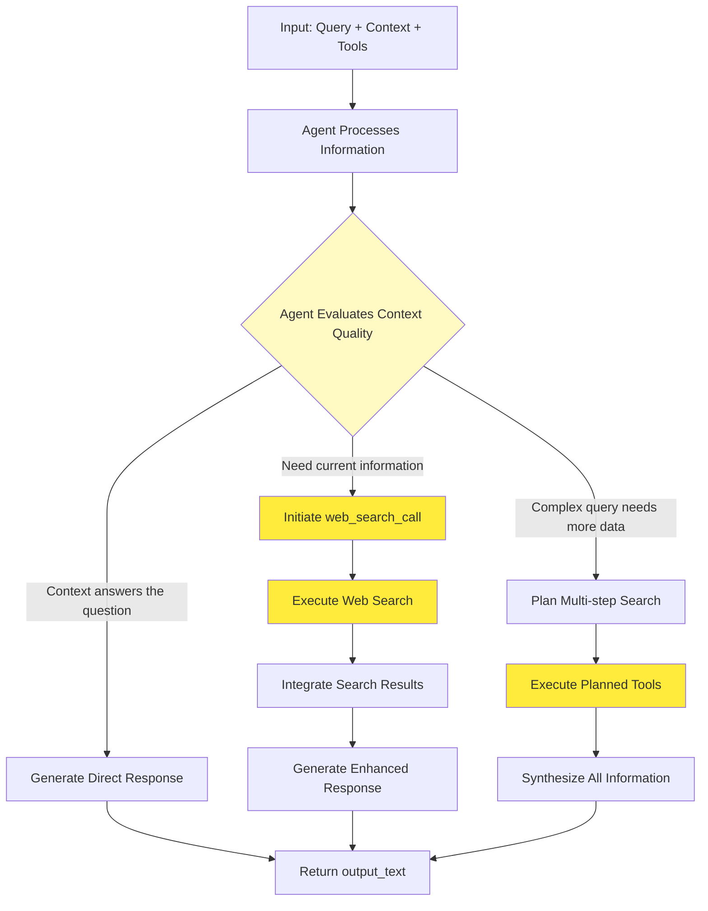

# Agentic RAG vs Traditional RAG Flow Comparison

This document compares the flow of your current agentic RAG implementation with traditional RAG approaches, highlighting the autonomous decision-making capabilities of the agentic system.

## Overall Architecture Comparison

```mermaid
graph TB
    subgraph "Traditional RAG Flow"
        A1[User Query] --> B1[Generate Embedding]
        B1 --> C1[Vector Similarity Search]
        C1 --> D1[Retrieve Top K Documents]
        D1 --> E1[Build Context Prompt]
        E1 --> F1[Send to LLM]
        F1 --> G1[Generate Response]
        G1 --> H1[Return Answer]
    end

    subgraph "Agentic RAG Flow"
        A2[User Query] --> B2[Generate Embedding]
        B2 --> C2[Vector Similarity Search]
        C2 --> D2[Retrieve Top K Documents]
        D2 --> E2[Build Context + System Prompt]
        E2 --> F2[Send to Agentic LLM with Tools]
        F2 --> G2{Agent Decision}
        G2 -->|Sufficient Context| H2[Direct Response]
        G2 -->|Needs More Info| I2[Execute Web Search]
        I2 --> J2[Integrate Search Results]
        J2 --> K2[Generate Enhanced Response]
        K2 --> L2[Return Answer]
        H2 --> L2
    end

    style A1 fill:#e3f2fd
    style A2 fill:#e3f2fd
    style G2 fill:#fff9c4
    style I2 fill:#ffeb3b
    style F1 fill:#f3e5f5
    style F2 fill:#e8f5e8
```



## Detailed Agentic Flow (Your Implementation)



## Traditional RAG vs Agentic RAG Comparison

### Traditional RAG Flow



### Agentic RAG Flow (Your Implementation)



## Key Differences Analysis

### 1. Decision Making Process



### 2. Information Sources



### 3. Response Quality Factors



## Your Agentic Implementation Features

### Tool Configuration

```typescript
// Multiple tool options for different capabilities
const tools = [
  { type: "web_search_preview" }, // Standard web search
  { type: "web_search_preview_2025_03_11" }, // Enhanced web search
];
```

### Agent Decision Flow



## Performance and Capability Comparison

| Aspect                   | Traditional RAG                  | Agentic RAG                      |
| ------------------------ | -------------------------------- | -------------------------------- |
| **Information Currency** | Static (last training/ingestion) | Real-time via web search         |
| **Decision Making**      | Rule-based retrieval             | AI-driven tool selection         |
| **Knowledge Scope**      | Limited to vector DB             | Unlimited (web + tools)          |
| **Response Quality**     | Consistent but limited           | Dynamic and comprehensive        |
| **Computational Cost**   | Lower (single API call)          | Variable (depends on tool usage) |
| **Latency**              | Predictable                      | Variable (tool execution time)   |
| **Accuracy**             | Depends on DB quality            | Self-correcting via tools        |
| **Adaptability**         | Fixed pipeline                   | Self-adapting workflow           |

## Real-World Scenarios

### Scenario 1: Travel Recommendations

```mermaid
graph TD
    A[Query: "Best restaurants in Tokyo 2025"]

    subgraph "Traditional RAG"
        A --> B1[Search Vector DB]
        B1 --> C1[Find Restaurant Info]
        C1 --> D1[Return Outdated Results]
    end

    subgraph "Agentic RAG"
        A --> B2[Evaluate Context]
        B2 --> C2{Context Current?}
        C2 -->|No| D2[Web Search for 2025 Data]
        C2 -->|Partial| E2[Combine DB + Web Search]
        D2 --> F2[Current Restaurant Info]
        E2 --> F2
        F2 --> G2[Comprehensive Recommendations]
    end

    style D1 fill:#ffcdd2
    style G2 fill:#c8e6c9
```

### Scenario 2: Technical Documentation

```mermaid
graph TD
    A[Query: "Latest OpenAI API features"]

    subgraph "Traditional RAG"
        A --> B1[Search Documentation DB]
        B1 --> C1[Return Stored Docs]
        C1 --> D1[Potentially Outdated Info]
    end

    subgraph "Agentic RAG"
        A --> B2[Agent Analysis]
        B2 --> C2{Need Latest Info?}
        C2 -->|Yes| D2[Web Search Official Docs]
        D2 --> E2[Compare with DB Knowledge]
        E2 --> F2[Synthesize Current Info]
    end

    style D1 fill:#ffcdd2
    style F2 fill:#c8e6c9
```

## Implementation Benefits

### 1. **Autonomous Intelligence**

- Agent decides when additional information is needed
- No manual rule configuration required
- Self-adapting to query complexity

### 2. **Information Freshness**

- Real-time web search capabilities
- Overcomes static knowledge limitations
- Always current information access

### 3. **Enhanced Accuracy**

- Cross-validation between sources
- Fact-checking via web search
- Context-aware decision making

### 4. **Scalable Architecture**

- Easy to add new tools
- Composable agent capabilities
- Future-proof design

Your agentic RAG implementation represents a significant evolution from traditional RAG systems, providing autonomous decision-making, real-time information access, and adaptive response generation that scales with user needs and information complexity.
