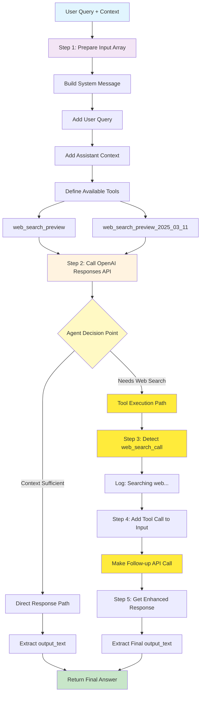
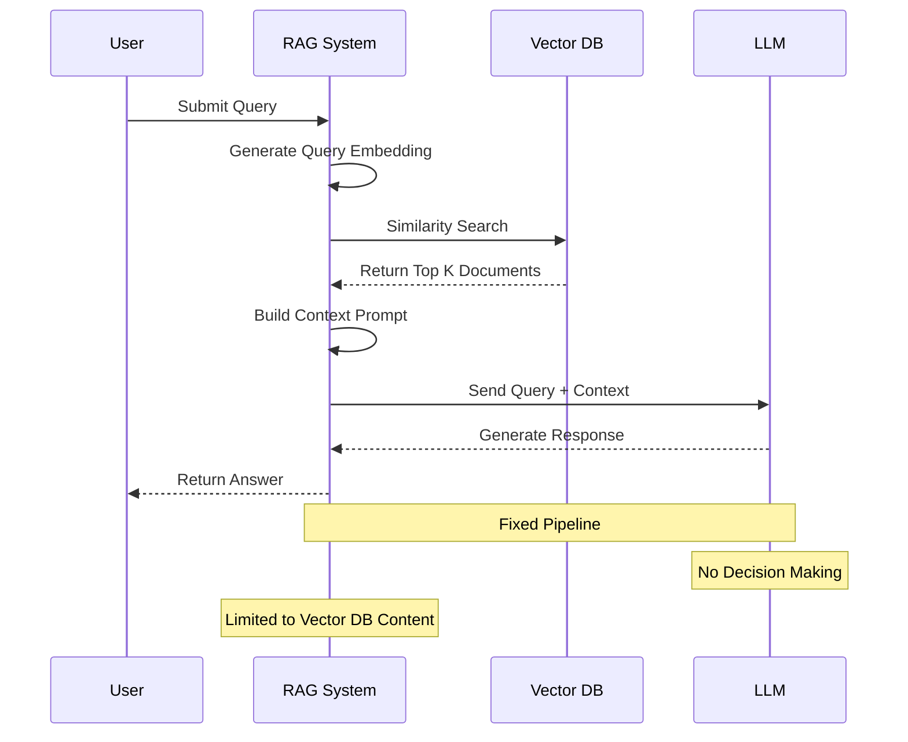
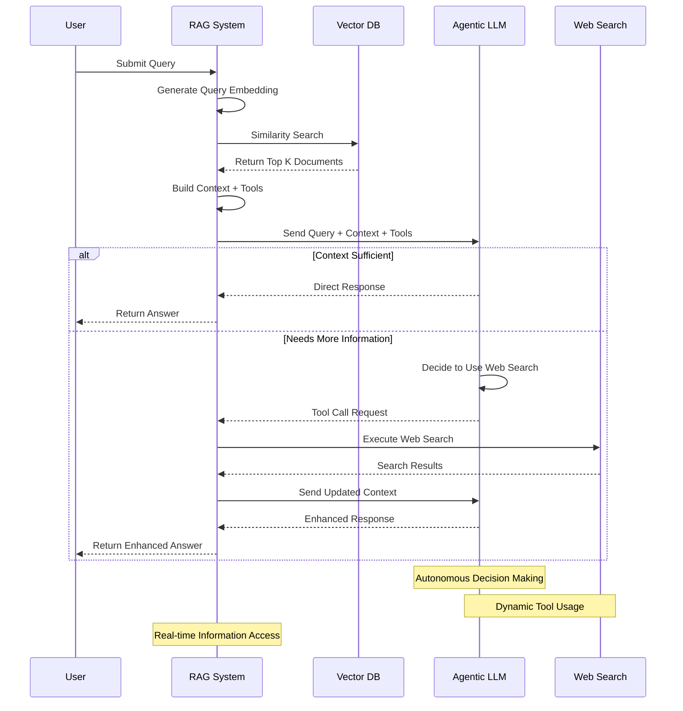
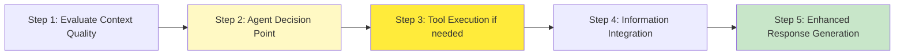
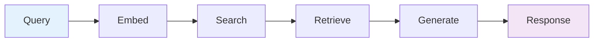
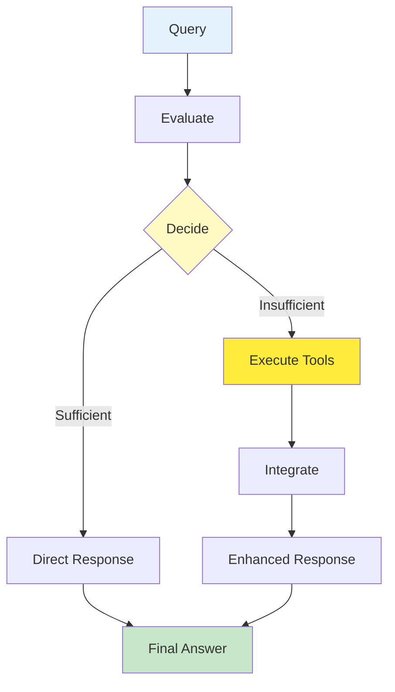
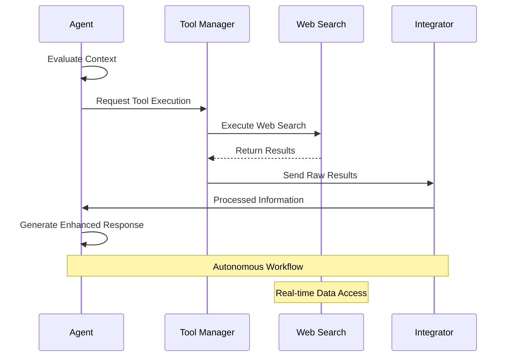

# Agentic RAG vs Traditional RAG Flow Comparison

This document compares the flow of your current agentic RAG implementation with traditional RAG approaches, highlighting the autonomous decision-making capabilities of the agentic system.

## Implementation Context and Evolution

### Previous Discussion Summary

This agentic RAG implementation evolved through several key discussions and iterations:

#### **1. Initial Architecture Refactoring**

- **Goal**: Transform a monolithic RAG system into composable, maintainable components
- **Outcome**: Modular services for query processing, ingestion, and embedding generation
- **Key Decision**: Chose composable architecture over framework dependencies like MemGPT for better control and integration

#### **2. Memory Management Strategy**

- **Question**: Whether to use MemGPT or similar frameworks for chat history and memory management
- **Recommendation**: Start with custom implementation (Phase 2) for better integration with existing Netlify/Neon/OpenAI stack
- **Future Path**: Consider MemGPT for advanced features in Phase 3 when complex memory patterns are needed

#### **3. API Choice Evolution**

- **Initial**: Standard OpenAI Chat Completions API
- **Transition**: Moved to OpenAI Agentic Response API for autonomous decision-making
- **Reason**: Enable the agent to autonomously decide when to use external tools (web search) vs. relying solely on vector database context

#### **4. Development Roadmap Planning**

- **Phase 1**: ✅ Core RAG pipeline (Complete)
- **Phase 2**: Chat history & memory management (In Progress)
- **Phase 3**: MCP tools and advanced tooling
- **Phase 7**: SaaS transformation (Final development phase)
- **Maintenance**: Ongoing after SaaS completion

#### **5. Tool Integration Approach**

```typescript
// Evolution from fixed responses to agentic tool selection
// Before: Always use vector DB context only
// After: Agent decides between vector context, web search, or hybrid approach
const tools = [
  { type: "web_search_preview" },
  { type: "web_search_preview_2025_03_11" },
];
```

### Key Implementation Decisions

1. **Custom Memory Management**: Preferred over MemGPT for Phase 2 to maintain composable architecture
2. **Agentic Response API**: Chosen over chat completions for autonomous tool selection
3. **Multi-tool Configuration**: Support for different web search capabilities
4. **Error Handling**: Comprehensive fallback strategies for production reliability
5. **TypeScript Safety**: Strong typing throughout the agentic workflow

### Technical Evolution Journey

#### **From Chat Completions to Agentic Response API**

**Previous Implementation (Chat Completions):**

```typescript
// Fixed pipeline approach
const messages = [
  { role: "system", content: systemPrompt },
  { role: "user", content: query },
];

const response = await openai.chat.completions.create({
  model: "gpt-4o",
  messages: messages,
  tools: [
    /* predefined tools */
  ],
});
```

**Current Implementation (Agentic Response API):**

```typescript
// Agent-driven approach
const input = [
  { role: "system", content: systemPrompt },
  { role: "user", content: query },
  { role: "assistant", content: contextText },
];

const response = await openai.responses.create({
  model: "gpt-4.1",
  input,
  tools: [
    { type: "web_search_preview" },
    { type: "web_search_preview_2025_03_11" },
  ],
});

// Agent autonomously decides tool usage
if (response.output?.[0]?.type === "web_search_call") {
  // Agent chose to search - execute tool and continue
  input.push(toolCall);
  const followUpResponse = await openai.responses.create({
    model: "gpt-4.1",
    input,
    tools,
  });
}
```

#### **Input Format Discovery**

- **Challenge**: Understanding how to construct input arrays for the responses API
- **Solution**: Discovered that input can be either string format or array of message objects
- **Implementation**: Chose array format for better structure and tool integration

#### **Error Handling Evolution**

```typescript
// Comprehensive error handling for production use
try {
  const response = await openai.responses.create(/* ... */);

  // Handle different output types
  switch (output.type) {
    case "message": /* extract text content */
    case "reasoning": /* handle chain-of-thought */
    case "web_search_call": /* tool execution */
    default: /* graceful fallbacks */
  }
} catch (error) {
  console.error("Error with responses API:", error);
  return "I apologize, but I'm having trouble processing your request right now.";
}
```

### Architecture Benefits Realized

1. **Autonomous Decision Making**: Agent chooses when to use tools without manual rules
2. **Real-time Information Access**: Web search integration for current data
3. **Composable Design**: Easy to add new tools and capabilities
4. **Production Ready**: Comprehensive error handling and fallbacks
5. **Future Proof**: Foundation for SaaS transformation in Phase 7

## Overall Architecture Comparison

```mermaid
graph TB
    subgraph "Traditional RAG Flow"
        A1[User Query] --> B1[Generate Embedding]
        B1 --> C1[Vector Similarity Search]
        C1 --> D1[Retrieve Top K Documents]
        D1 --> E1[Build Context Prompt]
        E1 --> F1[Send to LLM]
        F1 --> G1[Generate Response]
        G1 --> H1[Return Answer]
    end

    subgraph "Agentic RAG Flow"
        A2[User Query] --> B2[Generate Embedding]
        B2 --> C2[Vector Similarity Search]
        C2 --> D2[Retrieve Top K Documents]
        D2 --> E2[Build Context + System Prompt]
        E2 --> F2[Send to Agentic LLM with Tools]
        F2 --> G2{Agent Decision}
        G2 -->|Sufficient Context| H2[Direct Response]
        G2 -->|Needs More Info| I2[Execute Web Search]
        I2 --> J2[Integrate Search Results]
        J2 --> K2[Generate Enhanced Response]
        K2 --> L2[Return Answer]
        H2 --> L2
    end

    style A1 fill:#e3f2fd
    style A2 fill:#e3f2fd
    style G2 fill:#fff9c4
    style I2 fill:#ffeb3b
    style F1 fill:#f3e5f5
    style F2 fill:#e8f5e8
```



## Detailed Agentic Flow (Your Implementation)



## Traditional RAG vs Agentic RAG Comparison

### Traditional RAG Flow



### Agentic RAG Flow (Your Implementation)



## Key Differences Highlighted

### **1. Decision-Making Architecture**

- **Traditional RAG**: Fixed pipeline → Always uses vector DB only
- **Agentic RAG**: Autonomous evaluation → Agent decides when to use additional tools

### **2. Information Sources**

- **Traditional RAG**: Limited to static vector database content
- **Agentic RAG**: Dynamic access to vector DB + real-time web search + future tools

### **3. Response Quality**

- **Traditional RAG**: Consistent but potentially outdated
- **Agentic RAG**: Self-correcting, current, and comprehensive

## Your Implementation's Agentic Features

### **Autonomous Tool Selection**

```typescript
// Agent autonomously decides between:
// 1. Direct response (sufficient context)
// 2. Web search (needs current info)
// 3. Multi-tool orchestration (complex queries)

const tools = [
  { type: "web_search_preview" }, // Standard web search
  { type: "web_search_preview_2025_03_11" }, // Enhanced web search
];
```

### **Multi-Step Processing**



### **Real-World Advantages**

- **Travel queries**: Gets current restaurant/hotel data
- **Technical docs**: Accesses latest API features
- **News/events**: Provides up-to-date information
- **Complex research**: Combines multiple information sources

## Performance Comparison

| Factor           | Traditional RAG     | Your Agentic RAG          |
| ---------------- | ------------------- | ------------------------- |
| **Accuracy**     | Limited by DB       | Self-correcting           |
| **Currency**     | Static              | Real-time                 |
| **Scope**        | Fixed               | Unlimited                 |
| **Intelligence** | Rule-based          | AI-driven                 |
| **Latency**      | Predictable         | Variable (tool-dependent) |
| **Cost**         | Lower (single call) | Variable (tool usage)     |
| **Reliability**  | Consistent          | Adaptive                  |
| **Maintenance**  | Manual updates      | Self-updating             |

## Flow Patterns

### **Traditional**: Linear Pipeline



### **Agentic**: Adaptive Workflow



### **Agent Decision Matrix**

| Context Quality | Information Currency | Agent Decision      |
| --------------- | -------------------- | ------------------- |
| High            | Current              | Direct Response     |
| High            | Outdated             | Hybrid (DB + Web)   |
| Low             | Current              | Web Search          |
| Low             | Outdated             | Multi-tool Research |

### **Tool Execution Flow**



## Implementation Evolution Benefits

### **From Static to Dynamic**

- **Before**: Fixed retrieval patterns
- **After**: Intelligent, context-aware decisions

### **From Limited to Unlimited**

- **Before**: Constrained by vector database content
- **After**: Access to global information via tools

### **From Manual to Autonomous**

- **Before**: Rule-based logic requiring manual configuration
- **After**: Self-adapting agent behavior

### **From Single-source to Multi-source**

- **Before**: One information source (vector DB)
- **After**: Multiple sources orchestrated intelligently

Your agentic RAG implementation represents a significant evolution from traditional RAG systems, providing autonomous decision-making, real-time information access, and adaptive response generation that scales with user needs and information complexity.
