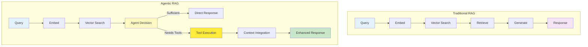
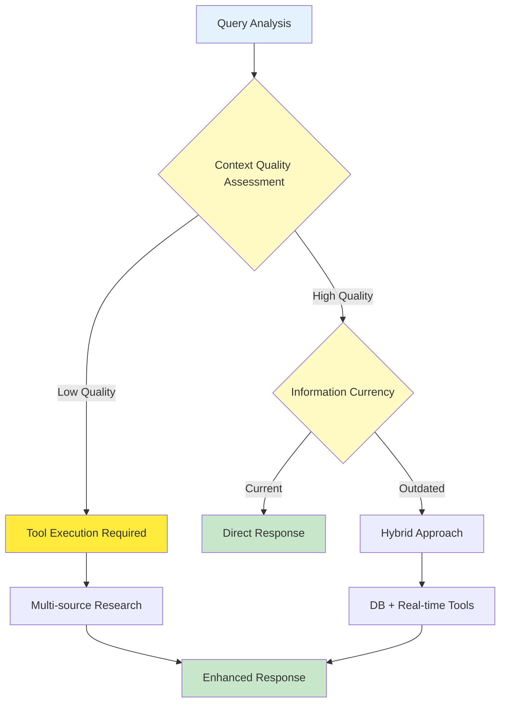

# Agentic RAG vs Traditional RAG Architecture

This document compares agentic RAG architecture with traditional RAG approaches, highlighting the autonomous decision-making capabilities and architectural differences.

## Architecture Overview

### **Traditional RAG Architecture**

- **Fixed Pipeline**: Linear flow from query to response
- **Single Information Source**: Vector database only
- **Rule-based Processing**: Predefined retrieval patterns
- **Static Context**: Limited to pre-indexed content

### **Agentic RAG Architecture**

- **Adaptive Workflow**: Dynamic decision-making at each step
- **Multi-source Integration**: Vector database + external tools + real-time data
- **AI-driven Processing**: Autonomous tool selection and orchestration
- **Dynamic Context**: Self-expanding information sources

## Architectural Flow Comparison

## Key Architectural Differences

### **Decision-Making Layer**

- **Traditional**: Fixed pipeline with no adaptation
- **Agentic**: Dynamic evaluation and tool selection at runtime

### **Information Architecture**

- **Traditional**: Single-source (vector database)
- **Agentic**: Multi-source orchestration (vector DB + external tools + real-time data)

### **Processing Model**

- **Traditional**: Linear, predictable flow
- **Agentic**: Branching, adaptive workflow with feedback loops

### **Context Management**

- **Traditional**: Static context from pre-indexed documents
- **Agentic**: Dynamic context expansion through autonomous tool usage

## Agentic Agent Decision Matrix

## Architecture Benefits Comparison

| Aspect                  | Traditional RAG     | Agentic RAG              |
| ----------------------- | ------------------- | ------------------------ |
| **Adaptability**        | Fixed pipeline      | Self-adapting workflow   |
| **Information Scope**   | Static database     | Dynamic multi-source     |
| **Decision Making**     | Rule-based          | AI-driven autonomous     |
| **Context Expansion**   | Limited             | Unlimited through tools  |
| **Response Quality**    | Consistent          | Self-improving           |
| **Real-time Data**      | Not available       | Integrated               |
| **Complexity Handling** | Linear processing   | Multi-step orchestration |
| **Error Recovery**      | Manual intervention | Self-correcting          |

## Architectural Evolution

### **From Static to Dynamic**

Traditional RAG systems follow predetermined paths, while agentic systems evaluate and adapt their approach based on query complexity and context quality.

### **From Single-source to Multi-source**

Agentic architecture orchestrates multiple information sources through intelligent tool selection, expanding beyond static vector databases.

### **From Linear to Branching**

The introduction of decision points and feedback loops enables sophisticated information gathering and response generation strategies.

### **From Manual to Autonomous**

Agentic systems reduce human intervention by making intelligent decisions about information needs and tool usage autonomously.
