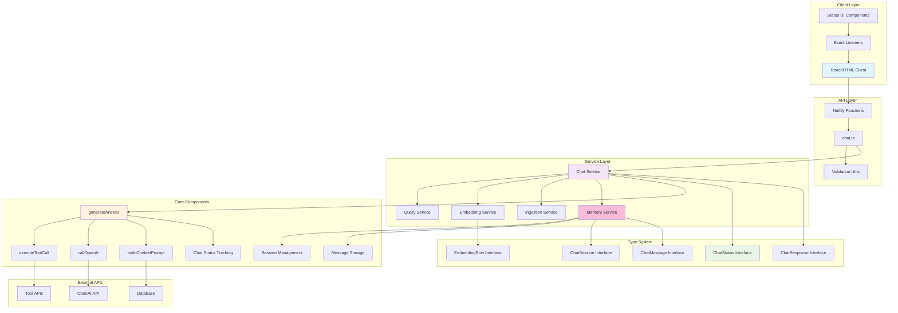
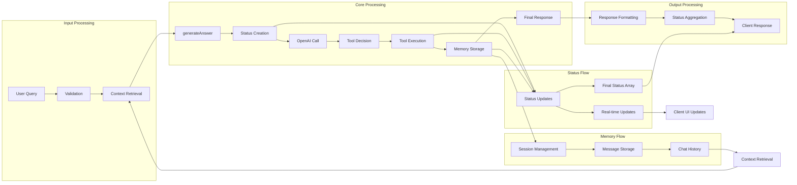
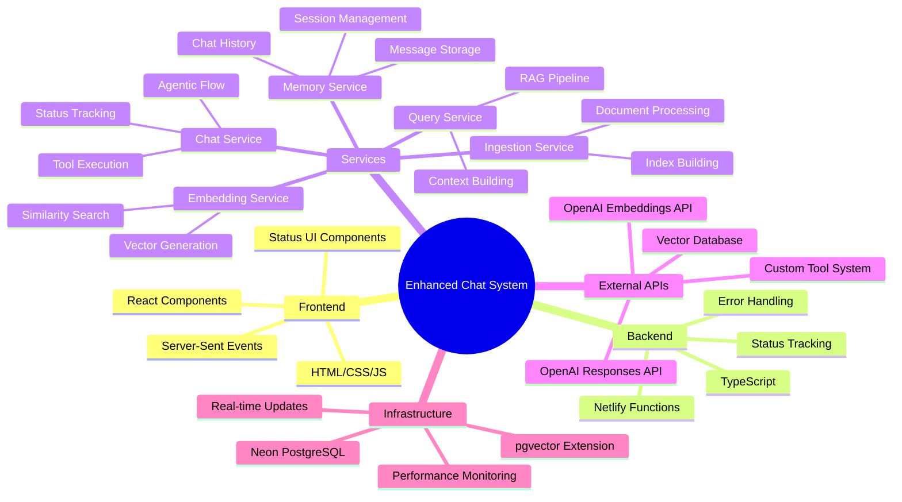

# System Architecture Overview

## High-Level Architecture Diagram

## Component Responsibility Matrix

| Component             | Responsibility                          | Status Tracking             | Files                            |
| --------------------- | --------------------------------------- | --------------------------- | -------------------------------- |
| **Client Layer**      | UI/UX, Event Handling                   | Receives & displays status  | React/HTML components            |
| **API Layer**         | Request validation, Response formatting | Passes status to client     | `netlify/functions/`             |
| **Chat Service**      | Core chat logic, Status orchestration   | Creates & manages status    | `netlify/services/chat/`         |
| **Query Service**     | Query processing and RAG pipeline       | Tracks query processing     | `netlify/services/query/`        |
| **Embedding Service** | Vector generation and similarity search | Tracks embedding operations | `netlify/services/embedding/`    |
| **Ingestion Service** | Document processing and indexing        | Tracks ingestion progress   | `netlify/services/ingestion/`    |
| **Memory Service**    | Chat history and session management     | Tracks memory operations    | `netlify/services/memory/`       |
| **generateAnswer**    | Main processing flow                    | Tracks all major steps      | Core chat processing             |
| **executeToolCall**   | Tool execution with switch logic        | Tracks tool-specific status | Tool orchestration               |
| **callOpenAI**        | OpenAI API integration                  | No direct status (wrapped)  | OpenAI API wrapper               |
| **Type System**       | Structure & validation                  | Defines status contracts    | `types.ts` files across services |

## Service Layer Architecture

### **Netlify Services Structure** (`netlify/services/`)

```mermaid
graph TB
    subgraph "Service Organization"
        A[services/index.ts] --> B[Chat Service]
        A --> C[Query Service]
        A --> D[Embedding Service]
        A --> E[Ingestion Service]
        A --> F[Memory Service]
    end

    subgraph "Chat Service (chat/)"
        B --> G[chat.ts - Core logic]
        B --> H[tools.ts - Tool execution]
        B --> I[chat-status-tracking.ts]
        B --> J[helpers.ts - Utilities]
        B --> K[types.ts - Chat types]
    end

    subgraph "Query Service (query/)"
        C --> L[query.ts - RAG pipeline]
        C --> M[types.ts - Query types]
    end

    subgraph "Embedding Service (embedding/)"
        D --> N[embedding.ts - Vector ops]
        D --> O[types.ts - Embedding types]
    end

    subgraph "Ingestion Service (ingestion/)"
        E --> P[ingestion.ts - Document processing]
        E --> Q[types.ts - Ingestion types]
    end

    subgraph "Memory Service (memory/)"
        F --> R[types.ts - Chat memory types]
        F --> S[utils.ts - Session management]
        F --> T[index.ts - Service exports]
    end

    style A fill:#e1f5fe
    style B fill:#f3e5f5
    style F fill:#f8bbd9
```

### **Service Responsibilities**

| Service       | Core Function              | Key Files                                        | Dependencies          |
| ------------- | -------------------------- | ------------------------------------------------ | --------------------- |
| **Chat**      | Agentic conversation flow  | `chat.ts`, `tools.ts`, `chat-status-tracking.ts` | Query, OpenAI API     |
| **Query**     | RAG pipeline orchestration | `query.ts`                                       | Embedding, Database   |
| **Embedding** | Vector operations          | `embedding.ts`                                   | OpenAI Embeddings API |
| **Ingestion** | Document processing        | `ingestion.ts`                                   | Embedding, Database   |
| **Memory**    | Chat history persistence   | `types.ts`, `utils.ts`                           | Database              |

## Data Flow Architecture

## Technology Stack Integration

