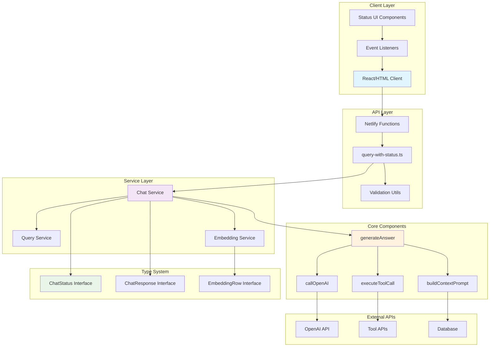
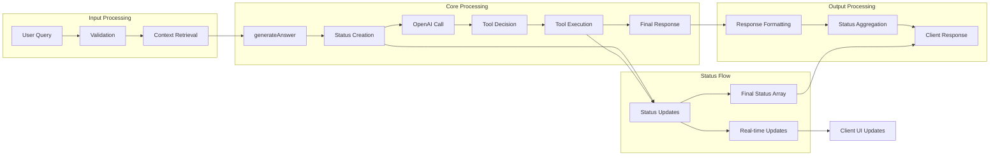
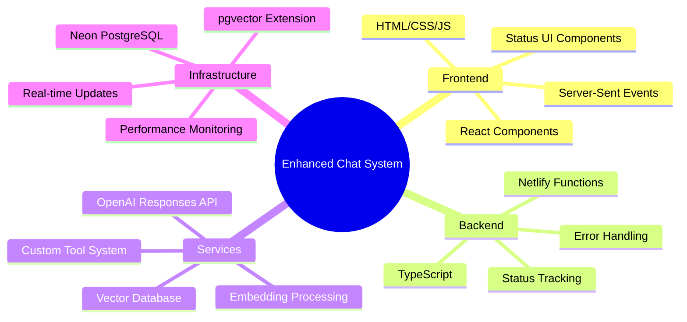

# System Architecture Overview

## High-Level Architecture Diagram

## Component Responsibility Matrix

| Component           | Responsibility                          | Status Tracking             |
| ------------------- | --------------------------------------- | --------------------------- |
| **Client Layer**    | UI/UX, Event Handling                   | Receives & displays status  |
| **API Layer**       | Request validation, Response formatting | Passes status to client     |
| **Chat Service**    | Core chat logic, Status orchestration   | Creates & manages status    |
| **generateAnswer**  | Main processing flow                    | Tracks all major steps      |
| **executeToolCall** | Tool execution with switch logic        | Tracks tool-specific status |
| **callOpenAI**      | OpenAI API integration                  | No direct status (wrapped)  |
| **Type System**     | Structure & validation                  | Defines status contracts    |

## Data Flow Architecture

## Technology Stack Integration

