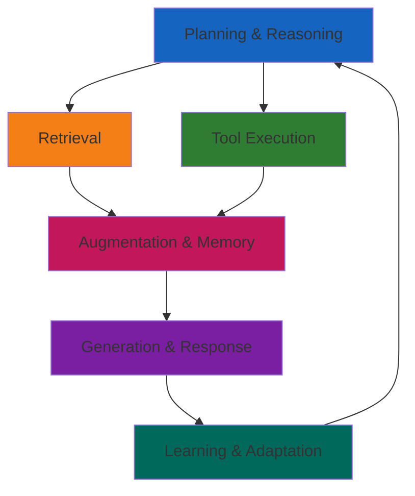

# RAG Architecture Documentation

[Build RAG Application with Neon, Netlify, and OpenAI Guide](https://developers.netlify.com/guides/build-rag-application-with-neon-netlify-openai/)

## Overview

This document outlines the Retrieval-Augmented Generation (RAG) architecture implemented in the AdventureCue project. The system uses a composable, modular approach to handle vector embeddings, similarity search, and AI-generated responses.

## Agentic RAG Pipeline Components



### 1. Planning & Reasoning Phase

Agent analyzes user requests to determine optimal approach and required tools. Breaks down complex queries, selects appropriate tools, and plans multi-step workflows.

### 2. Retrieval Phase

Enhanced semantic search using PostgreSQL + pgvector with contextual retrieval considering conversation history and relevance filtering.

### 3. Tool Execution Phase

Dynamic invocation of external APIs, computational tools, database queries, and custom business logic based on query requirements.

### 4. Augmentation & Memory Phase

Intelligent context building combining retrieved documents, conversation history, tool results, and system instructions with real-time status tracking.

### 5. Generation & Response Phase

AI-powered response generation using OpenAI's chat completion with context-aware prompting, tool-augmented responses, and conversational memory persistence.

### 6. Learning & Adaptation Phase

Continuous improvement through session management, feedback incorporation, pattern recognition, and memory optimization for personalized experiences.

## Directory Structure

The application follows a layered architecture pattern, with clear separation between presentation, API, business logic, and data layers:

```
adventurecue/
├── 📱 PRESENTATION LAYER (Frontend)
│   ├── src/
│   │   ├── app/                 # Next.js app router
│   │   │   ├── layout.tsx       # Root layout
│   │   │   └── page.tsx         # Main page component
│   │   ├── components/          # React components
│   │   │   ├── ingest.tsx       # Ingestion UI component
│   │   │   └── query.tsx        # Query UI component
│   │   └── lib/                 # Frontend utilities
│   └── public/                  # Static assets
│
├── 🌐 API LAYER (Backend Endpoints)
│   └── netlify/functions/
│       ├── ingest.ts            # Text ingestion endpoint
│       ├── query.ts             # Semantic search endpoint
│       └── chat.ts              # Chat with memory endpoint
│
├── ⚙️ CORE LAYER (Business Logic) - Agentic RAG Pipeline
│   └── netlify/services/
│       ├── chat/                # 🤖 GENERATION & ORCHESTRATION
│       │   ├── chat.ts          # → Core conversation engine (Generation Agent)
│       │   ├── helpers.ts       # → Conversation utilities
│       │   ├── types.ts
│       │   └── index.ts
│       ├── embedding/           # 🔍 RETRIEVAL PHASE
│       │   ├── embedding.ts     # → Vector encoding & similarity search (Retrieval Agent)
│       │   ├── types.ts
│       │   └── index.ts
│       ├── ingestion/           # 📥 KNOWLEDGE INGESTION
│       │   ├── ingestion.ts     # → Document processing & knowledge base building
│       │   ├── types.ts
│       │   └── index.ts
│       ├── memory/              # 🧠 CONVERSATIONAL MEMORY
│       │   ├── types.ts
│       │   ├── utils.ts         # → Memory management utilities
│       │   └── index.ts
│       ├── prompts/             # 📝 PROMPT MANAGEMENT
│       │   ├── prompts.ts       # → System & user prompt templates
│       │   ├── types.ts
│       │   └── index.ts
│       ├── query/               # 🎯 QUERY ORCHESTRATION
│       │   ├── query.ts         # → RAG pipeline orchestrator (Query Agent)
│       │   ├── types.ts
│       │   └── index.ts
│       ├── status/              # 📊 STATUS TRACKING
│       │   ├── status-tracking.ts    # → Real-time operation monitoring
│       │   ├── status-examples.ts    # → Usage examples & templates
│       │   └── index.ts
│       ├── tools/               # 🛠️ TOOL EXECUTION
│       │   ├── tools.ts         # → Tool execution framework (Agentic Tools)
│       │   └── index.ts
│       └── index.ts
│
├── 🔌 INTEGRATION LAYER (External Services)
│   ├── netlify/clients/         # External service clients
│   └── netlify/utils/           # Shared utility functions
│
├── 💾 DATA LAYER (Database & Storage)
│   ├── db/
│   │   ├── index.ts             # Database connection & setup
│   │   └── schema.ts            # Schema definitions (embeddings + chat)
│   ├── migrations/              # Database migrations
│   │   ├── 0000_enable-pgvector.sql
│   │   ├── 0001_create-tables.sql
│   │   ├── 0002_create-ivfflat-index.sql
│   │   ├── 0003_ancient_blue_blade.sql  # Chat memory tables
│   │   └── meta/                # Migration metadata
│   └── data/                    # Source data files
│
├── 🛠️ TOOLING LAYER (Development & Operations)
│   ├── bin/
│   │   ├── ingest.ts            # CLI ingestion script
│   │   └── verify-chat-tables.ts # Database verification utility
│   ├── docs/                    # Documentation
│   └── examples/                # Example code & usage
```

## Key Terminology

### Agentic RAG Pipeline Terms

- **Chat Agent**: Core conversation orchestrator that manages the complete chat pipeline including memory, tools, and response generation (implemented in `chat/chat.ts`).

- **Tool Execution**: Dynamic invocation of external functions and services based on query analysis, with standardized tool calling interface (implemented in `tools/tools.ts`).

- **Chat Session**: Persistent conversation container that maintains continuity across multiple message exchanges with unique session identifiers (schema in `memory/types.ts`).

- **Status Tracking**: Real-time progress monitoring system that provides step-by-step feedback during chat processing (implemented in `status/status-tracking.ts`).

- **Chat Message**: Individual conversation units with role-based typing (user, assistant, system) stored with session context (schema in `memory/types.ts`).

- **Session Management**: Utilities for creating, retrieving, and managing chat sessions including session ID generation and title management (implemented in `memory/utils.ts`).

- **Context Augmentation**: Process of combining retrieved documents, conversation history, and tool results into comprehensive prompts for generation.

- **Vector Similarity Search**: Semantic content matching using PostgreSQL pgvector extension to find relevant documents based on embedding distance calculations.

- **Embedding Generation**: Converting text queries into high-dimensional vectors using OpenAI's embedding models for similarity search operations.

- **Chat Status Messages**: Predefined status templates and messages for consistent user feedback during processing steps (implemented in `status/status-examples.ts`).

- **Multi-Modal Ingestion**: Support for processing different content types through both CLI bulk processing and UI-based real-time ingestion.

- **Session Memory Persistence**: Database storage of conversation history enabling context retrieval across multiple interactions within the same session.

## Architecture Benefits

- **Composability**: Modular services with single responsibilities
- **Scalability**: Independent service scaling and resource management
- **Maintainability**: Clear separation of concerns with TypeScript safety
- **Extensibility**: Easy integration of new RAG components and agentic tools

## Data Ingestion Architecture

### CLI-Based Ingestion

Bulk file processing with rate limiting and error resilience for building the knowledge base.

### UI-Based Ingestion

Real-time text ingestion through web interface for dynamic content addition.

### Processing Pipeline

Environment validation → File processing → Text chunking → Vector embedding → Database storage

## Technology Stack

### **Frontend Architecture**

- **Next.js**: React-based framework with app router
- **TypeScript**: Type-safe development environment
- **Real-time UI**: Server-Sent Events for live status updates
- **Component Library**: Modular React components for chat and ingestion

### **Backend Architecture**

- **Netlify Functions**: Serverless API endpoints
- **TypeScript**: End-to-end type safety
- **Server-Sent Events**: Real-time status streaming
- **Modular Services**: Layered business logic architecture

### **AI & ML Stack**

- **OpenAI GPT-4**: Agentic chat completion with tool calling
- **OpenAI Embeddings**: text-embedding-ada-002 for vector generation
- **Tool Integration**: Dynamic external API orchestration
- **Context Management**: Intelligent prompt engineering

### **Database & Vector Search**

- **PostgreSQL**: Primary data storage with ACID compliance
- **pgvector Extension**: High-performance vector similarity search
- **Drizzle ORM**: Type-safe database operations and migrations
- **IVFFlat Indexing**: Optimized vector search performance

### **Memory & Session Management**

- **Chat Sessions**: Persistent conversation containers
- **Message History**: Role-based conversation storage
- **Session Persistence**: Cross-request memory continuity
- **Context Retrieval**: Intelligent conversation history integration

### **Real-time Features**

- **Status Tracking**: Live processing feedback
- **Streaming Responses**: Server-Sent Events for real-time updates
- **Progress Monitoring**: Step-by-step operation visibility
- **Error Handling**: Graceful failure recovery

### **Data Processing Pipeline**

- **CLI Ingestion**: Bulk document processing utilities
- **UI Ingestion**: Real-time content addition interface
- **Text Chunking**: Intelligent document segmentation
- **Vector Generation**: Automated embedding creation
- **Rate Limiting**: Production-ready processing controls

### **Development & Operations**

- **TypeScript**: Full-stack type safety
- **Migration System**: Database schema evolution
- **Validation**: Request/response data integrity
- **Error Boundaries**: Comprehensive error handling
- **Monitoring**: Built-in status and health checks
