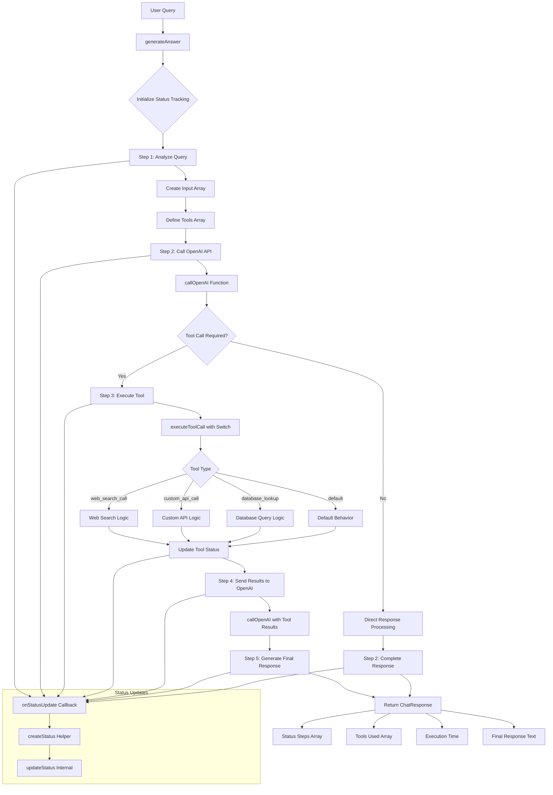
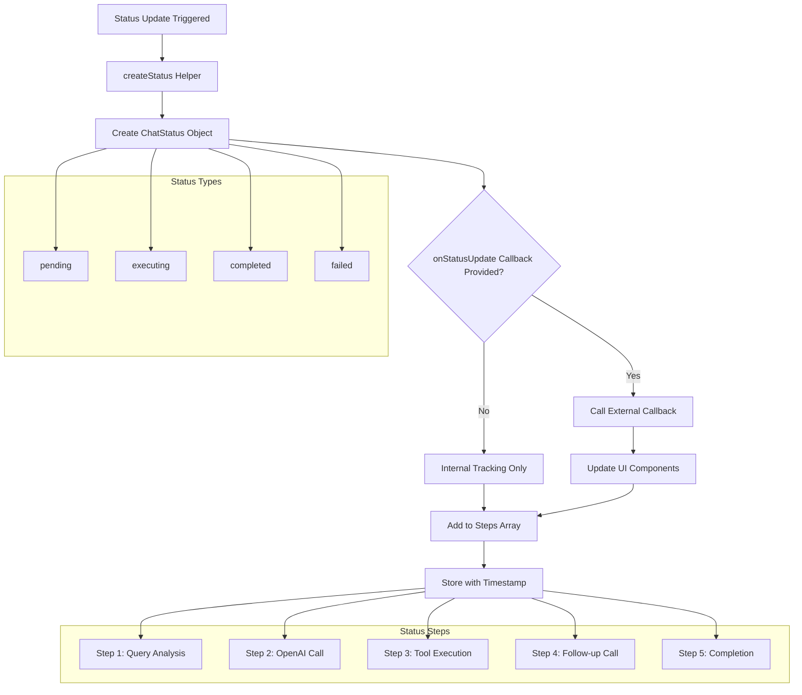
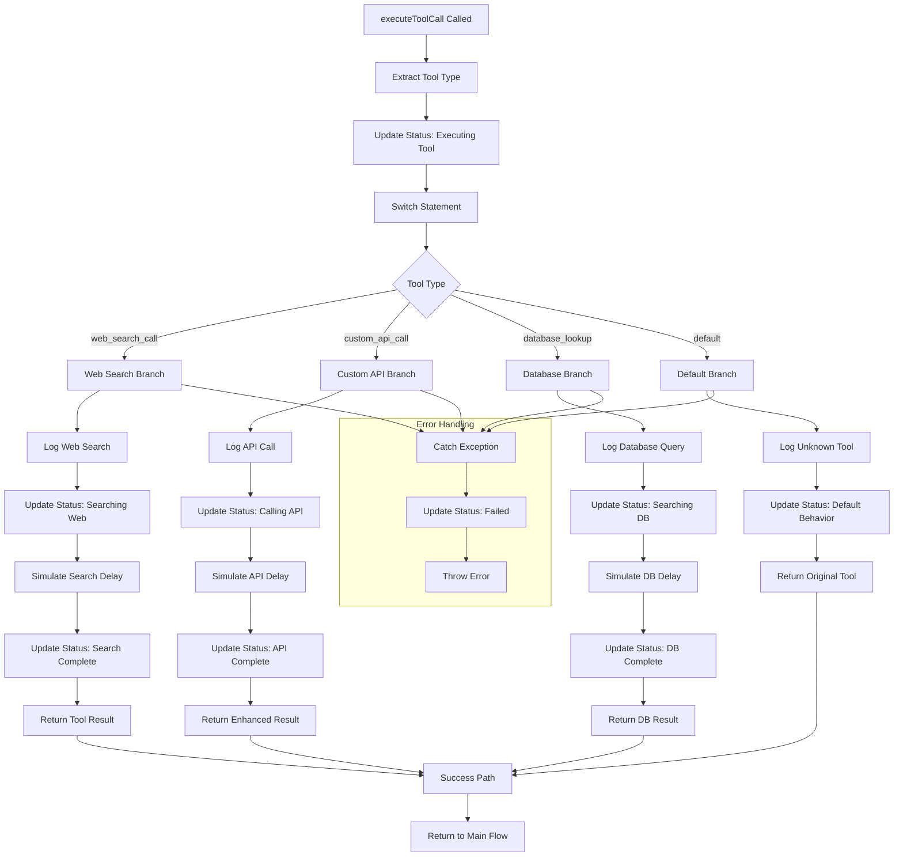
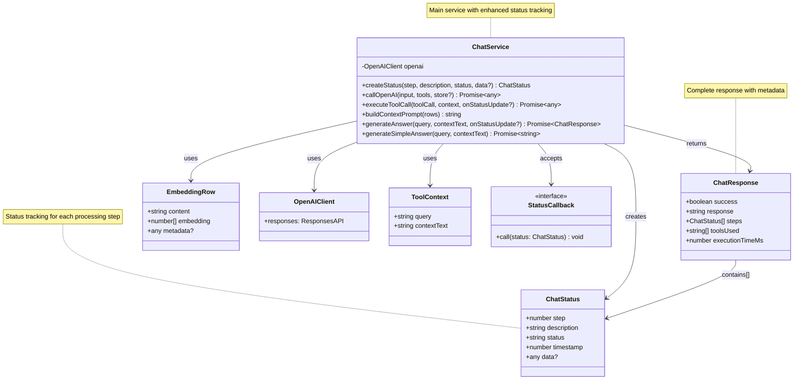
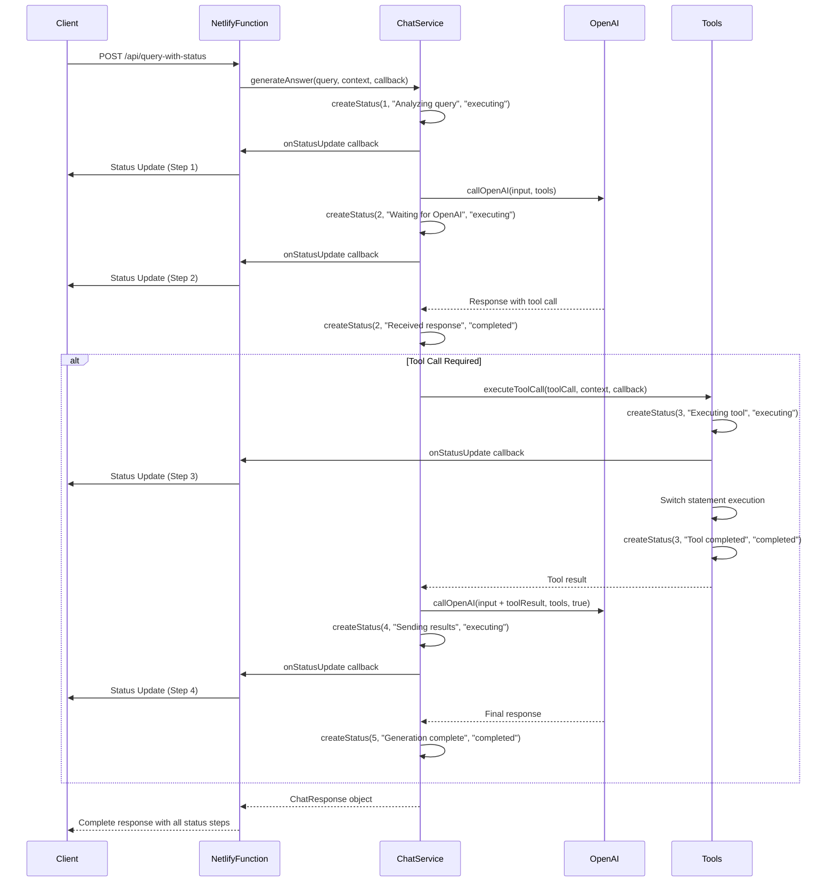
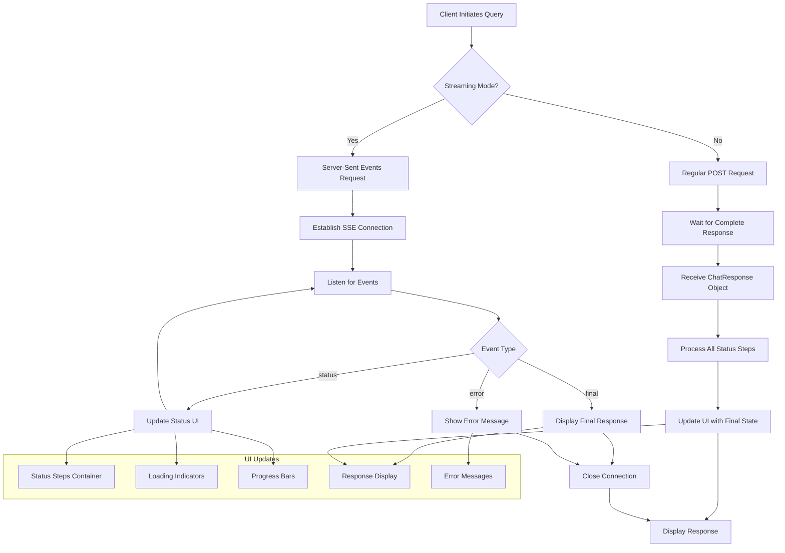
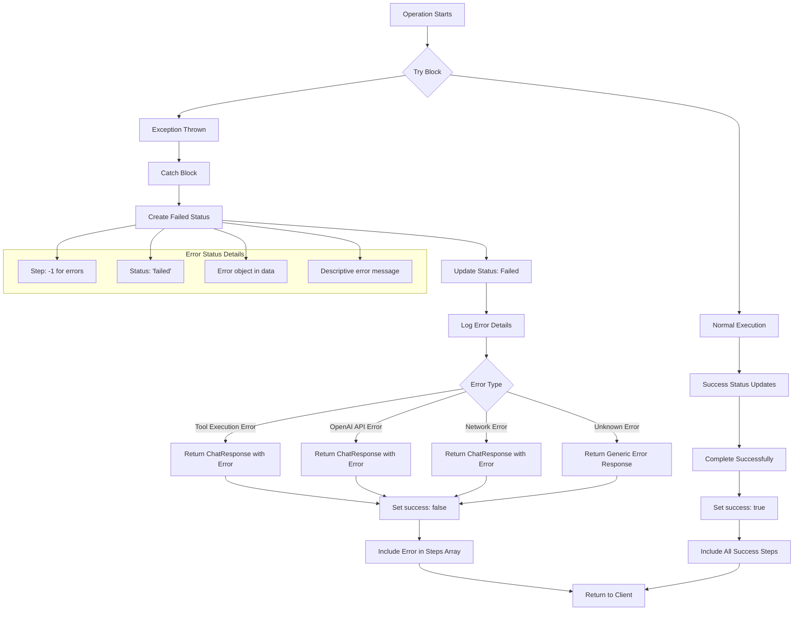

# Chat System Architecture Diagrams

This document contains flow diagrams and class diagrams for the enhanced chat system with status tracking capabilities.

## 1. Enhanced Chat System Flow Diagram

## 2. Status Tracking Flow Diagram

## 3. Tool Execution Flow Diagram

## 4. Class/Interface Diagram

## 5. API Integration Flow Diagram

## 6. Client-Side Status Handling Flow

## 7. Error Handling Flow Diagram

## Key Improvements Visualized

1. **Status Tracking**: Every operation now provides real-time feedback
2. **Tool Composability**: Switch-based system for easy tool addition
3. **Error Handling**: Comprehensive error tracking and reporting
4. **Performance Metrics**: Execution time and tool usage tracking
5. **Client Integration**: Support for both streaming and batch processing
6. **Backward Compatibility**: Maintained through wrapper functions

These diagrams illustrate how the enhanced chat system provides comprehensive status tracking while maintaining the core functionality and adding new capabilities for better user experience and system observability.
