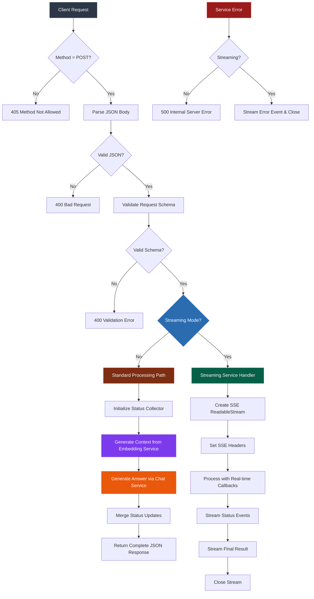

# Chat Endpoint Documentation

## Table of Contents

- [Overview](#overview)
- [Architecture](#architecture)
- [Flow Diagram](#flow-diagram)
- [Design Patterns](#design-patterns)
- [Service Dependencies](#service-dependencies)
- [Request/Response Structure](#requestresponse-structure)
- [Error Handling](#error-handling)
- [Usage Guide](#usage-guide)
- [Frontend Integration](#frontend-integration)

## Overview

The chat endpoint provides AI-powered conversational capabilities with support for both synchronous and real-time streaming responses. The refactored architecture now leverages dedicated services for chat processing, embedding generation, and streaming functionality.

**Endpoint:** `POST /netlify/functions/chat`

**Response Modes:**

- **Standard Mode**: Complete response after processing with collected status updates
- **Streaming Mode**: Real-time updates via Server-Sent Events using dedicated streaming service

## Architecture

The chat endpoint follows a modular service-oriented architecture with clear separation of concerns:

```
┌─────────────────────────────────────────────────────────┐
│                   HTTP Handler Layer                    │
│  ┌─────────────────┐    ┌─────────────────────────────┐ │
│  │ Request Router  │────│ Validation Middleware       │ │
│  │ (chat.ts)       │    │ (validation.ts)             │ │
│  └─────────────────┘    └─────────────────────────────┘ │
└─────────────────────────────────────────────────────────┘
                              │
                              ▼
┌─────────────────────────────────────────────────────────┐
│                Processing Strategy Layer                │
│  ┌─────────────────┐    ┌─────────────────────────────┐ │
│  │ Standard Mode   │    │ Streaming Service           │ │
│  │ Processor       │    │ (streaming/sse-handler.ts) │ │
│  └─────────────────┘    └─────────────────────────────┘ │
└─────────────────────────────────────────────────────────┘
                              │
                              ▼
┌─────────────────────────────────────────────────────────┐
│                    Service Layer                        │
│  ┌─────────────────┐    ┌─────────────────┐   ┌───────┐ │
│  │ Chat Service    │────│ Embedding       │───│Status │ │
│  │ (chat/chat.ts)  │    │ Service         │   │Track. │ │
│  │                 │    │ (embedding/)    │   │       │ │
│  └─────────────────┘    └─────────────────┘   └───────┘ │
└─────────────────────────────────────────────────────────┘
```

## Flow Diagram



## Design Patterns

### 1. Strategy Pattern

- **Context**: Response processing mode selection
- **Strategies**: Standard processing vs. Streaming service
- **Implementation**: Route-based strategy selection via `streaming` boolean flag
- **Benefits**: Clean separation of synchronous and asynchronous response handling

### 2. Service Layer Pattern

- **Purpose**: Encapsulate business logic in dedicated services
- **Services**: Chat Service, Embedding Service, Streaming Service
- **Benefits**: Loose coupling, reusability, and independent testing

### 3. Observer Pattern

- **Subject**: Chat processing services
- **Observers**: Status update callbacks
- **Usage**: Real-time status notifications during query processing
- **Implementation**: Callback functions passed through service layers

### 4. Chain of Responsibility

- **Handlers**: Method validation → JSON parsing → Schema validation → Processing
- **Early Exit**: Each handler can terminate the chain on failure
- **Benefits**: Clean error handling and request preprocessing

### 5. Facade Pattern

- **Facade**: Chat endpoint handler
- **Subsystems**: Validation, Chat Service, Embedding Service, Streaming Service
- **Benefits**: Simplified interface for complex service orchestration

## Service Dependencies

The chat endpoint orchestrates multiple services:

```typescript
// Core Dependencies
import { generateAnswer } from "../services/chat";           // Chat processing
import { generateContext } from "../services/embedding";     // Vector search & context
import { handleStreamingRequest } from "../services/streaming"; // SSE streaming
import { validateRequest } from "../utils/validation";       // Request validation

// Service Flow
validateRequest() → generateContext() → generateAnswer() → handleStreamingRequest()
```

### Service Responsibilities

| Service                | Responsibility                          | Location              |
| ---------------------- | --------------------------------------- | --------------------- |
| **Chat Service**       | AI conversation processing with memory  | `services/chat/`      |
| **Embedding Service**  | Vector generation and similarity search | `services/embedding/` |
| **Streaming Service**  | Real-time SSE response delivery         | `services/streaming/` |
| **Validation Utility** | Request schema validation               | `utils/validation.ts` |

## Request/Response Structure

### Request Schema

```typescript
{
  query: string;        // Required: User's chat query
  streaming?: boolean;  // Optional: Enable SSE streaming (default: false)
}
```

### Standard Response

```typescript
{
  answer: string;       // AI-generated response
  steps: ChatStatus[];  // Array of processing steps with status
  metadata?: object;    // Additional response metadata
}
```

### SSE Event Types

```typescript
// Status Update Event
{
  type: "status",
  status: {
    step: string;       // Processing step identifier
    description: string; // Human-readable step description
    status: "in-progress" | "completed" | "error";
    timestamp: string;   // ISO timestamp
  }
}

// Final Result Event
{
  type: "final",
  result: ChatResponse  // Complete chat response object
}

// Error Event
{
  type: "error",
  error: string        // Error message
}
```

## Error Handling

| Error Type        | Status Code | Response   | SSE Behavior        |
| ----------------- | ----------- | ---------- | ------------------- |
| Invalid Method    | 405         | Plain text | N/A                 |
| Invalid JSON      | 400         | Plain text | N/A                 |
| Schema Validation | 400         | Plain text | N/A                 |
| Service Error     | 500         | Plain text | Error event + close |
| Streaming Error   | 500         | N/A        | Error event + close |

### Error Recovery Strategies

- **Standard Mode**: Immediate error response with HTTP status codes
- **Streaming Mode**: Error events sent via SSE before closing connection
- **Service Failures**: Graceful degradation with informative error messages

## Usage Guide

### Standard Request (JSON Response)

```bash
curl -X POST https://your-domain.netlify.app/.netlify/functions/chat \
  -H "Content-Type: application/json" \
  -d '{"query": "What are the best restaurants in San Francisco?"}'
```

**Response:**

```json
{
  "answer": "Based on the travel information available...",
  "steps": [
    {
      "step": "context_generation",
      "description": "Generating context from vector database",
      "status": "completed",
      "timestamp": "2025-08-01T10:30:00Z"
    },
    {
      "step": "answer_generation",
      "description": "Generating AI response",
      "status": "completed",
      "timestamp": "2025-08-01T10:30:02Z"
    }
  ]
}
```

### Streaming Request (SSE)

```bash
curl -X POST https://your-domain.netlify.app/.netlify/functions/chat \
  -H "Content-Type: application/json" \
  -d '{"query": "Plan a 3-day trip to SF", "streaming": true}' \
  --no-buffer
```

**SSE Stream:**

```
data: {"type":"status","status":{"step":"context_generation","description":"Retrieving relevant travel information","status":"in-progress","timestamp":"2025-08-01T10:30:00Z"}}

data: {"type":"status","status":{"step":"context_generation","description":"Context generated successfully","status":"completed","timestamp":"2025-08-01T10:30:01Z"}}

data: {"type":"final","result":{"answer":"Here's your 3-day San Francisco itinerary...","steps":[...]}}
```

## Frontend Integration

### Standard Mode (Fetch API)

```javascript
async function sendChatMessage(query) {
  try {
    const response = await fetch("/.netlify/functions/chat", {
      method: "POST",
      headers: {
        "Content-Type": "application/json",
      },
      body: JSON.stringify({ query }),
    });

    if (!response.ok) {
      throw new Error(`HTTP error! status: ${response.status}`);
    }

    const result = await response.json();
    console.log("Answer:", result.answer);
    console.log("Processing steps:", result.steps);
    return result;
  } catch (error) {
    console.error("Chat request failed:", error);
    throw error;
  }
}
```

### Streaming Mode (EventSource API)

```javascript
function sendStreamingChatMessage(query, onStatus, onComplete, onError) {
  // Note: EventSource doesn't support POST requests directly
  // This example shows the concept - you'd need to use fetch with ReadableStream
  // or implement a custom SSE client

  const eventSource = new EventSource(
    `/.netlify/functions/chat?query=${encodeURIComponent(query)}&streaming=true`
  );

  eventSource.onmessage = (event) => {
    try {
      const data = JSON.parse(event.data);

      switch (data.type) {
        case "status":
          onStatus(data.status);
          break;

        case "final":
          onComplete(data.result);
          eventSource.close();
          break;

        case "error":
          onError(new Error(data.error));
          eventSource.close();
          break;
      }
    } catch (parseError) {
      onError(parseError);
      eventSource.close();
    }
  };

  eventSource.onerror = (error) => {
    onError(error);
    eventSource.close();
  };

  return () => eventSource.close();
}
```

### Custom SSE Client (Recommended)

```javascript
async function streamingChatRequest(query, onStatus, onComplete, onError) {
  try {
    const response = await fetch("/.netlify/functions/chat", {
      method: "POST",
      headers: {
        "Content-Type": "application/json",
      },
      body: JSON.stringify({ query, streaming: true }),
    });

    if (!response.ok) {
      throw new Error(`HTTP error! status: ${response.status}`);
    }

    const reader = response.body?.getReader();
    const decoder = new TextDecoder();

    if (!reader) {
      throw new Error("Response body is not readable");
    }

    while (true) {
      const { done, value } = await reader.read();

      if (done) break;

      const chunk = decoder.decode(value, { stream: true });
      const lines = chunk.split("\n");

      for (const line of lines) {
        if (line.startsWith("data: ")) {
          try {
            const data = JSON.parse(line.slice(6));

            switch (data.type) {
              case "status":
                onStatus(data.status);
                break;
              case "final":
                onComplete(data.result);
                return;
              case "error":
                onError(new Error(data.error));
                return;
            }
          } catch (parseError) {
            console.warn("Failed to parse SSE data:", parseError);
          }
        }
      }
    }
  } catch (error) {
    onError(error);
  }
}
```

### React Hook Example

```javascript
import { useState, useCallback } from "react";

function useChatStream() {
  const [status, setStatus] = useState(null);
  const [result, setResult] = useState(null);
  const [error, setError] = useState(null);
  const [isLoading, setIsLoading] = useState(false);

  const sendMessage = useCallback(async (query, streaming = false) => {
    setIsLoading(true);
    setError(null);
    setResult(null);
    setStatus(null);

    if (streaming) {
      await streamingChatRequest(
        query,
        (statusUpdate) => setStatus(statusUpdate),
        (finalResult) => {
          setResult(finalResult);
          setIsLoading(false);
        },
        (err) => {
          setError(err);
          setIsLoading(false);
        }
      );
    } else {
      try {
        const result = await sendChatMessage(query);
        setResult(result);
        setIsLoading(false);
      } catch (err) {
        setError(err);
        setIsLoading(false);
      }
    }
  }, []);

  return {
    sendMessage,
    status,
    result,
    error,
    isLoading,
  };
}
```

### Best Practices

1. **Service Architecture**: Leverage the modular service design for maintainability
2. **Error Handling**: Implement robust error handling for both sync and async modes
3. **Status Updates**: Use status information to provide user feedback
4. **Connection Management**: Always clean up SSE connections properly
5. **Fallback Strategy**: Implement fallback to standard mode if streaming fails
6. **Memory Management**: Clean up event listeners and close connections on unmount
