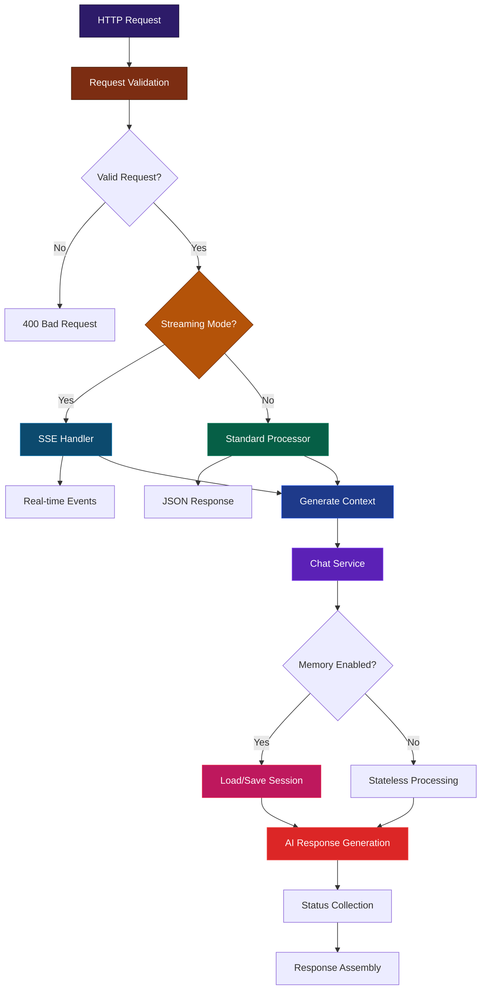

# Chat Function Endpoint

## Table of Contents

- [Overview](#overview)
- [Architecture Flow](#architecture-flow)
- [Design Patterns](#design-patterns)
- [Service Integration](#service-integration)
- [Usage](#usage)

## Overview

The Chat Function Endpoint (`/netlify/functions/chat`) serves as the primary entry point for conversational AI interactions. It orchestrates multiple services to provide both stateless and memory-enabled conversations with optional real-time streaming capabilities.

**Core Features:**

- Stateless and memory-enabled conversations
- Synchronous and streaming response modes
- Request validation and error handling
- Service orchestration and status tracking

## Architecture Flow



## Design Patterns

### 1. Strategy Pattern

- **Context**: Response handling based on client preferences
- **Strategies**: Streaming (SSE) vs Standard (JSON) response modes
- **Implementation**: Dynamic strategy selection via `streaming` parameter

### 2. Template Method Pattern

- **Template**: Request processing workflow
- **Steps**: Validation → Context Generation → AI Processing → Response Assembly
- **Variations**: Memory-enabled vs stateless processing paths

### 3. Observer Pattern

- **Subject**: Processing pipeline
- **Observers**: Status tracking callbacks for real-time updates
- **Events**: Step progress, completion, and error states

### 4. Facade Pattern

- **Purpose**: Unified interface to complex service ecosystem
- **Services**: Validation, Context Generation, Chat Service, Streaming Service
- **Benefit**: Simplified client integration with single endpoint

## Service Integration

### Core Services

| Service                | Layer      | Responsibility                       | Integration Point          |
| ---------------------- | ---------- | ------------------------------------ | -------------------------- |
| **Validation Service** | Input      | Request sanitization and validation  | `validateRequest()`        |
| **Context Service**    | Processing | Vector search and context generation | `generateContext()`        |
| **Chat Service**       | Core       | AI response generation with memory   | `generateAnswer()`         |
| **Streaming Service**  | Output     | Real-time event delivery             | `handleStreamingRequest()` |

### Integration Points

```typescript
// Request Flow
HTTP Request → validateRequest() → {
  streaming ? handleStreamingRequest() : processQueryWithStatus()
} → generateContext() → generateAnswer() → Response
```

### Memory Integration

- **Service**: Memory service integrated into Chat Service
- **Trigger**: Presence of `sessionId` parameter
- **Behavior**: Automatic session management and conversation history

## Usage

### Basic Request

```bash
curl -X POST /netlify/functions/chat \
  -H "Content-Type: application/json" \
  -d '{
    "query": "What are the best attractions in Paris?"
  }'
```

### Memory-Enabled Conversation

```bash
# Start new conversation
curl -X POST /netlify/functions/chat \
  -H "Content-Type: application/json" \
  -d '{
    "query": "Plan a trip to Tokyo",
    "sessionId": ""
  }'

# Continue conversation
curl -X POST /netlify/functions/chat \
  -H "Content-Type: application/json" \
  -d '{
    "query": "What about hotels?",
    "sessionId": "chat_session_id_from_response"
  }'
```

### Streaming Request

```bash
curl -X POST /netlify/functions/chat \
  -H "Content-Type: application/json" \
  -d '{
    "query": "Create a detailed itinerary",
    "streaming": true
  }' \
  --no-buffer
```

### Frontend Integration

```javascript
// Standard request
async function sendMessage(query, sessionId = null) {
  const response = await fetch("/netlify/functions/chat", {
    method: "POST",
    headers: { "Content-Type": "application/json" },
    body: JSON.stringify({
      query,
      sessionId: sessionId || undefined,
    }),
  });
  return response.json();
}

// Streaming request
async function streamMessage(query, onStatus, onComplete) {
  const response = await fetch("/netlify/functions/chat", {
    method: "POST",
    headers: { "Content-Type": "application/json" },
    body: JSON.stringify({ query, streaming: true }),
  });

  const reader = response.body.getReader();
  const decoder = new TextDecoder();

  while (true) {
    const { done, value } = await reader.read();
    if (done) break;

    const chunk = decoder.decode(value);
    const lines = chunk.split("\n");

    for (const line of lines) {
      if (line.startsWith("data: ")) {
        const data = JSON.parse(line.slice(6));
        if (data.type === "status") onStatus(data.status);
        if (data.type === "final") onComplete(data.result);
      }
    }
  }
}
```

### Request Parameters

| Parameter   | Type    | Required | Description                                 |
| ----------- | ------- | -------- | ------------------------------------------- |
| `query`     | string  | Yes      | User's question or input                    |
| `sessionId` | string  | No       | Session ID for memory functionality         |
| `streaming` | boolean | No       | Enable real-time streaming (default: false) |

### Response Format

**Standard Response:**

```json
{
  "success": boolean,
  "response": string,
  "steps": ChatStatus[],
  "toolsUsed": string[],
  "executionTimeMs": number,
  "sessionId": string // Present when memory enabled
}
```

**Streaming Events:**

- `status`: Processing step updates
- `final`: Complete response with results
- `error`: Error notifications
