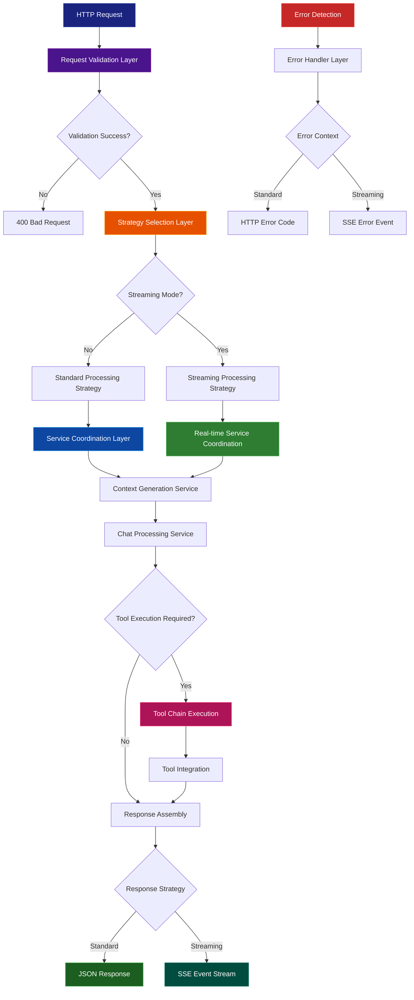

# Chat Endpoint Documentation

## Table of Contents

- [Overview](#overview)
- [Architectural Layers](#architectural-layers)
- [Request Flow Diagram](#request-flow-diagram)
- [Design Patterns](#design-patterns)
- [Service Integration](#service-integration)
- [Response Strategies](#response-strategies)
- [Error Handling](#error-handling)
- [Usage Examples](#usage-examples)

## Overview

The Chat Endpoint serves as the primary HTTP gateway for the Agentic RAG pipeline, orchestrating conversational AI capabilities through a multi-layered architecture. It provides both synchronous and asynchronous response modes with comprehensive status tracking.

**Endpoint:** `POST /netlify/functions/chat`

**Core Capabilities:**

- Intelligent conversation orchestration
- Real-time streaming via Server-Sent Events
- Dynamic service coordination
- Comprehensive error recovery

## Architectural Layers

The endpoint implements a clean separation of concerns across distinct architectural layers:

```
┌─────────────────────────────────────────────────────────┐
│                 🌐 HTTP Interface Layer                 │
│  ┌─────────────────┐    ┌─────────────────────────────┐ │
│  │ Request Handler │────│ Response Formatter          │ │
│  │ (Validation)    │    │ (JSON/SSE)                  │ │
│  └─────────────────┘    └─────────────────────────────┘ │
└─────────────────────────────────────────────────────────┘
                              │
                              ▼
┌─────────────────────────────────────────────────────────┐
│               ⚡ Strategy Orchestration Layer            │
│  ┌─────────────────┐    ┌─────────────────────────────┐ │
│  │ Standard        │    │ Streaming                   │ │
│  │ Processor       │    │ Processor                   │ │
│  └─────────────────┘    └─────────────────────────────┘ │
└─────────────────────────────────────────────────────────┘
                              │
                              ▼
┌─────────────────────────────────────────────────────────┐
│                🔧 Service Coordination Layer            │
│  ┌─────────────┐ ┌─────────────┐ ┌─────────────────────┐ │
│  │ Chat        │ │ Embedding   │ │ Streaming           │ │
│  │ Service     │ │ Service     │ │ Service             │ │
│  └─────────────┘ └─────────────┘ └─────────────────────┘ │
└─────────────────────────────────────────────────────────┘
```

## Request Flow Diagram



## Design Patterns

### 1. Strategy Pattern - Processing Mode Selection

- **Context**: Endpoint request handler
- **Strategies**: Standard synchronous vs. SSE streaming processing
- **Implementation**: Dynamic strategy selection based on request parameters
- **Benefits**: Clean separation of processing modes, extensible architecture

### 2. Facade Pattern - Service Orchestration

- **Purpose**: Unified interface to complex service ecosystem
- **Implementation**: Single endpoint coordinating multiple backend services
- **Benefits**: Simplified client integration, centralized coordination

### 3. Chain of Responsibility - Request Pipeline

- **Chain**: Validation → Authentication → Processing → Response
- **Implementation**: Sequential handler pipeline with early termination
- **Benefits**: Modular request processing, clean error propagation

### 4. Observer Pattern - Status Monitoring

- **Subject**: Service execution pipeline
- **Observers**: Status tracking callbacks and SSE event streams
- **Benefits**: Real-time progress visibility, decoupled monitoring

### 5. Template Method Pattern - Response Lifecycle

- **Template**: Standard request processing workflow
- **Variations**: Response formatting (JSON vs. SSE events)
- **Benefits**: Consistent processing flow, flexible output formats

## Service Integration

The endpoint coordinates multiple service layers through well-defined interfaces:

### Service Dependency Flow

```typescript
HTTP Layer → Strategy Layer → Service Layer
    ↓              ↓              ↓
Validation → Mode Selection → Service Coordination
    ↓              ↓              ↓
Request → Standard/Streaming → Chat/Embedding/Streaming
```

### Core Service Integrations

| Service               | Layer         | Responsibility         | Integration Point          |
| --------------------- | ------------- | ---------------------- | -------------------------- |
| **Validation**        | HTTP          | Request sanitization   | `validateRequest()`        |
| **Chat Service**      | Coordination  | AI response generation | `generateAnswer()`         |
| **Embedding Service** | Coordination  | Context generation     | `generateContext()`        |
| **Streaming Service** | Strategy      | Real-time delivery     | `handleStreamingRequest()` |
| **Status Service**    | Cross-cutting | Progress tracking      | Status callbacks           |

## Response Strategies

### Standard Response Strategy

- **Use Case**: Traditional request/response interactions
- **Processing**: Complete pipeline execution with result collection
- **Output**: Structured JSON with full execution metadata

```typescript
interface StandardResponse {
  answer: string;
  steps: ChatStatus[];
  toolsUsed: string[];
  executionTimeMs: number;
}
```

### Streaming Response Strategy

- **Use Case**: Real-time progress monitoring and progressive delivery
- **Processing**: Live event emission during pipeline execution
- **Output**: Server-Sent Events with typed message structure

```typescript
// Event Types
{ type: "status", status: ChatStatus }    // Progress updates
{ type: "final", result: ChatResponse }   // Complete result
{ type: "error", error: string }          // Error notifications
```

## Error Handling

### Layered Error Recovery Architecture

```
HTTP Layer Errors → Client-facing HTTP status codes
    ↓
Strategy Layer Errors → Processing mode-specific handling
    ↓
Service Layer Errors → Graceful degradation with fallbacks
    ↓
Infrastructure Errors → System-level recovery mechanisms
```

### Error Response Strategies

| Error Type              | Layer   | Standard Mode            | Streaming Mode        |
| ----------------------- | ------- | ------------------------ | --------------------- |
| **Validation**          | HTTP    | 400 Bad Request          | Connection rejected   |
| **Authentication**      | HTTP    | 401/403 Unauthorized     | Connection rejected   |
| **Service Unavailable** | Service | 503 with retry info      | Error event + close   |
| **Processing Timeout**  | Service | 504 with partial results | Timeout event + close |
| **Internal Error**      | Service | 500 with safe message    | Error event + close   |

## Usage Examples

### Basic Synchronous Request

```bash
curl -X POST https://your-domain.netlify.app/.netlify/functions/chat \
  -H "Content-Type: application/json" \
  -d '{
    "query": "What are the top 5 attractions in Paris?",
    "streaming": false
  }'
```

**Response:**

```json
{
  "answer": "Here are the top 5 attractions in Paris: 1. Eiffel Tower...",
  "steps": [
    {
      "step": 1,
      "description": "Analyzing query and generating context",
      "status": "completed",
      "timestamp": 1722513600000
    },
    {
      "step": 2,
      "description": "Generating AI response",
      "status": "completed",
      "timestamp": 1722513602000
    }
  ],
  "toolsUsed": [],
  "executionTimeMs": 2400
}
```

### Real-time Streaming Request

```bash
curl -X POST https://your-domain.netlify.app/.netlify/functions/chat \
  -H "Content-Type: application/json" \
  -d '{
    "query": "Create a detailed 7-day itinerary for Japan",
    "streaming": true
  }' \
  --no-buffer
```

**SSE Response Stream:**

```
data: {"type":"status","status":{"step":1,"description":"Retrieving travel information for Japan","status":"executing","timestamp":1722513600000}}

data: {"type":"status","status":{"step":2,"description":"Analyzing cultural preferences and seasonal factors","status":"executing","timestamp":1722513601500}}

data: {"type":"final","result":{"answer":"Here's your comprehensive 7-day Japan itinerary...","steps":[...],"executionTimeMs":4200}}
```

### JavaScript Client Integration

```javascript
// Standard Mode Client
async function sendChatMessage(query) {
  const response = await fetch("/.netlify/functions/chat", {
    method: "POST",
    headers: { "Content-Type": "application/json" },
    body: JSON.stringify({ query, streaming: false }),
  });

  if (!response.ok) {
    throw new Error(`HTTP ${response.status}: ${await response.text()}`);
  }

  return await response.json();
}

// Streaming Mode Client
async function streamChatMessage(query, onStatus, onComplete, onError) {
  try {
    const response = await fetch("/.netlify/functions/chat", {
      method: "POST",
      headers: { "Content-Type": "application/json" },
      body: JSON.stringify({ query, streaming: true }),
    });

    if (!response.ok) {
      throw new Error(`HTTP ${response.status}`);
    }

    const reader = response.body.getReader();
    const decoder = new TextDecoder();

    while (true) {
      const { done, value } = await reader.read();
      if (done) break;

      const chunk = decoder.decode(value);
      const lines = chunk.split("\n");

      for (const line of lines) {
        if (line.startsWith("data: ")) {
          const data = JSON.parse(line.slice(6));

          switch (data.type) {
            case "status":
              onStatus(data.status);
              break;
            case "final":
              onComplete(data.result);
              return;
            case "error":
              onError(new Error(data.error));
              return;
          }
        }
      }
    }
  } catch (error) {
    onError(error);
  }
}
```

### React Hook Implementation

```javascript
import { useState, useCallback } from "react";

function useChatEndpoint() {
  const [loading, setLoading] = useState(false);
  const [response, setResponse] = useState(null);
  const [error, setError] = useState(null);
  const [currentStatus, setCurrentStatus] = useState(null);

  const sendMessage = useCallback(async (query, streaming = false) => {
    setLoading(true);
    setError(null);
    setResponse(null);
    setCurrentStatus(null);

    try {
      if (streaming) {
        await streamChatMessage(
          query,
          (status) => setCurrentStatus(status),
          (result) => {
            setResponse(result);
            setLoading(false);
          },
          (err) => {
            setError(err.message);
            setLoading(false);
          }
        );
      } else {
        const result = await sendChatMessage(query);
        setResponse(result);
        setLoading(false);
      }
    } catch (err) {
      setError(err.message);
      setLoading(false);
    }
  }, []);

  return {
    sendMessage,
    loading,
    response,
    error,
    currentStatus,
    isStreaming: currentStatus !== null,
  };
}

// Usage in component
function ChatComponent() {
  const { sendMessage, loading, response, error, currentStatus } =
    useChatEndpoint();

  const handleSubmit = (query) => {
    sendMessage(query, true); // Enable streaming
  };

  return (
    <div>
      {loading && currentStatus && (
        <div>Status: {currentStatus.description}</div>
      )}
      {response && <div>Response: {response.answer}</div>}
      {error && <div>Error: {error}</div>}
    </div>
  );
}
```

### Error Handling Patterns

```javascript
// Robust error handling with fallbacks
async function robustChatRequest(query) {
  const maxRetries = 3;
  let attempt = 0;

  while (attempt < maxRetries) {
    try {
      return await sendChatMessage(query);
    } catch (error) {
      attempt++;

      if (attempt >= maxRetries) {
        return {
          success: false,
          answer:
            "I'm currently experiencing technical difficulties. Please try again later.",
          steps: [],
          toolsUsed: [],
          executionTimeMs: 0,
        };
      }

      // Exponential backoff
      await new Promise((resolve) =>
        setTimeout(resolve, Math.pow(2, attempt) * 1000)
      );
    }
  }
}
```

### Performance Monitoring

```javascript
// Monitor endpoint performance and health
async function monitoredChatRequest(query) {
  const startTime = performance.now();
  const metrics = {
    query: query.substring(0, 50) + "...",
    startTime: Date.now(),
    success: false,
    duration: 0,
    error: null,
  };

  try {
    const response = await sendChatMessage(query);
    metrics.success = true;
    metrics.duration = performance.now() - startTime;

    console.log("Chat Performance:", {
      ...metrics,
      responseLength: response.answer?.length || 0,
      stepsCount: response.steps?.length || 0,
      toolsUsed: response.toolsUsed?.length || 0,
    });

    return response;
  } catch (error) {
    metrics.error = error.message;
    metrics.duration = performance.now() - startTime;

    console.error("Chat Error:", metrics);
    throw error;
  }
}
```

### Load Testing Script

```bash
#!/bin/bash
# Load test the chat endpoint

# Create test payload
cat > test-query.json << EOF
{
  "query": "What are the best restaurants in Tokyo?",
  "streaming": false
}
EOF

# Run load test
echo "Starting load test..."
ab -n 50 -c 5 -T 'application/json' \
   -p test-query.json \
   https://your-domain.netlify.app/.netlify/functions/chat

# Cleanup
rm test-query.json
```
