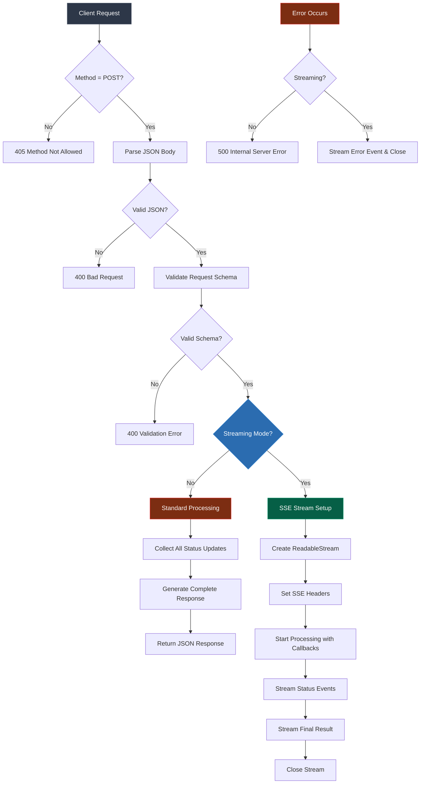

# Chat Endpoint Documentation

## Table of Contents

- [Overview](#overview)
- [Architecture](#architecture)
- [Flow Diagram](#flow-diagram)
- [Design Patterns](#design-patterns)
- [Request/Response Structure](#requestresponse-structure)
- [Error Handling](#error-handling)
- [Usage Guide](#usage-guide)
- [Frontend Integration](#frontend-integration)

## Overview

The chat endpoint provides AI-powered conversational capabilities with support for both synchronous and real-time streaming responses. It implements Server-Sent Events (SSE) for live status updates during query processing.

**Endpoint:** `POST /netlify/functions/chat`

**Response Modes:**

- **Standard Mode**: Complete response after processing
- **Streaming Mode**: Real-time updates via Server-Sent Events

## Architecture

The chat endpoint follows a layered architecture with clear separation of concerns:

```
┌─────────────────────────────────────────────────────────┐
│                    HTTP Handler Layer                   │
│  ┌─────────────────┐    ┌─────────────────────────────┐ │
│  │ Request Router  │────│ Validation Middleware       │ │
│  └─────────────────┘    └─────────────────────────────┘ │
└─────────────────────────────────────────────────────────┘
                              │
                              ▼
┌─────────────────────────────────────────────────────────┐
│                 Processing Strategy Layer               │
│  ┌─────────────────┐    ┌─────────────────────────────┐ │
│  │ Standard Mode   │    │ Streaming Mode (SSE)       │ │
│  │ Handler         │    │ Handler                     │ │
│  └─────────────────┘    └─────────────────────────────┘ │
└─────────────────────────────────────────────────────────┘
                              │
                              ▼
┌─────────────────────────────────────────────────────────┐
│                    Service Layer                        │
│  ┌─────────────────┐    ┌─────────────────────────────┐ │
│  │ Chat Service    │────│ Status Tracking             │ │
│  │ (generateAnswer)│    │ (Observer Pattern)          │ │
│  └─────────────────┘    └─────────────────────────────┘ │
└─────────────────────────────────────────────────────────┘
```

## Flow Diagram



## Design Patterns

### 1. Strategy Pattern

- **Context**: Request processing mode selection
- **Strategies**: Standard processing vs. SSE streaming
- **Implementation**: Route-based strategy selection based on `streaming` flag

### 2. Observer Pattern

- **Subject**: Chat processing service
- **Observers**: Status update callbacks
- **Usage**: Real-time status notifications during query processing

### 3. Template Method Pattern

- **Abstract Flow**: Request → Validate → Process → Respond
- **Variations**: Response formatting (JSON vs. SSE events)

### 4. Chain of Responsibility

- **Handlers**: Method validation → JSON parsing → Schema validation → Processing
- **Early Exit**: Each handler can terminate the chain on failure

## Request/Response Structure

### Request Schema

```typescript
{
  query: string;        // Required: User's chat query
  streaming?: boolean;  // Optional: Enable SSE streaming
}
```

### Standard Response

```typescript
{
  answer: string;
  steps: ChatStatus[];  // Array of processing steps
  metadata?: object;    // Additional response metadata
}
```

### SSE Event Types

```typescript
// Status Update Event
{
  type: "status",
  status: {
    step: string;
    description: string;
    status: "in-progress" | "completed" | "error";
    timestamp: string;
  }
}

// Final Result Event
{
  type: "final",
  result: ChatResponse
}

// Error Event
{
  type: "error",
  error: string
}
```

## Error Handling

| Error Type        | Status Code | Response   | SSE Behavior        |
| ----------------- | ----------- | ---------- | ------------------- |
| Invalid Method    | 405         | Plain text | N/A                 |
| Invalid JSON      | 400         | Plain text | N/A                 |
| Schema Validation | 400         | Plain text | N/A                 |
| Processing Error  | 500         | Plain text | Error event + close |

## Usage Guide

### Standard Request

```bash
curl -X POST https://your-domain.netlify.app/.netlify/functions/chat \
  -H "Content-Type: application/json" \
  -d '{"query": "What are the best restaurants in San Francisco?"}'
```

### Streaming Request

```bash
curl -X POST https://your-domain.netlify.app/.netlify/functions/chat \
  -H "Content-Type: application/json" \
  -d '{"query": "Plan a 3-day trip to SF", "streaming": true}'
```

## Frontend Integration

### Standard Mode (Fetch API)

```javascript
async function sendChatMessage(query) {
  try {
    const response = await fetch("/.netlify/functions/chat", {
      method: "POST",
      headers: {
        "Content-Type": "application/json",
      },
      body: JSON.stringify({ query }),
    });

    if (!response.ok) {
      throw new Error(`HTTP error! status: ${response.status}`);
    }

    const result = await response.json();
    return result;
  } catch (error) {
    console.error("Chat request failed:", error);
    throw error;
  }
}

// Usage
sendChatMessage("What's the weather like?").then((response) => {
  console.log("Answer:", response.answer);
  console.log("Processing steps:", response.steps);
});
```

### Streaming Mode (Server-Sent Events)

```javascript
function sendStreamingChatMessage(query, onStatus, onComplete, onError) {
  const eventSource = new EventSource("/.netlify/functions/chat", {
    method: "POST",
    headers: {
      "Content-Type": "application/json",
    },
    body: JSON.stringify({
      query,
      streaming: true,
    }),
  });

  eventSource.onmessage = (event) => {
    try {
      const data = JSON.parse(event.data);

      switch (data.type) {
        case "status":
          onStatus(data.status);
          break;

        case "final":
          onComplete(data.result);
          eventSource.close();
          break;

        case "error":
          onError(new Error(data.error));
          eventSource.close();
          break;
      }
    } catch (parseError) {
      onError(parseError);
      eventSource.close();
    }
  };

  eventSource.onerror = (error) => {
    onError(error);
    eventSource.close();
  };

  // Return function to manually close the connection
  return () => eventSource.close();
}

// Usage
const closeConnection = sendStreamingChatMessage(
  "Plan my San Francisco trip",

  // Status updates
  (status) => {
    console.log(`Step: ${status.step} - ${status.description}`);
    updateProgressUI(status);
  },

  // Final result
  (result) => {
    console.log("Final answer:", result.answer);
    displayFinalResult(result);
  },

  // Error handling
  (error) => {
    console.error("Streaming error:", error);
    showErrorMessage(error.message);
  }
);

// Optional: Close connection manually
// closeConnection();
```

### React Hook Example

```javascript
import { useState, useEffect, useRef } from "react";

function useChatStream() {
  const [status, setStatus] = useState(null);
  const [result, setResult] = useState(null);
  const [error, setError] = useState(null);
  const [isLoading, setIsLoading] = useState(false);
  const eventSourceRef = useRef(null);

  const sendMessage = (query) => {
    setIsLoading(true);
    setError(null);
    setResult(null);

    const closeConnection = sendStreamingChatMessage(
      query,
      (statusUpdate) => setStatus(statusUpdate),
      (finalResult) => {
        setResult(finalResult);
        setIsLoading(false);
      },
      (err) => {
        setError(err);
        setIsLoading(false);
      }
    );

    eventSourceRef.current = closeConnection;
  };

  const cancelRequest = () => {
    if (eventSourceRef.current) {
      eventSourceRef.current();
      setIsLoading(false);
    }
  };

  useEffect(() => {
    return () => {
      if (eventSourceRef.current) {
        eventSourceRef.current();
      }
    };
  }, []);

  return {
    sendMessage,
    cancelRequest,
    status,
    result,
    error,
    isLoading,
  };
}

// Component usage
function ChatComponent() {
  const { sendMessage, cancelRequest, status, result, error, isLoading } =
    useChatStream();

  return (
    <div>
      {status && <div>Status: {status.description}</div>}
      {result && <div>Answer: {result.answer}</div>}
      {error && <div>Error: {error.message}</div>}
      {isLoading && <button onClick={cancelRequest}>Cancel</button>}
    </div>
  );
}
```

### Best Practices

1. **Connection Management**: Always close SSE connections when components unmount
2. **Error Handling**: Implement robust error handling for both network and parsing errors
3. **UI Updates**: Use status updates to show progress indicators
4. **Timeouts**: Consider implementing connection timeouts for long-running requests
5. **Retry Logic**: Implement exponential backoff for failed connections
6. **Memory Management**: Clean up event listeners and close connections properly
