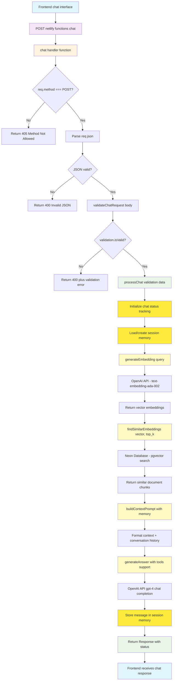

# RAG Architecture Documentation

[Build RAG Application with Neon, Netlify, and OpenAI Guide](https://developers.netlify.com/guides/build-rag-application-with-neon-netlify-openai/)

## Overview

This document outlines the Retrieval-Augmented Generation (RAG) architecture implemented in the AdventureCue project. The system uses a composable, modular approach to handle vector embeddings, similarity search, and AI-generated responses.

## Key Terminology

- **Embed**: Generate vector embeddings from text using OpenAI's embedding model
- **Ingest**: Complete pipeline that chunks text, generates embeddings, and stores them in the database
- **Query**: Search for similar content and generate AI responses using retrieved context

## Available Endpoints

- **`/.netlify/functions/query`** - Semantic search and response generation
- **`/.netlify/functions/chat`** - Query with real-time status updates
- **`/.netlify/functions/ingest`** - Text ingestion through web UI
- **CLI ingestion** - Bulk file processing via `tsx bin/ingest.ts`

## RAG Pipeline Components

### 1. Retrieval Phase

Converts user queries into vector embeddings and searches for similar content in the database using PostgreSQL + pgvector.

### 2. Augmentation Phase

Prepares and formats retrieved documents to provide context for the generation model with relevance ranking.

### 3. Generation Phase

Uses the augmented context to produce AI-generated responses via OpenAI's chat completion with context-aware prompting.

## Directory Structure

The application follows a layered architecture pattern, with clear separation between presentation, API, business logic, and data layers:

```
adventurecue/
├── 📱 PRESENTATION LAYER (Frontend)
│   ├── src/
│   │   ├── app/                 # Next.js app router
│   │   │   ├── layout.tsx       # Root layout
│   │   │   └── page.tsx         # Main page component
│   │   ├── components/          # React components
│   │   │   ├── ingest.tsx       # Ingestion UI component
│   │   │   └── query.tsx        # Query UI component
│   │   └── lib/                 # Frontend utilities
│   └── public/                  # Static assets
│
├── 🌐 API LAYER (Backend Endpoints)
│   └── netlify/functions/
│       ├── ingest.ts            # Text ingestion endpoint
│       ├── query.ts             # Semantic search endpoint
│       └── chat.ts              # Chat with memory endpoint
│
├── ⚙️ CORE LAYER (Business Logic) - Agentic RAG Pipeline
│   └── netlify/services/
│       ├── chat/                # 🤖 GENERATION & ORCHESTRATION
│       │   ├── chat.ts          # → Core conversation engine (Generation Agent)
│       │   ├── chat-status-tracking.ts  # → Real-time agent status (Monitoring)
│       │   ├── chat-status-examples.ts  # → Status message templates
│       │   ├── helpers.ts       # → Conversation utilities
│       │   ├── tools.ts         # → Tool execution framework (Agentic Tools)
│       │   ├── types.ts         # → Chat & agent type definitions
│       │   └── index.ts         # → Service exports
│       ├── embedding/           # 🔍 RETRIEVAL PHASE
│       │   ├── embedding.ts     # → Vector encoding & similarity search (Retrieval Agent)
│       │   ├── types.ts         # → Embedding type definitions
│       │   └── index.ts         # → Service exports
│       ├── ingestion/           # 📥 KNOWLEDGE INGESTION
│       │   ├── ingestion.ts     # → Document processing & knowledge base building
│       │   ├── types.ts         # → Ingestion pipeline types
│       │   └── index.ts         # → Service exports
│       ├── memory/              # 🧠 CONVERSATIONAL MEMORY
│       │   ├── types.ts         # → Session & message schemas (Memory Agent)
│       │   ├── utils.ts         # → Memory management utilities
│       │   └── index.ts         # → Service exports
│       ├── query/               # 🎯 QUERY ORCHESTRATION
│       │   ├── query.ts         # → RAG pipeline orchestrator (Query Agent)
│       │   ├── types.ts         # → Query processing types
│       │   └── index.ts         # → Service exports
│       └── index.ts             # Core layer exports
│
├── 🔌 INTEGRATION LAYER (External Services)
│   ├── netlify/clients/         # External service clients
│   └── netlify/utils/           # Shared utility functions
│
├── 💾 DATA LAYER (Database & Storage)
│   ├── db/
│   │   ├── index.ts             # Database connection & setup
│   │   └── schema.ts            # Schema definitions (embeddings + chat)
│   ├── migrations/              # Database migrations
│   │   ├── 0000_enable-pgvector.sql
│   │   ├── 0001_create-tables.sql
│   │   ├── 0002_create-ivfflat-index.sql
│   │   ├── 0003_ancient_blue_blade.sql  # Chat memory tables
│   │   └── meta/                # Migration metadata
│   └── data/                    # Source data files
│
├── 🛠️ TOOLING LAYER (Development & Operations)
│   ├── bin/
│   │   ├── ingest.ts            # CLI ingestion script
│   │   └── verify-chat-tables.ts # Database verification utility
│   ├── docs/                    # Documentation
│   └── examples/                # Example code & usage
```

## Chat Request Flow Diagram

The following diagram shows the complete flow from frontend request to backend response through the chat endpoint with memory and real-time status updates:



## Agentic RAG Architecture Flow

### Chat Processing

Frontend → API Layer → Chat Services → Memory & Tools → External APIs → Response

### Service Orchestration

- **Chat Agent** orchestrates the conversation and RAG pipeline
- **Retrieval Agent** handles vector search operations
- **Generation Agent** manages responses with tool execution
- **Memory Agent** maintains session context and conversation history
- **Status Tracking** provides real-time operation updates

## Architecture Benefits

- **Composability**: Modular services with single responsibilities
- **Scalability**: Independent service scaling and resource management
- **Maintainability**: Clear separation of concerns with TypeScript safety
- **Extensibility**: Easy integration of new RAG components and agentic tools

## Data Ingestion Architecture

### CLI-Based Ingestion

Bulk file processing with rate limiting and error resilience for building the knowledge base.

### UI-Based Ingestion

Real-time text ingestion through web interface for dynamic content addition.

### Processing Pipeline

Environment validation → File processing → Text chunking → Vector embedding → Database storage

## Technology Stack

- **Frontend**: Next.js with React components
- **Backend**: Netlify Functions with TypeScript
- **Database**: PostgreSQL with pgvector extension
- **AI Services**: OpenAI (embeddings + chat completion)
- **ORM**: Drizzle with type-safe migrations
