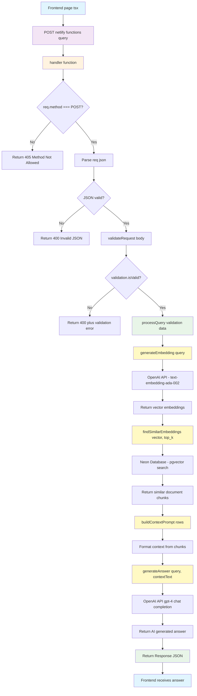
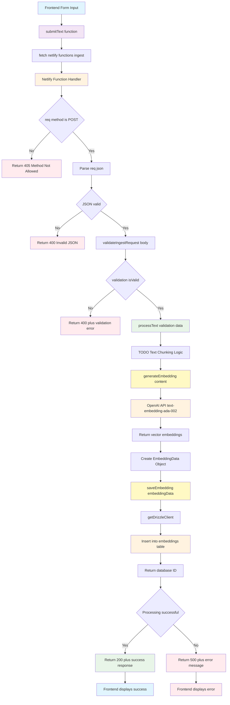

# RAG Architecture Documentation

[Build RAG Application with Neon, Netlify, and OpenAI Guide](https://developers.netlify.com/guides/build-rag-application-with-neon-netlify-openai/)

## Overview

This document outlines the Retrieval-Augmented Generation (RAG) architecture implemented in the AdventureCue project. The system uses a composable, modular approach to handle vector embeddings, similarity search, and AI-generated responses.

## Key Terminology

- **Embed**: Generate vector embeddings from text using OpenAI's embedding model
- **Ingest**: Complete pipeline that chunks text, generates embeddings, and stores them in the database
- **Query**: Search for similar content and generate AI responses using retrieved context

## Available Endpoints

- **`/.netlify/functions/query`** - Semantic search and response generation
- **`/.netlify/functions/ingest`** - Text ingestion through web UI
- **CLI ingestion** - Bulk file processing via `tsx bin/ingest.ts`

## RAG Pipeline Components

### 1. Retrieval Phase

The retrieval phase converts user queries into vector embeddings and searches for similar content in the database.

**Components:**

- `generateEmbedding()` - Converts user query to vector using OpenAI's embedding model
- `findSimilarEmbeddings()` - Performs vector similarity search using PostgreSQL + pgvector

### 2. Augmentation Phase

The augmentation phase prepares and formats retrieved documents to provide context for the generation model.

**Components:**

- `buildContextPrompt()` - Formats retrieved documents into structured context
- Context preparation with relevance ranking

### 3. Generation Phase

The generation phase uses the augmented context to produce AI-generated responses.

**Components:**

- `generateAnswer()` - Uses OpenAI's chat completion with context-aware prompting

## Directory Structure

```
netlify/
├── functions/
│   ├── query.ts                    # Query endpoint - semantic search & response generation
│   ├── ingest.ts                   # Ingestion endpoint - text processing & embedding storage
│   └── search.ts                   # Additional search endpoints - TBD
├── lib/
│   ├── clients/
│   │   ├── openai.ts              # OpenAI client initialization
│   │   ├── database.ts            # Neon database client + Drizzle
│   │   └── index.ts               # Export all clients
│   ├── services/
│   │   ├── embedding.ts           # generateEmbedding, findSimilarEmbeddings
│   │   ├── chat.ts                # generateAnswer, buildContextPrompt
│   │   ├── query.ts               # processQuery orchestration
│   │   ├── ingestion.ts           # saveEmbedding, processFile, processText, ingestFiles
│   │   └── index.ts               # Export all services
│   ├── types/
│   │   ├── query.ts               # QueryRequest, EmbeddingRow interfaces
│   │   ├── embedding.ts           # Embedding-related types
│   │   ├── ingestion.ts           # FileData, EmbeddingData, ProcessingResult
│   │   └── index.ts               # Export all types
│   ├── utils/
│   │   ├── validation.ts          # validateRequest, other validators
│   │   ├── response.ts            # Response helpers
│   │   ├── file-system.ts         # walkDirectory, readFileData
│   │   ├── rate-limiting.ts       # rateLimitDelay, createRateLimiter
│   │   └── index.ts               # Export all utils
│   └── config/
│       └── environment.ts         # Environment variable handling
├── shared/
│   ├── middleware/
│   │   ├── cors.ts                # CORS middleware
│   │   └── auth.ts                # Authentication middleware
│   └── constants/
│       └── models.ts              # AI model constants
├── bin/
│   ├── ingest.ts                  # CLI ingestion script
│   └── migrate.ts                 # Database migration script
└── db/
    ├── index.ts                   # Database connection and setup
    ├── schema.ts                  # Database schema definitions
    └── migrations/                # Database migration files
```

## Client Initialization Pattern

### Singleton Pattern for Shared Clients

**OpenAI Client (`netlify/lib/clients/openai.ts`):**

**Database Client (`netlify/lib/clients/database.ts`):**

## Utility Functions

**File System Utilities (`netlify/lib/utils/file-system.ts`)**

**Rate Limiting Utilities (`netlify/lib/utils/rate-limiting.ts`)**

## Type Definitions

**Ingestion Types (`netlify/lib/types/ingestion.ts`)**

## Service Layer Implementation

**Embedding Service (`netlify/lib/services/embedding.ts`)**

**Chat Service (`netlify/lib/services/chat.ts`)**

**Ingestion Service (`netlify/lib/services/ingestion.ts`)**

## CLI Scripts

**Ingestion CLI (`bin/ingest.ts`)**

## Complete RAG Flow

```typescript
// Current implementation in processQuery()
const processQuery = async (queryData: QueryRequest): Promise<string> => {
  const { query, top_k = 5 } = queryData;

  // 1. RETRIEVAL: Convert query to embedding
  const vector = await generateEmbedding(query);

  // 2. RETRIEVAL: Find similar documents
  const rows = await findSimilarEmbeddings(vector, top_k);

  // 3. AUGMENTATION: Build context from retrieved docs
  const contextText = buildContextPrompt(rows);

  // 4. GENERATION: Generate answer with context
  const answer = await generateAnswer(query, contextText);

  return answer;
};
```

## Query Request Flow Diagram

The following diagram shows the complete flow from frontend request to backend response through each composable function:



### Query Flow Description:

#### **1. Frontend Layer**

```typescript
// page.tsx
queryRAG({ query: "user question" })
  ↓
fetch("/.netlify/functions/query", {
  method: "POST",
  body: JSON.stringify({ query })
})
```

#### **2. Netlify Function Handler**

```typescript
// netlify/functions/query.ts
handler(req: Request) {
  // 1. Method validation
  // 2. JSON parsing
  // 3. Request validation
  // 4. Process query
  // 5. Return response
}
```

#### **3. RAG Pipeline (Composable Functions)**

```typescript
// services/query.ts
processQuery(queryData) {
  // 1. generateEmbedding(query)     → OpenAI Embeddings API
  // 2. findSimilarEmbeddings(vector) → Neon Database Query
  // 3. buildContextPrompt(rows)      → Format context
  // 4. generateAnswer(query, context) → OpenAI Chat API
}
```

#### **4. External Services**

- **OpenAI Embeddings**: Convert text to vectors using `text-embedding-ada-002`
- **Neon Database**: Vector similarity search with pgvector extension
- **OpenAI Chat**: Generate contextual responses using `gpt-4.1`

#### **5. Error Handling Points**

- Method validation (405 Method Not Allowed)
- JSON parsing (400 Invalid JSON)
- Request validation (400 + validation error)
- Processing errors (500 Internal Server Error)

This flow demonstrates how the composable architecture creates clean separation between HTTP handling, business logic, and external service calls, making each component independently testable and maintainable.

## Ingestion Flow Diagram

The following diagram shows the complete ingestion flow from CLI execution through each composable function:

```mermaid
graph TD
    A[CLI Command tsx bin ingest ts data] --> B[bin ingest ts Entry Point]
    B --> C[Environment Validation]

    C --> D{OPENAI_KEY exists}
    D -->|No| E[Exit with error]
    D -->|Yes| F{DATABASE_URL exists}
    F -->|No| E
    F -->|Yes| G[Create IngestionConfig]

    G --> H[main function]
    H --> I[ingestFiles config]

    I --> J[Log Configuration Info]
    J --> K[processDirectory config]

    K --> L[walkDirectory Generator]
    L --> M{For each file found}

    M --> N[rateLimitDelay 200ms]
    N --> O[processFile filePath targetDir]

    O --> P[readFileData filePath targetDir]
    P --> Q[Read file content metadata]

    Q --> R[TODO Text Chunking Logic]
    R --> S[generateEmbedding content]
    S --> T[getOpenAIClient]
    T --> U[OpenAI API Call text-embedding-ada-002]
    U --> V[Return vector embeddings]

    V --> W[Create EmbeddingData Object]
    W --> X[saveEmbedding embeddingData]
    X --> Y[getDrizzleClient]
    Y --> Z[Format vector string]
    Z --> AA[Insert into embeddings table]
    AA --> BB[Return database ID]

    BB --> CC{Processing successful}
    CC -->|Yes| DD[Create success ProcessingResult]
    CC -->|No| EE[Create error ProcessingResult]

    DD --> FF[Log Success with ID]
    EE --> GG[Log Error message]

    FF --> HH[Add result to array]
    GG --> HH
    HH --> II{More files to process}
    II -->|Yes| M
    II -->|No| JJ[Return ProcessingResult array]

    JJ --> KK[Filter successful results]
    KK --> LL[Filter failed results]
    LL --> MM[Log final statistics]
    MM --> NN[Return results to CLI]
    NN --> OO[CLI process completes]

    style A fill:#e1f5fe
    style B fill:#f3e5f5
    style I fill:#e8f5e8
    style K fill:#fff3e0
    style O fill:#fff9c4
    style S fill:#ffeb3b
    style X fill:#ffeb3b
    style OO fill:#e1f5fe

    classDef error fill:#ffebee
    classDef success fill:#e8f5e8
    classDef external fill:#fff3e0

    class E,EE,GG error
    class DD,FF success
    class U,AA external
```



### Ingestion Flow Description:

#### **1. CLI Entry Point**

```bash
# Command execution
tsx bin/ingest.ts ./data
```

```typescript
// bin/ingest.ts
async function main() {
  const targetDir = process.argv[2] || "./data";
  const config: IngestionConfig = {
    targetDir,
    fileExtensions: [".md", ".txt"],
    rateLimitMs: 200,
    batchSize: 10,
  };
  await ingestFiles(config);
}
```

#### **2. Main Orchestration Flow**

```typescript
// netlify/services/ingestion.ts
export const ingestFiles = async (config: IngestionConfig) => {
  // 1. Log configuration
  // 2. Process all files in directory
  // 3. Aggregate and report results
};
```

#### **3. Directory Processing Pipeline**

```typescript
export const processDirectory = async (config: IngestionConfig) => {
  // 1. walkDirectory() - Find all matching files
  // 2. For each file:
  //    - rateLimitDelay() - Prevent API rate limits
  //    - processFile() - Complete file processing
  //    - Log individual results
};
```

#### **4. Individual File Processing**

```typescript
export const processFile = async (filePath: string, targetDir: string) => {
  // 1. readFileData() - Read file content + metadata
  // 2. TODO: Text chunking logic
  // 3. generateEmbedding() - OpenAI API call
  // 4. saveEmbedding() - Database storage
  // 5. Return ProcessingResult
};
```

#### **5. Core Operations**

- **File System**: `readFileData()` → file content + relative path
- **AI Processing**: `generateEmbedding()` → OpenAI embeddings API
- **Database**: `saveEmbedding()` → Drizzle ORM → PostgreSQL with pgvector

#### **6. Error Handling Strategy**

- Environment validation at startup
- Individual file processing wrapped in try/catch
- Failed files don't stop the entire process
- Comprehensive logging for debugging

#### **7. Rate Limiting & Performance**

- 200ms delay between each file processing
- Configurable through `IngestionConfig`
- Prevents OpenAI API rate limit violations

#### **8. Result Aggregation**

```typescript
const successful = results.filter((r) => r.success);
const failed = results.filter((r) => !r.success);

console.log(`Ingestion complete:`);
console.log(`- Successful: ${successful.length}`);
console.log(`- Failed: ${failed.length}`);
console.log(`- Total: ${results.length}`);
```

This ingestion flow shows how the system processes files in a robust, composable way while maintaining error resilience and performance controls. The modular design makes it easy to add features like text chunking or different embedding models.

## UI-Based Ingestion Flow

The system also supports text ingestion through a web UI via the `/netlify/functions/ingest` endpoint. This provides an alternative to CLI-based ingestion for dynamic content:



### UI Ingestion Flow Description:

#### **1. Frontend Integration**

```typescript
// src/lib/api/rag.ts
export const ingestText = async (
  data: IngestRequest
): Promise<IngestResponse> => {
  const response = await fetch("/.netlify/functions/ingest", {
    method: "POST",
    headers: { "Content-Type": "application/json" },
    body: JSON.stringify(data),
  });

  if (!response.ok) {
    throw new Error(`Failed to ingest text: ${response.statusText}`);
  }

  return response.json();
};
```

#### **2. Netlify Function Handler**

```typescript
// netlify/functions/ingest.ts
export const handler = async (req: Request): Promise<Response> => {
  // 1. Method validation (POST only)
  // 2. JSON parsing and validation
  // 3. Process text through processText()
  // 4. Return structured response
};
```

#### **3. Text Processing Pipeline**

```typescript
// netlify/services/ingestion.ts
export const processText = async (
  data: IngestTextData
): Promise<ProcessingResult> => {
  // 1. TODO: Text chunking (split long text)
  // 2. generateEmbedding(content) - OpenAI API
  // 3. saveEmbedding(embeddingData) - Database storage
  // 4. Return success/failure result
};
```

#### **4. Key Differences from CLI Ingestion**

| Aspect               | CLI Ingestion      | UI Ingestion                |
| -------------------- | ------------------ | --------------------------- |
| **Input Source**     | File system        | HTTP request body           |
| **Batch Processing** | Multiple files     | Single text input           |
| **Rate Limiting**    | Built-in delays    | Handled by HTTP concurrency |
| **Error Handling**   | Continue on errors | Return immediate error      |
| **User Feedback**    | Console logs       | HTTP response               |
| **Use Case**         | Bulk data import   | Dynamic content addition    |

#### **5. Request/Response Format**

**Request:**

```typescript
interface IngestRequest {
  content: string;
  source?: string;
  metadata?: Record<string, any>;
}
```

**Response:**

```typescript
interface IngestResponse {
  success: boolean;
  id?: number;
  message: string;
  error?: string;
}
```

### Endpoint Usage Examples:

#### **Success Case:**

```bash
curl -X POST /.netlify/functions/ingest \
  -H "Content-Type: application/json" \
  -d '{"content": "Your text content here", "source": "manual_input"}'

# Response:
{
  "success": true,
  "id": 123,
  "message": "Text successfully ingested and embedded"
}
```

#### **Error Case:**

```bash
curl -X POST /.netlify/functions/ingest \
  -H "Content-Type: application/json" \
  -d '{"content": ""}'

# Response:
{
  "success": false,
  "message": "Validation failed",
  "error": "Content is required and cannot be empty"
}
```

This dual approach provides flexibility for both bulk file ingestion (CLI) and dynamic content addition (UI), while maintaining the same composable architecture and processing pipeline.

## Key Improvements

### 1. **Single Initialization**

- The `sql` and `openai` clients are initialized once at the module level and reused by all functions

### 2. **Composable Functions**

- **`generateEmbedding()`** - Handles OpenAI embedding generation
- **`findSimilarEmbeddings()`** - Handles database queries for similar vectors
- **`buildContextPrompt()`** - Formats context text from database results
- **`generateAnswer()`** - Handles OpenAI chat completion
- **`processQuery()`** - Orchestrates the entire query pipeline
- **`validateRequest()`** - Handles input validation

### 3. **Type Safety**

- Added proper TypeScript interfaces (`QueryRequest`, `EmbeddingRow`)
- Replaced `any` types with proper type annotations
- Added type assertions where needed

### 4. **Separation of Concerns**

- Each function has a single responsibility
- Business logic is separated from HTTP handling
- Easy to test individual components
- Easy to reuse functions in other contexts

### 5. **Benefits of This Structure**

- **Testable**: Each function can be unit tested independently
- **Reusable**: Functions can be imported and used in other files
- **Maintainable**: Changes to one aspect don't affect others
- **Extensible**: Easy to add new features like different embedding models or database operations

## Benefits of This Architecture

### 1. **Composability**

- Each function has a single responsibility
- Easy to swap components (different embedding models, LLMs, etc.)
- Services can be reused across different endpoints

### 2. **Testability**

- Each service can be unit tested independently
- Mock clients for testing without external dependencies
- Clear separation of concerns

### 3. **Scalability**

- Singleton pattern ensures efficient resource usage
- Easy to add new RAG components (reranking, preprocessing, etc.)
- Can scale individual services independently

### 4. **Maintainability**

- Clear directory structure maps to RAG concepts
- Type safety with TypeScript interfaces
- Centralized client management

## Future Enhancements

### Additional RAG Components to Consider:

```
services/
├── preprocessing.ts    # Text chunking, cleaning
├── reranking.ts       # Re-rank retrieved results
├── postprocessing.ts  # Filter/validate generated responses
├── evaluation.ts      # RAG quality metrics
└── hybrid-search.ts   # Combine keyword + semantic search
```

### Advanced Features:

- **Hybrid Search**: Combine keyword and semantic search
- **Re-ranking**: Improve relevance of retrieved documents
- **Caching**: Cache embeddings and responses
- **Streaming**: Stream responses for better UX
- **Evaluation**: Metrics for RAG quality assessment

## Environment Variables

```bash
OPENAI_API_KEY=your_openai_api_key
NETLIFY_DATABASE_URL=your_neon_database_url
```

## Database Schema

```sql
-- Enable pgvector extension
CREATE EXTENSION IF NOT EXISTS vector;

-- Embeddings table
CREATE TABLE embeddings (
  id SERIAL PRIMARY KEY,
  content TEXT NOT NULL,
  embedding vector(1536) NOT NULL -- OpenAI ada-002 dimensions
);

-- Create index for similarity search
CREATE INDEX ON embeddings USING ivfflat (embedding vector_l2_ops);
```

This architecture provides a solid foundation for a production-ready RAG system with clean separation of concerns and excellent maintainability.
