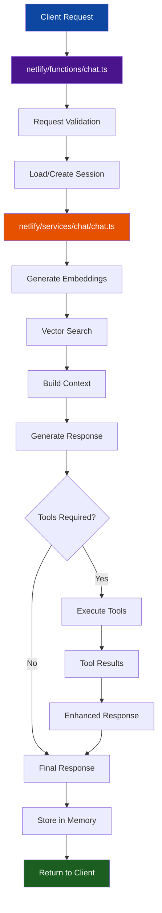
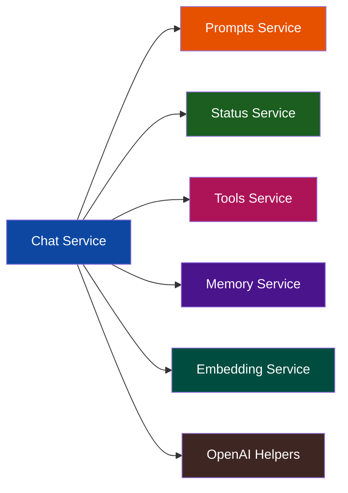

# Chat Service & Endpoint Documentation

## Overview

The chat system implements an Agentic RAG (Retrieval-Augmented Generation) pipeline that combines conversational AI with semantic search, tool execution, and memory persistence. It provides both a serverless API endpoint and a modular service architecture for managing chat conversations.

## Architecture Components

### 🌐 API Layer: `netlify/functions/chat.ts`

Serverless function that handles HTTP requests and orchestrates the chat pipeline.

**Responsibilities:**

- Request validation and parsing
- Session management coordination
- Response formatting and error handling
- Real-time status streaming (Server-Sent Events)

### ⚙️ Service Layer: `netlify/services/chat/`

Core business logic for conversation management and response generation.

**Components:**

- `chat.ts` - Main conversation orchestrator
- `helpers.ts` - OpenAI API integration utilities
- `types.ts` - TypeScript definitions for chat operations

## Chat Request Flow



## Service Dependencies

The chat service integrates with multiple other services in the Agentic RAG pipeline:



## Key Features

### 🔄 Conversation Orchestration

- **Session Management**: Persistent conversation context across requests
- **Memory Integration**: Automatic storage and retrieval of conversation history
- **Context Building**: Intelligent combination of user query, retrieved documents, and memory

### 🛠️ Tool Execution

- **Dynamic Tool Selection**: AI determines when external tools are needed
- **Status Tracking**: Real-time progress updates during tool execution
- **Error Recovery**: Graceful handling of tool failures

### 📊 Real-time Status

- **Progress Monitoring**: Step-by-step execution feedback
- **Live Updates**: Server-Sent Events for real-time client notifications
- **Detailed Logging**: Comprehensive execution traces

## API Endpoint Specification

### `POST /netlify/functions/chat`

**Request Format:**

```typescript
{
  message: string;          // User's message
  sessionId?: string;       // Optional session identifier
  useStreaming?: boolean;   // Enable real-time status updates
}
```

**Response Format:**

```typescript
{
  success: boolean;
  response: string;         // AI-generated response
  sessionId: string;        // Session identifier for continuity
  steps?: ChatStatus[];     // Execution status steps
  toolsUsed?: string[];     // List of tools that were executed
  executionTimeMs: number;  // Total processing time
}
```

**Status Streaming (SSE):**

```typescript
{
  step: number;
  description: string;
  status: "pending" | "executing" | "completed" | "failed";
  timestamp: number;
  data?: any;              // Optional additional context
}
```

## Processing Pipeline

### 1. **Request Handling**

- Validate incoming request structure
- Parse JSON payload and extract parameters
- Initialize status tracking system

### 2. **Session Management**

- Load existing session or create new one
- Retrieve conversation history from memory
- Generate unique session identifier if needed

### 3. **Query Processing**

- Generate vector embeddings for user query
- Perform semantic search against knowledge base
- Build context from retrieved documents

### 4. **Response Generation**

- Combine query, context, and conversation history
- Call OpenAI with system prompts and tools
- Handle tool execution if required by AI

### 5. **Memory Persistence**

- Store user message and AI response
- Update session metadata and context
- Maintain conversation continuity

## Error Handling

### Graceful Degradation

- **API Failures**: Fallback responses when external services fail
- **Tool Errors**: Continue conversation even if tools fail
- **Memory Issues**: Temporary session handling if persistence fails

### Status Reporting

- **Real-time Updates**: Immediate notification of failures
- **Detailed Context**: Error messages with actionable information
- **Recovery Options**: Suggestions for retrying or alternative approaches

## Performance Considerations

### Optimization Strategies

- **Parallel Processing**: Concurrent execution of independent operations
- **Response Streaming**: Immediate status feedback during long operations
- **Context Caching**: Efficient reuse of embedding and context data

### Scalability Features

- **Stateless Design**: Each request is self-contained
- **Service Modularity**: Independent scaling of different components
- **Error Isolation**: Failures in one service don't cascade

## Integration Points

### External Services

- **OpenAI API**: GPT-4 for response generation and embeddings
- **Neon Database**: Vector storage and similarity search
- **Tool APIs**: Dynamic integration with external services

### Internal Services

- **Memory Service**: Session and message persistence
- **Embedding Service**: Vector generation and search
- **Status Service**: Real-time progress tracking
- **Tools Service**: External API orchestration

## Security & Validation

### Request Security

- **Input Validation**: Comprehensive request structure validation
- **Rate Limiting**: Protection against abuse and excessive usage
- **Error Sanitization**: Safe error messages without sensitive data

### Data Protection

- **Session Isolation**: Secure separation of user conversations
- **Memory Encryption**: Protected storage of conversation history
- **API Key Management**: Secure handling of external service credentials
