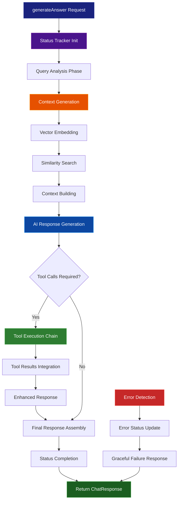

# Chat Service Documentation

## Table of Contents

- [Overview](#overview)
- [Architecture](#architecture)
- [Service Flow Diagram](#service-flow-diagram)
- [Design Patterns](#design-patterns)
- [Core Components](#core-components)
- [Integration Points](#integration-points)
- [Status Tracking](#status-tracking)
- [Error Handling](#error-handling)
- [Usage Examples](#usage-examples)

## Overview

The Chat Service is the core orchestrator of the Agentic RAG pipeline, responsible for generating AI-powered responses by coordinating multiple services including embeddings, tools, prompts, and status tracking.

**Location:** `netlify/services/chat/`

**Key Responsibilities:**

- AI response generation with GPT-4
- Context integration from embedding service
- Dynamic tool execution based on AI decisions
- Real-time status tracking and progress reporting
- Comprehensive error handling and recovery

## Architecture

The Chat Service follows a modular, service-oriented architecture:

```
┌─────────────────────────────────────────────────────────┐
│                    Chat Service Core                    │
│  ┌─────────────────┐    ┌─────────────────────────────┐ │
│  │ generateAnswer  │────│ Status Tracker             │ │
│  │ (Orchestrator)  │    │ (Observer Pattern)         │ │
│  └─────────────────┘    └─────────────────────────────┘ │
└─────────────────────────────────────────────────────────┘
                              │
                              ▼
┌─────────────────────────────────────────────────────────┐
│                 External Service Layer                  │
│  ┌─────────────┐ ┌─────────────┐ ┌─────────────────────┐ │
│  │ Embedding   │ │ Tools       │ │ Prompts & OpenAI    │ │
│  │ Service     │ │ Service     │ │ Integration         │ │
│  └─────────────┘ └─────────────┘ └─────────────────────┘ │
└─────────────────────────────────────────────────────────┘
```

## Service Flow Diagram



## Design Patterns

### 1. Facade Pattern

- **Implementation**: `generateAnswer` function
- **Purpose**: Provides simplified interface to complex RAG pipeline
- **Benefits**: Hides complexity, centralized coordination, easy integration

### 2. Observer Pattern

- **Implementation**: Status tracking with callback notifications
- **Purpose**: Real-time progress updates during processing
- **Benefits**: Decoupled monitoring, flexible notification strategies

### 3. Chain of Responsibility

- **Implementation**: Tool execution pipeline
- **Purpose**: Sequential processing of tool calls
- **Benefits**: Extensible tool system, dynamic execution flow

### 4. Strategy Pattern

- **Implementation**: Adaptive response generation
- **Purpose**: Context-aware AI behavior
- **Benefits**: Flexible response strategies, intelligent tool selection

### 5. Template Method Pattern

- **Implementation**: Consistent processing workflow
- **Purpose**: Standardized response generation steps
- **Benefits**: Predictable execution, maintainable pipeline

## Core Components

### Primary Function: `generateAnswer`

```typescript
generateAnswer(
  userQuery: string,
  similarEmbeddingContext: string,
  onStatusUpdate?: (status: ChatStatus) => void
): Promise<ChatResponse>
```

**Processing Pipeline:**

1. **Query Analysis** - Analyze user intent and context
2. **Context Integration** - Combine query with retrieved embeddings
3. **AI Generation** - Generate response using GPT-4
4. **Tool Execution** - Execute tools if required by AI
5. **Response Assembly** - Compile final response with metadata

### Response Structure: `ChatResponse`

```typescript
interface ChatResponse {
  success: boolean;
  response: string;
  steps: ChatStatus[];
  toolsUsed: string[];
  executionTimeMs: number;
}
```

### Status Tracking: `ChatStatus`

```typescript
interface ChatStatus {
  step: number;
  description: string;
  status: "pending" | "executing" | "completed" | "failed";
  timestamp: number;
  data?: any;
}
```

## Integration Points

### Service Dependencies

```typescript
// Core integrations
import { TRAVEL_ASSISTANT_SYSTEM_PROMPT } from "../prompts";
import { ChatStatusTracker, ChatStatusMessages } from "../status";
import { executeToolCall, openAITools } from "../tools";
import { callOpenAI } from "./helpers";
```

### External Service Coordination

| Service               | Purpose                  | Integration Point                |
| --------------------- | ------------------------ | -------------------------------- |
| **Embedding Service** | Context generation       | `generateContext()`              |
| **Tools Service**     | Dynamic tool execution   | `executeToolCall()`              |
| **Prompts Service**   | System prompt management | `TRAVEL_ASSISTANT_SYSTEM_PROMPT` |
| **Status Service**    | Progress tracking        | `ChatStatusTracker`              |
| **OpenAI Client**     | AI response generation   | `callOpenAI()`                   |

## Status Tracking

### Status Lifecycle

```
pending → executing → completed/failed
```

### Predefined Status Messages

- `ANALYZING_QUERY` - Initial query processing
- `GENERATING_RESPONSE` - AI response creation
- `EXECUTING_TOOLS` - Tool execution phase
- `FINALIZING_RESPONSE` - Response compilation
- `ERROR_OCCURRED` - Error handling

### Real-time Updates

```typescript
const tracker = new ChatStatusTracker(onStatusUpdate);
tracker.executing(1, ChatStatusMessages.ANALYZING_QUERY);
// Triggers callback: onStatusUpdate(status)
```

## Error Handling

### Graceful Degradation Strategy

```typescript
try {
  // Main processing pipeline
} catch (error) {
  status.failed(-1, ChatStatusMessages.ERROR_OCCURRED(String(error)));
  return {
    success: false,
    response: "I apologize, but I encountered an error...",
    steps: status.getSteps(),
    toolsUsed: tools,
    executionTimeMs: Date.now() - startTime,
  };
}
```

### Error Recovery Patterns

- **API Failures**: Informative fallback responses
- **Tool Errors**: Continue without failing entire conversation
- **Context Issues**: Generate response with available information
- **Timeout Handling**: Graceful termination with partial results

## Usage Examples

### Basic Response Generation

```typescript
import { generateAnswer } from "@/netlify/services/chat";
import { generateContext } from "@/netlify/services/embedding";

async function basicChatResponse(userQuery: string) {
  // Generate context from embeddings
  const context = await generateContext({
    query: userQuery,
    top_k: 5,
  });

  // Generate AI response
  const response = await generateAnswer(userQuery, context);

  console.log("Response:", response.response);
  console.log("Success:", response.success);
  console.log("Execution time:", response.executionTimeMs + "ms");

  return response;
}
```

### Real-time Status Tracking

```typescript
async function chatWithStatusUpdates(userQuery: string) {
  const context = await generateContext({ query: userQuery });

  const response = await generateAnswer(userQuery, context, (status) => {
    console.log(`[Step ${status.step}] ${status.description}`);
    console.log(`Status: ${status.status} at ${new Date(status.timestamp)}`);
  });

  console.log("Processing completed with", response.steps.length, "steps");
  return response;
}
```

### Error Handling with Fallback

```typescript
async function robustChatHandler(userQuery: string) {
  try {
    const context = await generateContext({ query: userQuery });
    return await generateAnswer(userQuery, context);
  } catch (error) {
    console.error("Chat processing failed:", error);

    // Fallback response
    return {
      success: false,
      response: "I'm experiencing technical difficulties. Please try again.",
      steps: [],
      toolsUsed: [],
      executionTimeMs: 0,
    };
  }
}
```

### Tool Execution Monitoring

```typescript
async function monitorToolUsage(userQuery: string) {
  const context = await generateContext({ query: userQuery });

  const response = await generateAnswer(userQuery, context, (status) => {
    if (status.description.includes("tool")) {
      console.log("🔧 Tool execution detected:", status);
    }
  });

  if (response.toolsUsed.length > 0) {
    console.log("Tools executed:", response.toolsUsed);
    console.log("Enhanced response with tool data");
  }

  return response;
}
```

### Batch Processing

```typescript
async function processBatchQueries(queries: string[]) {
  const results = [];

  for (const query of queries) {
    try {
      const context = await generateContext({ query });
      const response = await generateAnswer(query, context);
      results.push({ query, success: true, response });
    } catch (error) {
      results.push({
        query,
        success: false,
        error: error.message,
      });
    }
  }

  return results;
}
```

### Performance Analysis

```typescript
async function analyzePerformance(userQuery: string) {
  const startTime = performance.now();
  const stepTimes: number[] = [];

  const response = await generateAnswer(
    await generateContext({ query: userQuery }),
    userQuery,
    (status) => {
      stepTimes.push(performance.now() - startTime);
      console.log(
        `Step ${status.step}: ${stepTimes[stepTimes.length - 1].toFixed(2)}ms`
      );
    }
  );

  console.log("Performance Summary:");
  console.log(`- Total time: ${response.executionTimeMs}ms`);
  console.log(`- Steps: ${response.steps.length}`);
  console.log(`- Tools used: ${response.toolsUsed.length}`);
  console.log(`- Success rate: ${response.success ? "100%" : "0%"}`);

  return response;
}
```

### Streaming Integration

```typescript
async function streamingChatResponse(
  userQuery: string,
  sendUpdate: (data: any) => void
) {
  const context = await generateContext({ query: userQuery });

  const response = await generateAnswer(userQuery, context, (status) => {
    // Send real-time status to client
    sendUpdate({
      type: "status",
      data: {
        step: status.step,
        description: status.description,
        status: status.status,
        timestamp: status.timestamp,
      },
    });
  });

  // Send final response
  sendUpdate({
    type: "final",
    data: response,
  });

  return response;
}
```

### Testing and Debugging

```typescript
async function debugChatService(userQuery: string) {
  console.log("🚀 Starting chat processing for:", userQuery);

  const response = await generateAnswer(
    await generateContext({ query: userQuery }),
    userQuery,
    (status) => {
      console.log(`📊 [${status.step}] ${status.description}`);
      console.log(`⏱️  Status: ${status.status}`);
      if (status.data) {
        console.log("📋 Additional data:", status.data);
      }
    }
  );

  console.log("✅ Processing complete");
  console.log("📝 Response length:", response.response.length);
  console.log("🔧 Tools used:", response.toolsUsed);
  console.log("⚡ Execution time:", response.executionTimeMs + "ms");

  return response;
}
```
