# Chat Service Documentation

## Table of Contents

- [Overview](#overview)
- [Architecture Components](#architecture-components)
- [Service Flow Diagram](#service-flow-diagram)
- [Design Patterns](#design-patterns)
- [Core Functions](#core-functions)
- [Integration Points](#integration-points)
- [Status Tracking](#status-tracking)
- [Error Handling](#error-handling)
- [Usage Examples](#usage-examples)

## Overview

The Chat Service implements the core conversation orchestration in the Agentic RAG pipeline. It combines semantic search, AI response generation, tool execution, and real-time status tracking to deliver intelligent conversational experiences.

**Location:** `netlify/services/chat/`

**Key Capabilities:**

- AI-powered response generation with GPT-4
- Dynamic tool execution based on context
- Real-time status tracking and progress reporting
- Integration with embedding service for context generation
- Comprehensive error handling and recovery

## Architecture Components

### 🎯 **Core Service: `chat.ts`**

Primary conversation orchestrator with status tracking and tool execution capabilities.

### 🔧 **OpenAI Integration: `helpers.ts`**

Specialized utilities for OpenAI API interactions and response processing.

### 📋 **Type Definitions: `types.ts`**

TypeScript interfaces for chat operations, status tracking, and response structures.

### 🚀 **Service Exports: `index.ts`**

Clean API surface with exported functions and types for external consumption.

## Service Flow Diagram


## Design Patterns

### 🎭 **Facade Pattern**

- **Implementation**: `generateAnswer` function provides simplified interface
- **Purpose**: Hides complexity of orchestrating multiple services
- **Benefits**: Clean API for consumers, centralized coordination

### 📊 **Observer Pattern**

- **Implementation**: Status tracking with callback notifications
- **Purpose**: Real-time progress updates to clients
- **Benefits**: Decoupled monitoring, flexible notification strategies

### 🔗 **Chain of Responsibility**

- **Implementation**: Tool execution pipeline
- **Purpose**: Dynamic tool selection and execution
- **Benefits**: Extensible tool system, clean separation of concerns

### 🏗️ **Builder Pattern**

- **Implementation**: Context prompt construction
- **Purpose**: Incremental building of conversation context
- **Benefits**: Flexible context assembly, reusable components

### ⚡ **Strategy Pattern**

- **Implementation**: Different response generation strategies
- **Purpose**: Adaptive AI interaction based on context
- **Benefits**: Flexible AI behavior, context-aware responses

## Core Functions

### `generateAnswer(userQuery, similarEmbeddingContext, onStatusUpdate?)`

**Primary conversation orchestrator with comprehensive status tracking.**

```typescript
interface ChatResponse {
  success: boolean;
  response: string;
  steps: ChatStatus[];
  toolsUsed: string[];
  executionTimeMs: number;
}
```

**Processing Steps:**

1. **Query Analysis** - Analyze user intent and requirements
2. **Context Integration** - Combine query with retrieved context
3. **AI Generation** - Generate response using GPT-4
4. **Tool Execution** - Execute tools if required by AI
5. **Response Finalization** - Compile final response with metadata

### `generateSimpleAnswer(userQuery, similarEmbeddingContext)`

**Simplified wrapper for backward compatibility.**

```typescript
// Returns only the response string
const response: string = await generateSimpleAnswer(query, context);
```

## Integration Points

### 🔍 **Embedding Service Integration**

```typescript
import { generateContext } from "../embedding";

// Context generation with vector search
const contextText = await generateContext({
  query: userQuery,
  top_k: 5,
});
```

### 🛠️ **Tools Service Integration**

```typescript
import { executeToolCall, openAITools } from "../tools";

// Dynamic tool execution based on AI decisions
const toolResult = await executeToolCall(toolCall);
```

### 📝 **Prompts Service Integration**

```typescript
import { TRAVEL_ASSISTANT_SYSTEM_PROMPT } from "../prompts";

// System prompt for conversation context
const systemMessage = {
  role: "system",
  content: TRAVEL_ASSISTANT_SYSTEM_PROMPT,
};
```

### 📊 **Status Service Integration**

```typescript
import { ChatStatusTracker, ChatStatusMessages } from "../status";

// Real-time status tracking
const status = new ChatStatusTracker(onStatusUpdate);
status.executing(1, ChatStatusMessages.ANALYZING_QUERY);
```

## Status Tracking

### **Status Lifecycle**

```typescript
interface ChatStatus {
  step: number; // Sequential step identifier
  description: string; // Human-readable description
  status: "pending" | "executing" | "completed" | "failed";
  timestamp: number; // Unix timestamp
  data?: any; // Optional additional context
}
```

### **Status Flow**

1. **Pending** → Initial state when step is queued
2. **Executing** → Active processing state
3. **Completed** → Successful completion
4. **Failed** → Error occurred during processing

### **Predefined Status Messages**

- `ANALYZING_QUERY` - Initial query analysis
- `GENERATING_RESPONSE` - AI response generation
- `EXECUTING_TOOLS` - Tool execution phase
- `FINALIZING_RESPONSE` - Response compilation
- `ERROR_OCCURRED` - Error handling

## Error Handling

### **Graceful Degradation**

```typescript
catch (error) {
  status.failed(-1, ChatStatusMessages.ERROR_OCCURRED(String(error)), { error });
  return {
    success: false,
    response: "I apologize, but I encountered an error while processing your request.",
    steps: status.getSteps(),
    toolsUsed: tools,
    executionTimeMs: Date.now() - startTime,
  };
}
```

### **Error Recovery Strategies**

- **API Failures**: Fallback responses with informative messages
- **Tool Errors**: Continue conversation flow without failing completely
- **Context Issues**: Provide response based on available information
- **Timeout Handling**: Graceful termination with partial results

## Usage Examples

### **Basic Chat Response**

```typescript
import { generateAnswer } from "@/netlify/services/chat";
import { generateContext } from "@/netlify/services/embedding";

async function handleChatRequest(userQuery: string) {
  try {
    // Generate context from embedding service
    const context = await generateContext({
      query: userQuery,
      top_k: 5,
    });

    // Generate AI response with status tracking
    const response = await generateAnswer(userQuery, context, (status) =>
      console.log(`Step ${status.step}: ${status.description}`)
    );

    console.log("Response:", response.response);
    console.log("Tools used:", response.toolsUsed);
    console.log("Execution time:", response.executionTimeMs + "ms");

    return response;
  } catch (error) {
    console.error("Chat processing failed:", error);
    throw error;
  }
}
```

### **Streaming Response with Real-time Status**

```typescript
import { generateAnswer } from "@/netlify/services/chat";
import { generateContext } from "@/netlify/services/embedding";

async function streamingChatResponse(userQuery: string, sendStatus: Function) {
  // Generate context
  const context = await generateContext({ query: userQuery });

  // Process with real-time status updates
  const response = await generateAnswer(userQuery, context, (status) => {
    // Send real-time status updates to client
    sendStatus({
      type: "status",
      data: {
        step: status.step,
        description: status.description,
        status: status.status,
        timestamp: status.timestamp,
      },
    });
  });

  // Send final response
  sendStatus({
    type: "final",
    data: response,
  });

  return response;
}
```

### **Error Handling with Fallback**

```typescript
async function robustChatHandler(userQuery: string) {
  try {
    const context = await generateContext({ query: userQuery });
    return await generateAnswer(userQuery, context);
  } catch (embeddingError) {
    console.warn("Context generation failed, using fallback:", embeddingError);

    // Fallback: Generate response without context
    try {
      return await generateAnswer(userQuery, "No specific context available.");
    } catch (chatError) {
      console.error("Complete chat failure:", chatError);

      // Ultimate fallback
      return {
        success: false,
        response:
          "I'm currently experiencing technical difficulties. Please try again later.",
        steps: [],
        toolsUsed: [],
        executionTimeMs: 0,
      };
    }
  }
}
```

### **Batch Processing**

```typescript
async function processBatchQueries(queries: string[]) {
  const results = [];

  for (const query of queries) {
    try {
      const context = await generateContext({ query });
      const response = await generateAnswer(query, context);
      results.push({ query, success: true, response });
    } catch (error) {
      results.push({
        query,
        success: false,
        error: error.message,
        response: null,
      });
    }
  }

  return results;
}
```

### **Custom Tool Integration**

```typescript
import { generateAnswer } from "@/netlify/services/chat";

async function chatWithCustomTools(userQuery: string) {
  const context = await generateContext({ query: userQuery });

  const response = await generateAnswer(userQuery, context, (status) => {
    // Monitor tool usage
    if (status.description.includes("tool")) {
      console.log("Tool execution detected:", status);
    }
  });

  // Analyze tool usage
  if (response.toolsUsed.length > 0) {
    console.log("Tools executed:", response.toolsUsed);
    console.log("Tool execution enhanced the response");
  }

  return response;
}
```

### **Performance Monitoring**

```typescript
async function monitoredChatRequest(userQuery: string) {
  const startTime = performance.now();

  const response = await generateAnswer(
    userQuery,
    await generateContext({ query: userQuery }),
    (status) => {
      const elapsed = performance.now() - startTime;
      console.log(`[${elapsed.toFixed(2)}ms] ${status.description}`);
    }
  );

  console.log(`Total execution time: ${response.executionTimeMs}ms`);
  console.log(`Steps completed: ${response.steps.length}`);
  console.log(`Success rate: ${response.success ? "100%" : "0%"}`);

  return response;
}
```

## Chat Request Flow

```mermaid
graph TD
    A[Client Request] --> B[netlify/functions/chat.ts<br/>🏭 Factory Pattern]
    B --> C[Request Validation<br/>⚡ Strategy Pattern]
    C --> D[Load/Create Session<br/>🔄 Singleton Pattern]
    D --> E[netlify/services/chat/chat.ts<br/>🎭 Facade Pattern]

    E --> F[Generate Embeddings<br/>🏗️ Builder Pattern]
    F --> G[Vector Search<br/>🔍 Repository Pattern]
    G --> H[Build Context<br/>🧩 Composite Pattern]
    H --> I[Generate Response<br/>🎯 Template Method]

    I --> J{Tools Required?<br/>⚖️ Decision Pattern}
    J -->|Yes| K[Execute Tools<br/>🔗 Chain of Responsibility]
    J -->|No| L[Final Response<br/>📋 Command Pattern]
    K --> M[Tool Results<br/>📊 Observer Pattern]
    M --> N[Enhanced Response<br/>🔄 Decorator Pattern]
    N --> L

    L --> O[Store in Memory<br/>💾 Memento Pattern]
    O --> P[Return to Client<br/>🚀 Proxy Pattern]

    style A fill:#0d47a1,color:#fff
    style B fill:#4a148c,color:#fff
    style E fill:#e65100,color:#fff
    style P fill:#1b5e20,color:#fff
    style J fill:#d32f2f,color:#fff
    style K fill:#f57c00,color:#fff
    style M fill:#388e3c,color:#fff
```



## Design Patterns Implementation

### 🏭 Factory Pattern - `chat.ts` Function Handler

Creates appropriate service instances based on request type and configuration.

### ⚡ Strategy Pattern - Request Validation

Dynamically selects validation strategies based on request content and session state.

### 🔄 Singleton Pattern - Session Management

Ensures single session instance per conversation thread for consistency.

### 🎭 Facade Pattern - Chat Service

Provides simplified interface to complex subsystems (embeddings, tools, memory).

### 🏗️ Builder Pattern - Context Building

Incrementally constructs conversation context from multiple data sources.

### 🔍 Repository Pattern - Vector Search

Abstracts data access layer for embeddings and similarity search operations.

### 🧩 Composite Pattern - Context Assembly

Combines different context types (memory, documents, system prompts) into unified structure.

### 🎯 Template Method - Response Generation

Defines algorithmic skeleton for AI response generation with customizable steps.

### 🔗 Chain of Responsibility - Tool Execution

Passes tool requests through chain of handlers until appropriate executor is found.

### 📋 Command Pattern - Response Actions

Encapsulates response operations as objects for execution and potential rollback.

### 📊 Observer Pattern - Status Tracking

Notifies multiple subscribers (client, logging, metrics) of execution progress.

### 🔄 Decorator Pattern - Response Enhancement

Dynamically adds capabilities (formatting, validation, metadata) to base responses.

### 💾 Memento Pattern - Memory Storage

Captures and restores conversation state without exposing internal structure.

### 🚀 Proxy Pattern - Client Interface

Controls access to chat service with additional concerns (rate limiting, logging).

## Service Dependencies

The chat service integrates with multiple other services in the Agentic RAG pipeline:


## Key Features

### 🔄 Conversation Orchestration

- **Session Management**: Persistent conversation context across requests
- **Memory Integration**: Automatic storage and retrieval of conversation history
- **Context Building**: Intelligent combination of user query, retrieved documents, and memory

### 🛠️ Tool Execution

- **Dynamic Tool Selection**: AI determines when external tools are needed
- **Status Tracking**: Real-time progress updates during tool execution
- **Error Recovery**: Graceful handling of tool failures

### 📊 Real-time Status

- **Progress Monitoring**: Step-by-step execution feedback
- **Live Updates**: Server-Sent Events for real-time client notifications
- **Detailed Logging**: Comprehensive execution traces

## API Endpoint Specification

### `POST /netlify/functions/chat`

**Request Format:**

```typescript
{
  message: string;          // User's message
  sessionId?: string;       // Optional session identifier
  useStreaming?: boolean;   // Enable real-time status updates
}
```

**Response Format:**

```typescript
{
  success: boolean;
  response: string;         // AI-generated response
  sessionId: string;        // Session identifier for continuity
  steps?: ChatStatus[];     // Execution status steps
  toolsUsed?: string[];     // List of tools that were executed
  executionTimeMs: number;  // Total processing time
}
```

**Status Streaming (SSE):**

```typescript
{
  step: number;
  description: string;
  status: "pending" | "executing" | "completed" | "failed";
  timestamp: number;
  data?: any;              // Optional additional context
}
```

## Processing Pipeline

### 1. **Request Handling**

- Validate incoming request structure
- Parse JSON payload and extract parameters
- Initialize status tracking system

### 2. **Session Management**

- Load existing session or create new one
- Retrieve conversation history from memory
- Generate unique session identifier if needed

### 3. **Query Processing**

- Generate vector embeddings for user query
- Perform semantic search against knowledge base
- Build context from retrieved documents

### 4. **Response Generation**

- Combine query, context, and conversation history
- Call OpenAI with system prompts and tools
- Handle tool execution if required by AI

### 5. **Memory Persistence**

- Store user message and AI response
- Update session metadata and context
- Maintain conversation continuity

## Error Handling

### Graceful Degradation

- **API Failures**: Fallback responses when external services fail
- **Tool Errors**: Continue conversation even if tools fail
- **Memory Issues**: Temporary session handling if persistence fails

### Status Reporting

- **Real-time Updates**: Immediate notification of failures
- **Detailed Context**: Error messages with actionable information
- **Recovery Options**: Suggestions for retrying or alternative approaches

## Performance Considerations

### Optimization Strategies

- **Parallel Processing**: Concurrent execution of independent operations
- **Response Streaming**: Immediate status feedback during long operations
- **Context Caching**: Efficient reuse of embedding and context data

### Scalability Features

- **Stateless Design**: Each request is self-contained
- **Service Modularity**: Independent scaling of different components
- **Error Isolation**: Failures in one service don't cascade

## Integration Points

### External Services

- **OpenAI API**: GPT-4 for response generation and embeddings
- **Neon Database**: Vector storage and similarity search
- **Tool APIs**: Dynamic integration with external services

### Internal Services

- **Memory Service**: Session and message persistence
- **Embedding Service**: Vector generation and search
- **Status Service**: Real-time progress tracking
- **Tools Service**: External API orchestration

## Security & Validation

### Request Security

- **Input Validation**: Comprehensive request structure validation
- **Rate Limiting**: Protection against abuse and excessive usage
- **Error Sanitization**: Safe error messages without sensitive data

### Data Protection

- **Session Isolation**: Secure separation of user conversations
- **Memory Encryption**: Protected storage of conversation history
- **API Key Management**: Secure handling of external service credentials
