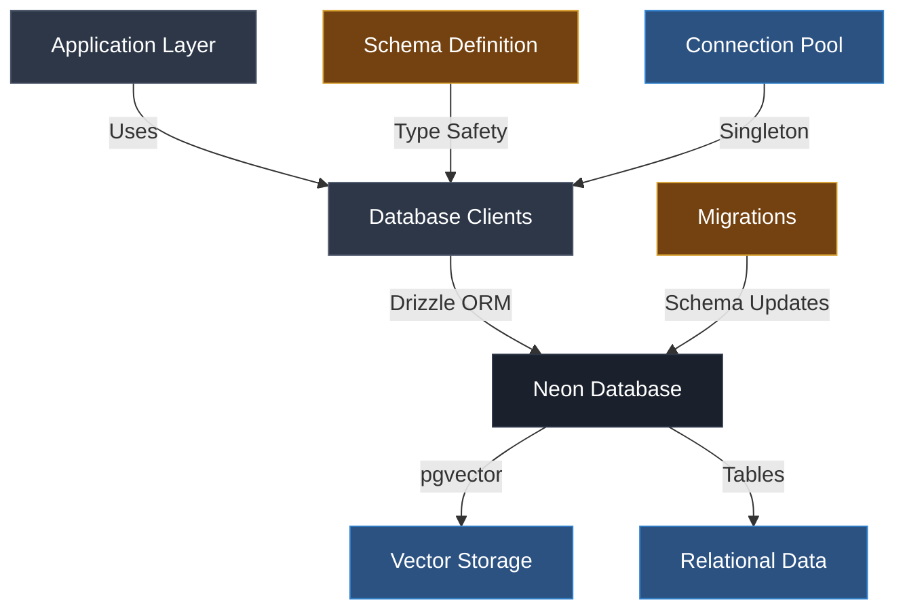

# Database Architecture

## Table of Contents

- [Overview](#overview)
- [Architecture Flow](#architecture-flow)
- [Core Components](#core-components)
  - [Database Schema (db/)](#database-schema-db)
  - [Migrations](#migrations)
  - [Database Clients (netlify/clients/)](#database-clients-netlifyeclients)
- [Data Models](#data-models)
- [Vector Storage](#vector-storage)
- [Connection Management](#connection-management)

## Overview

The AdventureCue database architecture uses PostgreSQL with pgvector extension for vector similarity search, managed through Drizzle ORM. The system supports both content embeddings and chat functionality with efficient connection pooling and migration management.

## Architecture Flow



## Core Components

### Database Schema (db/)

**Location**: `/db/`

The schema defines the application's data structure using Drizzle ORM with TypeScript type safety:

- **`schema.ts`**: Defines all table schemas including custom vector types
- **`index.ts`**: Exports the main database client with schema integration

**Key Features**:

- Custom vector type for embeddings (1536 dimensions)
- Foreign key relationships between chat sessions and messages
- Automatic timestamps with timezone support
- Indexed fields for query optimization

### Migrations

**Location**: `/migrations/`

Schema evolution is managed through SQL migration files with a versioned approach:

```
0000_enable-pgvector.sql     # Enable vector extension
0001_create-tables.sql       # Create initial tables
0002_create-ivfflat-index.sql # Vector similarity indexes
0003_ancient_blue_blade.sql   # Schema updates
```

**Migration Strategy**:

- Linear versioning system
- Extension setup before table creation
- Performance optimization through strategic indexing
- Never edit migrations directly - use Drizzle Kit

### Database Clients (netlify/clients/)

**Location**: `/netlify/clients/`

Provides optimized database connections for serverless environments:

- **`database.ts`**: Singleton connection manager for Neon database
- **Connection pooling**: Reuses connections across function invocations
- **Environment validation**: Ensures required credentials are present

## Data Models

### Embeddings Table

Stores vector embeddings for content similarity search:

- **Primary Key**: Auto-incrementing serial ID
- **Vector Field**: 1536-dimension embeddings (OpenAI compatible)
- **Content**: Original text chunks for retrieval
- **Indexing**: Chunk-based organization

### Chat System

Supports conversational interfaces with session management:

**Chat Sessions**:

- Unique session identifiers
- Optional titles for conversation threads
- Automatic timestamp tracking

**Chat Messages**:

- Role-based message types (user/assistant/system)
- Session foreign key relationships
- Chronological ordering

## Vector Storage

The system leverages PostgreSQL's pgvector extension for high-performance similarity search:

- **Dimension**: 1536 (OpenAI text-embedding-ada-002 compatible)
- **Index Type**: IVFFlat for approximate nearest neighbor search
- **Distance Metric**: Cosine similarity for semantic matching

## Connection Management

**Singleton Pattern**: Ensures efficient resource utilization in serverless environments by reusing database connections across function invocations.

**Environment Configuration**:

- `NETLIFY_DATABASE_URL`: Neon database connection string
- Automatic client initialization with error handling
- Separation of SQL client and ORM layers for flexibility
