# Embedding Service Documentation

## Table of Contents

- [Overview](#overview)
- [Architecture Components](#architecture-components)
- [Embedding Generation Flow](#embedding-generation-flow)
- [Design Patterns Implementation](#design-patterns-implementation)
- [Service Dependencies](#service-dependencies)
- [Key Features](#key-features)
- [Vector Similarity Search](#vector-similarity-search)
- [Database Schema](#database-schema)
- [Performance Considerations](#performance-considerations)
- [Integration Points](#integration-points)

## Overview

The embedding service provides semantic text representation capabilities using OpenAI's text embedding models. It handles both embedding generation for new content and similarity search operations against stored embeddings in a PostgreSQL database with vector extensions.

## Architecture Components

### 🔧 Service Layer: `netlify/services/embedding/`

Core embedding functionality for text vectorization and similarity operations.

**Components:**

- `embedding.ts` - Main embedding operations (generation & similarity search)
- `types.ts` - TypeScript definitions for embedding data structures
- `index.ts` - Service exports and public API

### 🎯 Core Functions

**`generateEmbedding(text: string)`**

- Converts text into vector representations using OpenAI's `text-embedding-ada-002` model
- Returns 1536-dimensional numeric vectors

**`findSimilarEmbeddings(vector: number[], limit: number)`**

- Performs cosine distance similarity search against stored embeddings
- Returns ranked results by semantic similarity

## Embedding Generation Flow

```mermaid
graph TD
    A[Text Input] --> B[OpenAI API Request<br/>🚀 Proxy Pattern]
    B --> C[text-embedding-ada-002 Model<br/>🎯 Strategy Pattern]
    C --> D[1536-dimensional Vector<br/>🏗️ Builder Pattern]
    D --> E[Return Embedding Array<br/>📋 Command Pattern]

    F[Query Vector] --> G[Database Similarity Search<br/>🔍 Repository Pattern]
    G --> H[PostgreSQL pgvector Extension<br/>🔌 Adapter Pattern]
    H --> I[Cosine Distance Calculation<br/>🧮 Template Method]
    I --> J[Ranked Similar Embeddings<br/>📊 Observer Pattern]

    K[Vector Cache] --> L[Cache Manager<br/>💾 Singleton Pattern]
    L --> M[Cache Hit/Miss<br/>⚖️ State Pattern]
    M -->|Hit| N[Return Cached<br/>⚡ Flyweight Pattern]
    M -->|Miss| B

    style C fill:#1976d2,color:#fff
    style H fill:#388e3c,color:#fff
    style L fill:#e65100,color:#fff
    style I fill:#7b1fa2,color:#fff
    style J fill:#d32f2f,color:#fff
```



## Design Patterns Implementation

### 🚀 Proxy Pattern - OpenAI API Interface

Controls access to OpenAI embedding service with caching, rate limiting, and error handling.

### 🎯 Strategy Pattern - Embedding Model Selection

Dynamically selects appropriate embedding model based on content type and requirements.

### 🏗️ Builder Pattern - Vector Construction

Incrementally builds vector representations from text processing pipeline stages.

### 📋 Command Pattern - Embedding Operations

Encapsulates embedding requests as objects for queuing, retry logic, and batch processing.

### 🔍 Repository Pattern - Vector Storage

Abstracts vector database operations with consistent interface for different storage backends.

### 🔌 Adapter Pattern - Database Integration

Adapts PostgreSQL pgvector operations to service-level embedding interfaces.

### 🧮 Template Method - Similarity Algorithm

Defines standard similarity calculation workflow with customizable distance metrics.

### 📊 Observer Pattern - Result Processing

Notifies multiple handlers (caching, logging, metrics) when similarity searches complete.

### 💾 Singleton Pattern - Cache Management

Ensures single instance of embedding cache manager across application lifecycle.

### ⚖️ State Pattern - Cache Behavior

Manages cache states (empty, loading, ready, expired) with appropriate behaviors.

### ⚡ Flyweight Pattern - Vector Optimization

Shares common vector data structures to minimize memory usage for large embedding sets.

## Service Dependencies

### External Services

- **OpenAI API**: Text embedding model (`text-embedding-ada-002`)
- **PostgreSQL**: Vector storage with pgvector extension

### Internal Dependencies

- **SQL Client**: Database connection management (`../../clients`)
- **OpenAI Client**: API authentication and request handling (`../../clients`)

## Key Features

### 🤖 Text Vectorization

- High-dimensional semantic representation (1536 dimensions)
- Consistent embedding generation for similar content
- Optimized for English text processing

### 🔍 Semantic Similarity Search

- Cosine distance-based similarity matching
- Configurable result limits
- Efficient vector indexing for fast retrieval

### 📊 Vector Operations

- Distance calculation using PostgreSQL's `<=>` operator
- Automatic vector type handling with pgvector
- Ordered results by similarity score

## Vector Similarity Search

### Search Process

1. **Input Vector**: Received as number array
2. **Vector Formatting**: Converted to PostgreSQL vector format
3. **Distance Calculation**: Cosine distance computation against all stored embeddings
4. **Result Ranking**: Ordered by ascending distance (lower = more similar)
5. **Limit Application**: Returns top N similar results

### Distance Interpretation

- **0.0**: Identical content
- **0.0 - 0.3**: Very similar content
- **0.3 - 0.7**: Moderately similar content
- **0.7+**: Dissimilar content

## Database Schema

### Embeddings Table Structure

```sql
embeddings (
  id: string (primary key)
  content: text
  embedding: vector(1536)
)
```

### Index Requirements

- Vector similarity index on `embedding` column
- Recommended: `CREATE INDEX ON embeddings USING ivfflat (embedding vector_cosine_ops)`

## Performance Considerations

### Embedding Generation

- **Latency**: ~100-300ms per OpenAI API request
- **Rate Limits**: Subject to OpenAI API quotas
- **Cost**: $0.0001 per 1K tokens (approximate)

### Similarity Search

- **Query Performance**: O(n) without proper indexing
- **Index Optimization**: IVFFlat or HNSW for large datasets
- **Memory Usage**: ~6KB per 1536-dimensional vector

### Scaling Recommendations

- Implement embedding caching for frequently accessed content
- Batch embedding generation when possible
- Monitor OpenAI API usage and rate limits
- Consider vector database alternatives for massive scale

## Integration Points

### Used By

- **Query Service**: Semantic search functionality
- **Ingestion Service**: Content vectorization during data import
- **Memory Service**: Experience and conversation embedding

### Usage Patterns

- **Content Ingestion**: Generate embeddings for new content
- **Search Operations**: Find semantically similar content
- **Recommendation Systems**: Content similarity matching
- **Semantic Clustering**: Group related content by vector similarity

### Error Handling

- OpenAI API failures gracefully handled with retries
- Database connection errors with proper fallbacks
- Vector format validation before database operations
