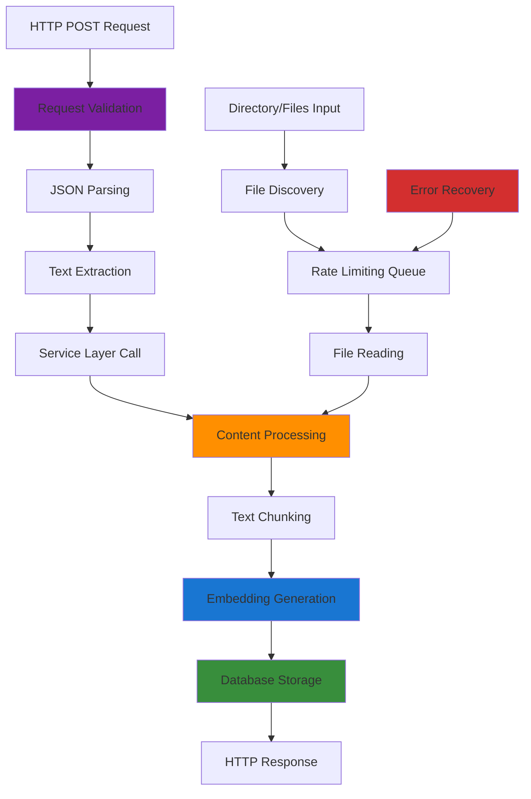

# Ingestion Service Documentation

## Table of Contents

- [Overview](#overview)
- [Architecture Components](#architecture-components)
- [Ingestion Pipeline Flow](#ingestion-pipeline-flow)
- [API Endpoint Specification](#api-endpoint-specification)
- [Service Dependencies](#service-dependencies)
- [Key Features](#key-features)
- [Processing Operations](#processing-operations)
- [Configuration Options](#configuration-options)
- [Performance Considerations](#performance-considerations)
- [Integration Points](#integration-points)
- [Error Handling](#error-handling)

## Overview

The ingestion service provides automated content processing capabilities for bulk embedding generation from file-based sources. It handles directory traversal, file reading, content chunking, embedding generation, and database persistence with built-in rate limiting and error recovery.

## Architecture Components

### 🌐 API Layer: `netlify/functions/ingest.ts`

Serverless function that provides HTTP endpoint for direct text ingestion.

**Responsibilities:**

- HTTP request validation and parsing
- JSON payload processing
- Single text content ingestion
- Response formatting and error handling

### 🔧 Service Layer: `netlify/services/ingestion/`

Core ingestion functionality for batch content processing and embedding generation.

**Components:**

- `ingestion.ts` - Main orchestration and processing logic
- `types.ts` - TypeScript definitions for ingestion operations
- `index.ts` - Service exports and public API

### 🎯 Core Functions

**`ingestFiles(config: IngestionConfig)`**

- Main orchestration function for batch file processing
- Handles directory traversal and result aggregation

**`processDirectory(config: IngestionConfig)`**

- Iterates through target directory with file extension filtering
- Applies rate limiting between file operations

**`processFile(filePath: string, targetDir: string)`**

- Single file processing pipeline
- Handles reading, embedding generation, and database storage

**`processText(text: string)`**

- Direct text processing without file operations
- Useful for API-based content ingestion

## Ingestion Pipeline Flow



## API Endpoint Specification

### POST `/api/ingest`

Ingests single text content via HTTP API for immediate processing and embedding generation.

#### Request Format

```json
{
  "text": "Content to be processed and embedded"
}
```

#### Response Format

**Success (200 OK):**

```json
{
  "result": {
    "id": 123,
    "success": true
  }
}
```

**Error Responses:**

- `400 Bad Request`: Invalid JSON or missing text field
- `405 Method Not Allowed`: Non-POST requests
- `500 Internal Server Error`: Processing failures

#### Usage Examples

```bash
# Single text ingestion
curl -X POST https://your-domain/.netlify/functions/ingest \
  -H "Content-Type: application/json" \
  -d '{"text": "Your content to embed"}'
```


## Service Dependencies

### External Services

- **OpenAI API**: Via embedding service for vector generation
- **PostgreSQL**: Vector storage with Drizzle ORM

### Internal Dependencies

- **Embedding Service**: Text-to-vector conversion (`../embedding`)
- **Drizzle Client**: Database operations (`../../clients`)
- **File System Utils**: Directory traversal and file reading (`../../utils/file-system`)
- **Rate Limiting Utils**: API throttling (`../../utils/rate-limiting`)

### Database Schema

- **embeddings table**: Content storage with vector representations
- **Vector extension**: PostgreSQL pgvector for similarity operations

## Key Features

### 📁 Bulk File Processing

- Directory-based content discovery
- Configurable file extension filtering
- Recursive directory traversal
- Relative path preservation for organization

### ⚡ Rate-Limited Processing

- Configurable delay between API calls
- OpenAI API quota management
- Prevents service overload
- Graceful degradation under load

### 🔄 Error Recovery

- Individual file failure isolation
- Comprehensive error reporting
- Processing continuation on partial failures
- Detailed success/failure metrics

### 📊 Progress Tracking

- Real-time processing status
- Success/failure counters
- File-level error details
- Batch completion reporting

## Processing Operations

### File Discovery Process

1. **Directory Scanning**: Recursive traversal of target directory
2. **Extension Filtering**: Include only specified file types
3. **Path Resolution**: Maintain relative path structure
4. **Queue Management**: Ordered processing with rate limiting

### Content Processing Pipeline

1. **File Reading**: UTF-8 text extraction
2. **Content Preparation**: Text normalization and validation
3. **Chunking Strategy**: Text segmentation (planned feature)
4. **Embedding Generation**: Vector creation via OpenAI API
5. **Database Persistence**: Drizzle ORM-based storage

### Result Aggregation

- Per-file processing outcomes
- Error message collection
- Database ID tracking
- Batch-level statistics

## Configuration Options

### IngestionConfig Interface

```typescript
{
  targetDir: string;        // Source directory path
  fileExtensions: string[]; // Allowed file types ['.md', '.txt']
  rateLimitMs: number;      // Delay between API calls
  batchSize?: number;       // Future batch processing size
}
```

### Recommended Settings

- **Rate Limit**: 200-500ms for OpenAI API compliance
- **File Extensions**: ['.md', '.txt', '.json'] for content files
- **Target Directory**: Absolute paths for reliable processing

## Performance Considerations

### Processing Speed

- **Rate Limiting**: 200-500ms delays between embeddings
- **Sequential Processing**: One file at a time to prevent overload
- **Chunking**: Future optimization for large files

### Resource Usage

- **Memory**: Proportional to largest file size
- **API Calls**: One embedding request per file/chunk
- **Database**: Batch inserts for efficiency

### Scaling Recommendations

- Monitor OpenAI API usage and quotas
- Implement chunking for large files (>8K tokens)
- Consider parallel processing for large directories
- Add resume capability for interrupted ingestion

## Integration Points

### Used By

- **Client Applications**: Direct text embedding via HTTP API
- **Content Management Systems**: Real-time content processing
- **CLI Tools**: Bulk content import scripts (`bin/ingest.ts`)
- **Admin Functions**: Content management operations
- **Migration Scripts**: Database population workflows

### Usage Patterns

- **Real-time Ingestion**: Single content items via API endpoint
- **Initial Setup**: Bulk import of existing content
- **Content Updates**: Periodic re-ingestion of modified files
- **Migration Operations**: Database rebuilding and updates
- **Development Workflows**: Test data population

## Error Handling

### API Endpoint Errors

- **Request Validation**: JSON parsing and required field validation
- **Method Restrictions**: Only POST requests accepted
- **Content Validation**: Text field type and presence checking
- **HTTP Status Codes**: Standard REST API error responses

### File-Level Errors

- Individual file processing failures don't stop batch operations
- Detailed error messages with file paths
- Continue processing remaining files

### API Failures

- OpenAI API rate limit handling
- Network connectivity issues
- Authentication failures with clear messaging

### Database Errors

- Connection failure recovery
- Constraint violation handling
- Transaction rollback for data integrity

### Recovery Strategies

- Retry mechanisms for transient failures
- Partial success reporting
- Resume capability for large ingestion jobs
