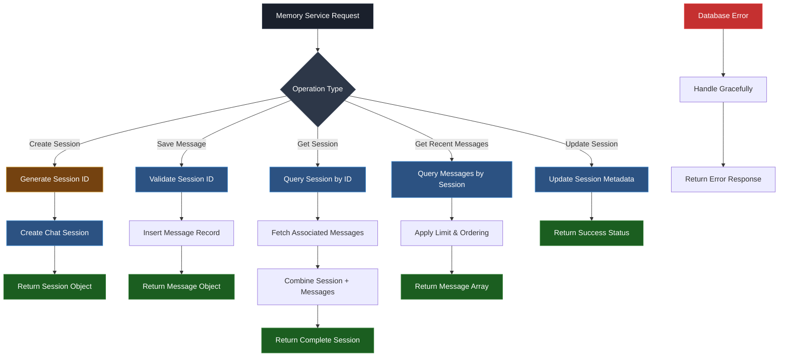

# Memory Service Documentation

## Table of Contents

- [Overview](#overview)
- [Architecture](#architecture)
- [Service Flow Diagram](#service-flow-diagram)
- [Design Patterns](#design-patterns)
- [Core Components](#core-components)
- [Data Models](#data-models)
- [Integration Points](#integration-points)
- [Usage & Commands](#usage--commands)

## Overview

The Memory Service provides persistent conversation history management for the AdventureCue chat system. It enables contextual conversations by storing and retrieving chat sessions and messages, integrating seamlessly with the existing RAG pipeline.

**Location:** `netlify/services/memory/`

**Key Responsibilities:**

- Chat session lifecycle management
- Message persistence and retrieval
- Conversation context generation
- Session metadata management
- Conversation history queries

## Architecture

The Memory Service follows a layered architecture with clear separation of concerns:

```
┌─────────────────────────────────────────────────────────┐
│                   Memory Service Layer                  │
│  ┌─────────────────┐    ┌─────────────────────────────┐ │
│  │ Session         │    │ Message                     │ │
│  │ Management      │    │ Management                  │ │
│  │ (CRUD)          │    │ (CRUD)                      │ │
│  └─────────────────┘    └─────────────────────────────┘ │
│  ┌─────────────────┐    ┌─────────────────────────────┐ │
│  │ Utility         │    │ Type                        │ │
│  │ Functions       │    │ Definitions                 │ │
│  └─────────────────┘    └─────────────────────────────┘ │
└─────────────────────────────────────────────────────────┘
                              │
                              ▼
┌─────────────────────────────────────────────────────────┐
│                Database Abstraction Layer               │
│  ┌─────────────────┐    ┌─────────────────────────────┐ │
│  │ Drizzle ORM     │    │ Database                    │ │
│  │ Client          │    │ Schema                      │ │
│  └─────────────────┘    └─────────────────────────────┘ │
└─────────────────────────────────────────────────────────┘
                              │
                              ▼
┌─────────────────────────────────────────────────────────┐
│                  Data Storage Layer                     │
│  ┌─────────────────┐    ┌─────────────────────────────┐ │
│  │ chat_sessions   │    │ chat_messages               │ │
│  │ Table           │    │ Table                       │ │
│  └─────────────────┘    └─────────────────────────────┘ │
└─────────────────────────────────────────────────────────┘
```

## Service Flow Diagram



## Design Patterns

### 1. Repository Pattern

- **Implementation**: Core CRUD operations abstracted from business logic
- **Purpose**: Centralizes data access logic and provides clean interfaces
- **Benefits**: Testable, maintainable, and database-agnostic operations

### 2. Factory Pattern

- **Implementation**: Session ID and title generation utilities
- **Purpose**: Encapsulates object creation logic with consistent rules
- **Benefits**: Standardized session creation, easy to modify generation logic

### 3. Data Transfer Object (DTO) Pattern

- **Implementation**: Typed input/output interfaces for all operations
- **Purpose**: Ensures type safety and clear contracts between layers
- **Benefits**: Compile-time validation, clear API boundaries

### 4. Singleton Pattern

- **Implementation**: Database client connection management
- **Purpose**: Reuses database connections across service calls
- **Benefits**: Efficient resource utilization in serverless environments

### 5. Specification Pattern

- **Implementation**: Query builders with filtering and ordering logic
- **Purpose**: Encapsulates query logic for complex data retrieval
- **Benefits**: Reusable query logic, maintainable data access

## Core Components

### Session Management

**Primary Functions:**

```typescript
createChatSession(input: CreateChatSessionInput): Promise<ChatSession>
getChatSession(sessionId: string): Promise<ChatSessionWithMessages | null>
updateSessionTitle(sessionId: string, title: string): Promise<void>
```

**Responsibilities:**

- Session lifecycle management
- Metadata handling and updates
- Session-message relationship coordination

### Message Management

**Primary Functions:**

```typescript
saveChatMessage(input: CreateChatMessageInput): Promise<ChatMessage>
getRecentMessages(sessionId: string, limit?: number): Promise<ChatMessage[]>
```

**Responsibilities:**

- Message persistence and retrieval
- Conversation context building
- Chronological message ordering

### Utility Layer

**Helper Functions:**

```typescript
generateSessionId(): string
generateSessionTitle(firstMessage: string): string
isValidChatRole(role: string): boolean
```

**Purpose:**

- Session ID generation with uniqueness guarantees
- Automatic title creation from conversation content
- Role validation for message types

## Data Models

### Session Entity

```typescript
interface ChatSession {
  id: number; // Auto-increment primary key
  session_id: string; // Unique session identifier
  title?: string; // Human-readable session title
  created_at: Date; // Session creation timestamp
  updated_at: Date; // Last modification timestamp
}
```

### Message Entity

```typescript
interface ChatMessage {
  id: number; // Auto-increment primary key
  session_id: string; // Foreign key to chat session
  role: ChatRole; // Message author role
  content: string; // Message text content
  created_at: Date; // Message creation timestamp
}
```

### Role Types

```typescript
type ChatRole = "user" | "assistant" | "system";
```

**Role Definitions:**

- **user**: Human-generated messages and queries
- **assistant**: AI-generated responses and answers
- **system**: Internal system messages and prompts

## Integration Points

### Database Layer Integration

```typescript
// Database client dependency
import { getDrizzleClient } from "../../clients/database";
import { chatSessions, chatMessages } from "../../../db/schema";
```

**Integration Strategy:**

- Singleton database client for connection efficiency
- Schema-first approach with type-safe operations
- Foreign key relationships for data integrity

### Chat Service Integration

```typescript
// Memory service usage in chat pipeline
import {
  createChatSession,
  saveChatMessage,
  getRecentMessages,
} from "../memory";
```

**Integration Points:**

- Session creation for new conversations
- Message persistence during chat processing
- Context retrieval for conversation continuity

### Service Dependencies

| Dependency             | Purpose          | Integration Method      |
| ---------------------- | ---------------- | ----------------------- |
| **Database Client**    | Data persistence | `getDrizzleClient()`    |
| **Schema Definitions** | Type safety      | Import from `db/schema` |
| **Query Builder**      | Data operations  | Drizzle ORM methods     |

## Usage & Commands

### Basic Session Management

```typescript
import { createChatSession, getChatSession } from "@/netlify/services/memory";

// Create a new chat session
const session = await createChatSession({
  session_id: "unique-session-id",
  title: "Travel Planning Discussion",
});

// Retrieve session with all messages
const fullSession = await getChatSession("unique-session-id");
console.log(`Session: ${fullSession?.title}`);
console.log(`Messages: ${fullSession?.messages.length}`);
```

### Message Operations

```typescript
import { saveChatMessage, getRecentMessages } from "@/netlify/services/memory";

// Save user message
await saveChatMessage({
  session_id: "unique-session-id",
  role: "user",
  content: "What are the best attractions in San Francisco?",
});

// Save assistant response
await saveChatMessage({
  session_id: "unique-session-id",
  role: "assistant",
  content: "Here are the top attractions in San Francisco...",
});

// Get recent conversation context
const recentMessages = await getRecentMessages("unique-session-id", 10);
console.log(`Recent messages: ${recentMessages.length}`);
```

### Utility Functions

```typescript
import {
  generateSessionId,
  generateSessionTitle,
  isValidChatRole,
} from "@/netlify/services/memory";

// Generate unique session identifier
const sessionId = generateSessionId();
console.log(`New session ID: ${sessionId}`);

// Create session title from user input
const title = generateSessionTitle("I want to plan a trip to San Francisco");
console.log(`Generated title: ${title}`);

// Validate message role
if (isValidChatRole("user")) {
  console.log("Valid role for message");
}
```

### Integration with Chat Service

```typescript
import { generateAnswerWithMemory } from "@/netlify/services/chat";
import { generateContext } from "@/netlify/services/embedding";

// Start new conversation with memory
async function startConversationWithMemory(userQuery: string) {
  const context = await generateContext({ query: userQuery });

  const response = await generateAnswerWithMemory({
    userQuery,
    similarEmbeddingContext: context,
    // sessionId omitted - new session created automatically
  });

  return {
    sessionId: response.sessionId,
    response: response.response,
    success: response.success,
  };
}

// Continue existing conversation
async function continueConversation(sessionId: string, userQuery: string) {
  const context = await generateContext({ query: userQuery });

  const response = await generateAnswerWithMemory({
    userQuery,
    sessionId, // Use existing session
    similarEmbeddingContext: context,
  });

  return response;
}
```

### Advanced Query Patterns

```typescript
// Custom message filtering
async function getConversationSummary(sessionId: string) {
  const session = await getChatSession(sessionId);

  if (!session) return null;

  const userMessages = session.messages.filter((msg) => msg.role === "user");
  const assistantMessages = session.messages.filter(
    (msg) => msg.role === "assistant"
  );

  return {
    title: session.title,
    totalMessages: session.messages.length,
    userMessages: userMessages.length,
    assistantMessages: assistantMessages.length,
    firstMessage: session.messages[0]?.content,
    lastMessage: session.messages[session.messages.length - 1]?.content,
  };
}

// Conversation context builder
async function buildConversationContext(
  sessionId: string,
  contextSize: number = 8
) {
  const recentMessages = await getRecentMessages(sessionId, contextSize);

  return recentMessages.map((msg) => ({
    role: msg.role,
    content: msg.content,
    timestamp: msg.created_at,
  }));
}
```

### Error Handling Patterns

```typescript
// Robust session retrieval
async function safeGetSession(sessionId: string) {
  try {
    const session = await getChatSession(sessionId);

    if (!session) {
      console.warn(`Session not found: ${sessionId}`);
      return null;
    }

    return session;
  } catch (error) {
    console.error(`Failed to retrieve session ${sessionId}:`, error);
    return null;
  }
}

// Graceful message saving
async function safeSaveMessage(input: CreateChatMessageInput) {
  try {
    if (!isValidChatRole(input.role)) {
      throw new Error(`Invalid chat role: ${input.role}`);
    }

    return await saveChatMessage(input);
  } catch (error) {
    console.error("Failed to save message:", error);
    throw error; // Re-throw for upstream handling
  }
}
```
