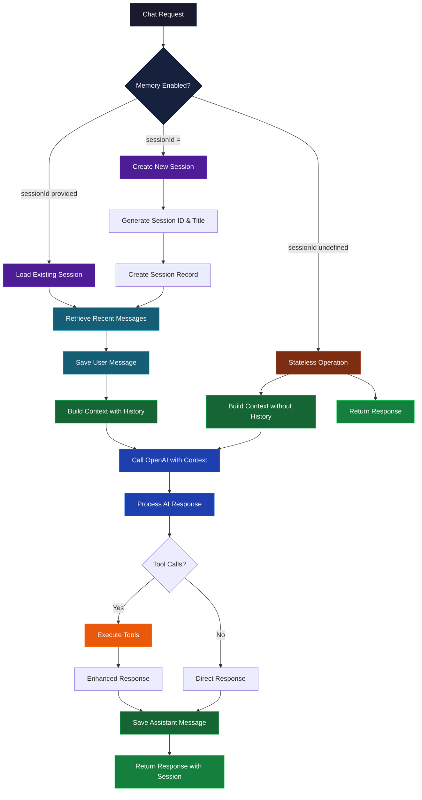

# Memory Service Documentation

## Table of Contents

- [Overview](#overview)
- [Architecture](#architecture)
- [Integration Flow Diagram](#integration-flow-diagram)
- [Design Patterns](#design-patterns)
- [Core Components](#core-components)
- [Data Models](#data-models)
- [Service Integration](#service-integration)
- [Usage](#usage)

## Overview

The Memory Service provides persistent conversation history management for the AdventureCue chat system. It enables contextual conversations by storing and retrieving chat sessions and messages, now fully integrated into the main chat pipeline for seamless memory-enabled conversations.

**Location:** `netlify/services/memory/`

**Key Responsibilities:**

- Chat session lifecycle management
- Message persistence and retrieval
- Conversation context generation
- Session metadata management
- Real-time conversation history integration

## Architecture

The Memory Service follows a layered architecture with clear separation of concerns:

```
┌─────────────────────────────────────────────────────────┐
│                   Memory Service Layer                  │
│  ┌─────────────────┐    ┌─────────────────────────────┐ │
│  │ Session         │    │ Message                     │ │
│  │ Management      │    │ Management                  │ │
│  │ (CRUD)          │    │ (CRUD)                      │ │
│  └─────────────────┘    └─────────────────────────────┘ │
│  ┌─────────────────┐    ┌─────────────────────────────┐ │
│  │ Utility         │    │ Type                        │ │
│  │ Functions       │    │ Definitions                 │ │
│  └─────────────────┘    └─────────────────────────────┘ │
└─────────────────────────────────────────────────────────┘
                              │
                              ▼
┌─────────────────────────────────────────────────────────┐
│                Database Abstraction Layer               │
│  ┌─────────────────┐    ┌─────────────────────────────┐ │
│  │ Drizzle ORM     │    │ Database                    │ │
│  │ Client          │    │ Schema                      │ │
│  └─────────────────┘    └─────────────────────────────┘ │
└─────────────────────────────────────────────────────────┘
                              │
                              ▼
┌─────────────────────────────────────────────────────────┐
│                  Data Storage Layer                     │
│  ┌─────────────────┐    ┌─────────────────────────────┐ │
│  │ chat_sessions   │    │ chat_messages               │ │
│  │ Table           │    │ Table                       │ │
│  └─────────────────┘    └─────────────────────────────┘ │
└─────────────────────────────────────────────────────────┘
```

## Integration Flow Diagram



## Design Patterns

### 1. Repository Pattern

- **Implementation**: Core CRUD operations abstracted from business logic
- **Purpose**: Centralizes data access logic and provides clean interfaces
- **Benefits**: Testable, maintainable, and database-agnostic operations

### 2. Factory Pattern

- **Implementation**: Session ID and title generation utilities
- **Purpose**: Encapsulates object creation logic with consistent rules
- **Benefits**: Standardized session creation, easy to modify generation logic

### 3. Data Transfer Object (DTO) Pattern

- **Implementation**: Typed input/output interfaces for all operations
- **Purpose**: Ensures type safety and clear contracts between layers
- **Benefits**: Compile-time validation, clear API boundaries

### 4. Singleton Pattern

- **Implementation**: Database client connection management
- **Purpose**: Reuses database connections across service calls
- **Benefits**: Efficient resource utilization in serverless environments

### 6. Observer Pattern

- **Implementation**: Memory operations integrated into chat status tracking
- **Purpose**: Provides real-time updates during memory operations
- **Benefits**: Transparent memory activities, debugging capabilities

### 7. Adapter Pattern

- **Implementation**: Memory service integration layer in chat service
- **Purpose**: Seamlessly integrates memory into existing chat pipeline
- **Benefits**: Non-intrusive integration, backward compatibility

## Core Components

### Session Management

**Primary Functions:**

```typescript
createChatSession(input: CreateChatSessionInput): Promise<ChatSession>
getChatSession(sessionId: string): Promise<ChatSessionWithMessages | null>
updateSessionTitle(sessionId: string, title: string): Promise<void>
```

**Responsibilities:**

- Session lifecycle management
- Metadata handling and updates
- Session-message relationship coordination

### Message Management

**Primary Functions:**

```typescript
saveChatMessage(input: CreateChatMessageInput): Promise<ChatMessage>
getRecentMessages(sessionId: string, limit?: number): Promise<ChatMessage[]>
```

**Responsibilities:**

- Message persistence and retrieval
- Conversation context building
- Chronological message ordering

### Utility Layer

**Helper Functions:**

```typescript
generateSessionId(): string
generateSessionTitle(firstMessage: string): string
isValidChatRole(role: string): boolean
```

**Purpose:**

- Session ID generation with uniqueness guarantees
- Automatic title creation from conversation content
- Role validation for message types

## Data Models

### Session Entity

```typescript
interface ChatSession {
  id: number; // Auto-increment primary key
  session_id: string; // Unique session identifier
  title?: string; // Human-readable session title
  created_at: Date; // Session creation timestamp
  updated_at: Date; // Last modification timestamp
}
```

### Message Entity

```typescript
interface ChatMessage {
  id: number; // Auto-increment primary key
  session_id: string; // Foreign key to chat session
  role: ChatRole; // Message author role
  content: string; // Message text content
  created_at: Date; // Message creation timestamp
}
```

### Role Types

```typescript
type ChatRole = "user" | "assistant" | "system";
```

**Role Definitions:**

- **user**: Human-generated messages and queries
- **assistant**: AI-generated responses and answers
- **system**: Internal system messages and prompts

## Service Integration

### Chat Service Integration

The Memory Service is now **fully integrated** into the main chat service, providing seamless conversation persistence without requiring code changes for existing implementations.

**Integration Location:** `netlify/services/chat/chat.ts`

**Integration Method:**

- **Backward Compatible**: Existing `generateAnswer()` calls work unchanged
- **Memory Enabled**: Optional `sessionId` parameter activates memory features
- **Automatic Management**: Session creation, message persistence, and context retrieval handled transparently

**Function Signatures:**

```typescript
// Original function with optional memory
generateAnswer(
  userQuery: string,
  similarEmbeddingContext: string,
  onStatusUpdate?: (status: ChatStatus) => void,
  sessionId?: string // New: enables memory when provided
): Promise<ChatResponse>

// Convenience function for memory-enabled conversations
generateAnswerWithMemory(
  userQuery: string,
  similarEmbeddingContext: string,
  onStatusUpdate?: (status: ChatStatus) => void,
  existingSessionId?: string
): Promise<ChatResponse>
```

**Memory Behavior:**

- `sessionId` **undefined**: Stateless operation (original behavior)
- `sessionId` **empty string** `""`: Creates new session automatically
- `sessionId` **with value**: Continues existing conversation

**Integration Benefits:**

- **Zero Migration**: Existing code continues to work without changes
- **Opt-in Memory**: Enable memory by simply passing a sessionId
- **Transparent Operations**: Memory saving/loading handled automatically
- **Status Integration**: Memory operations included in existing status tracking

### Database Integration

**Tables Used:**

- `chat_sessions`: Session metadata and lifecycle management
- `chat_messages`: Individual message storage with role-based organization

**Connection Management:**

- Leverages existing database client singleton pattern
- Efficient connection reuse across serverless function invocations
- Integrated with existing migration and schema management

## Usage

### Terminal Commands

**Database Management:**

```bash
# Generate migration for chat tables (if needed)
npm run db:generate

# Apply chat table migrations
npm run db:migrate

# Open database studio to view chat sessions
npm run db:studio
```

**Development & Testing:**

```bash
# Start development server with memory-enabled chat
npm run dev

# Test chat endpoints with memory functionality
curl -X POST http://localhost:3000/api/chat \
  -H "Content-Type: application/json" \
  -d '{"query": "Tell me about San Francisco", "sessionId": ""}'

# Continue conversation with existing session
curl -X POST http://localhost:3000/api/chat \
  -H "Content-Type: application/json" \
  -d '{"query": "What about Golden Gate Bridge?", "sessionId": "chat_abc123"}'
```

### Implementation Guide

#### 1. Basic Memory-Enabled Chat

```typescript
import { generateAnswer } from "@/netlify/services/chat";
import { generateContext } from "@/netlify/services/embedding";

// Start new conversation with memory
async function startNewConversation(userQuery: string) {
  const context = await generateContext({ query: userQuery });

  // Pass empty string to enable memory with auto-session creation
  const response = await generateAnswer(
    userQuery,
    context,
    undefined,
    "" // Creates new session
  );

  console.log("New session ID:", response.sessionId);
  return response;
}

// Continue existing conversation
async function continueConversation(sessionId: string, userQuery: string) {
  const context = await generateContext({ query: userQuery });

  const response = await generateAnswer(
    userQuery,
    context,
    undefined,
    sessionId // Use existing session
  );

  return response;
}
```

#### 2. Using the Convenience Function

```typescript
import { generateAnswerWithMemory } from "@/netlify/services/chat";

// Automatically create new session
async function simpleMemoryChat(userQuery: string) {
  const context = await generateContext({ query: userQuery });

  const response = await generateAnswerWithMemory(
    userQuery,
    context
    // sessionId automatically managed
  );

  return response;
}

// Continue with existing session
async function continueSimpleChat(sessionId: string, userQuery: string) {
  const context = await generateContext({ query: userQuery });

  const response = await generateAnswerWithMemory(
    userQuery,
    context,
    undefined,
    sessionId
  );

  return response;
}
```

#### 3. Memory Operations

```typescript
import {
  getChatSession,
  getRecentMessages,
  createChatSession,
  saveChatMessage,
} from "@/netlify/services/memory";

// Retrieve conversation history
async function getConversationHistory(sessionId: string) {
  const session = await getChatSession(sessionId);

  if (!session) {
    console.log("Session not found");
    return null;
  }

  console.log(`Session: ${session.title}`);
  console.log(`Messages: ${session.messages.length}`);

  return session;
}

// Get recent context for AI
async function getConversationContext(sessionId: string) {
  const recentMessages = await getRecentMessages(sessionId, 10);

  return recentMessages.map((msg) => ({
    role: msg.role,
    content: msg.content,
    timestamp: msg.created_at,
  }));
}

// Manual session management
async function createNewSession(title: string) {
  const sessionId = `chat_${Date.now()}_${Math.random()
    .toString(36)
    .substring(2, 8)}`;

  const session = await createChatSession({
    session_id: sessionId,
    title,
  });

  return session;
}
```

#### 4. API Endpoint Integration

```typescript
// Example API endpoint with memory support
export async function POST(request: Request) {
  try {
    const { query, sessionId } = await request.json();

    const context = await generateContext({ query });

    const response = await generateAnswer(
      query,
      context,
      undefined,
      sessionId // Optional: enables memory if provided
    );

    return Response.json({
      success: true,
      response: response.response,
      sessionId: response.sessionId, // Return for client to continue conversation
      toolsUsed: response.toolsUsed,
      executionTime: response.executionTimeMs,
    });
  } catch (error) {
    return Response.json(
      { success: false, error: "Chat processing failed" },
      { status: 500 }
    );
  }
}
```

#### 5. Advanced Usage Patterns

```typescript
// Conversation management service
class ConversationManager {
  async startConversation(userQuery: string, title?: string) {
    const context = await generateContext({ query: userQuery });

    // Create session with custom title
    const sessionId = title
      ? (
          await createChatSession({
            session_id: generateSessionId(),
            title,
          })
        ).session_id
      : "";

    return await generateAnswer(userQuery, context, undefined, sessionId);
  }

  async continueConversation(sessionId: string, userQuery: string) {
    const context = await generateContext({ query: userQuery });
    return await generateAnswer(userQuery, context, undefined, sessionId);
  }

  async getHistory(sessionId: string) {
    return await getChatSession(sessionId);
  }

  async getSummary(sessionId: string) {
    const session = await getChatSession(sessionId);
    if (!session) return null;

    return {
      title: session.title,
      messageCount: session.messages.length,
      lastActivity: session.updated_at,
      preview: session.messages[0]?.content?.substring(0, 100) + "...",
    };
  }
}

// Usage
const conversationManager = new ConversationManager();

// Start new conversation
const newChat = await conversationManager.startConversation(
  "Plan a trip to San Francisco",
  "SF Trip Planning"
);

// Continue conversation
const followUp = await conversationManager.continueConversation(
  newChat.sessionId!,
  "What about the Golden Gate Bridge?"
);

// Get conversation summary
const summary = await conversationManager.getSummary(newChat.sessionId!);
```

#### 6. Error Handling & Best Practices

```typescript
// Robust conversation handling
async function robustConversation(userQuery: string, sessionId?: string) {
  try {
    const context = await generateContext({ query: userQuery });

    const response = await generateAnswer(
      userQuery,
      context,
      (status) => {
        console.log(`[${status.step}] ${status.description}`);
      },
      sessionId
    );

    if (!response.success) {
      console.error("Chat generation failed:", response.response);
      return null;
    }

    return response;
  } catch (error) {
    console.error("Conversation error:", error);

    // Fallback to stateless operation
    try {
      const context = await generateContext({ query: userQuery });
      return await generateAnswer(userQuery, context); // No sessionId = stateless
    } catch (fallbackError) {
      console.error("Fallback also failed:", fallbackError);
      return null;
    }
  }
}

// Session validation
async function validateSession(sessionId: string): Promise<boolean> {
  try {
    const session = await getChatSession(sessionId);
    return session !== null;
  } catch (error) {
    console.error("Session validation failed:", error);
    return false;
  }
}
```
