# Query Service Documentation

## Table of Contents

- [Overview](#overview)
- [Architecture Components](#architecture-components)
- [Query Processing Flow](#query-processing-flow)
- [Design Patterns Implementation](#design-patterns-implementation)
- [Service Dependencies](#service-dependencies)
- [Key Features](#key-features)
- [API Endpoints](#api-endpoints)
- [Performance Considerations](#performance-considerations)
- [Integration Points](#integration-points)
- [Usage & Commands](#usage--commands)

## Overview

The query service orchestrates the core RAG (Retrieval-Augmented Generation) pipeline, handling semantic search operations and AI response generation. It provides both basic query processing and advanced streaming capabilities with real-time status updates for enhanced user experience.

## Architecture Components

### 🌐 API Layer: `netlify/functions/query.ts` & `query-with-status.ts`

Serverless functions that handle HTTP requests and provide different query processing modes.

**Endpoints:**

- `query.ts` - Basic semantic search with simple response
- `query-with-status.ts` - Advanced query with streaming and status tracking

### 🔧 Service Layer: `netlify/services/query/`

Core query orchestration functionality for RAG pipeline management.

**Components:**

- `query.ts` - Main query processing orchestrator
- `types.ts` - TypeScript definitions for query operations
- `index.ts` - Service exports and public API

### 🎯 Core Functions

**`processQuery(queryData: QueryRequest)`**

- Main RAG pipeline orchestrator
- Coordinates embedding generation, similarity search, and answer generation
- Returns AI-generated responses based on retrieved context

## Query Processing Flow

```mermaid
graph TD
    A[User Query] --> B[Request Validation<br/>⚡ Strategy Pattern]
    B --> C[Query Processing<br/>🎭 Facade Pattern]
    C --> D[Generate Embedding<br/>🚀 Proxy Pattern]
    D --> E[Vector Search<br/>🔍 Repository Pattern]
    E --> F[Build Context<br/>🏗️ Builder Pattern]
    F --> G[Generate Answer<br/>🎯 Template Method]
    G --> H[Response Formatting<br/>📤 Decorator Pattern]
    H --> I[Return Result<br/>📋 Command Pattern]

    J[Status Tracking<br/>📊 Observer Pattern] --> C
    K[Cache Layer<br/>💨 Flyweight Pattern] --> D
    L[Error Handler<br/>🔗 Chain of Responsibility] --> C
    M[Connection Pool<br/>💾 Singleton Pattern] --> E

    N{Streaming Mode?<br/>⚖️ State Pattern} --> O[SSE Response<br/>📢 Mediator Pattern]
    N --> H

    style D fill:#1976d2,color:#fff
    style E fill:#388e3c,color:#fff
    style G fill:#ff8f00,color:#fff
    style J fill:#7b1fa2,color:#fff
    style N fill:#d32f2f,color:#fff
    style O fill:#e65100,color:#fff
```



## Design Patterns Implementation

### ⚡ Strategy Pattern - Request Validation

Dynamically selects validation strategies based on query type and endpoint requirements.

### 🎭 Facade Pattern - Query Processing

Provides simplified interface to complex RAG subsystems (embedding, search, generation).

### 🚀 Proxy Pattern - Embedding Generation

Controls access to OpenAI embedding service with caching, rate limiting, and error handling.

### 🔍 Repository Pattern - Vector Search

Abstracts vector database operations with consistent interface for similarity search.

### 🏗️ Builder Pattern - Context Building

Incrementally constructs conversation context from retrieved documents and query data.

### 🎯 Template Method - Answer Generation

Defines standard answer generation workflow with customizable steps for different query types.

### 📤 Decorator Pattern - Response Formatting

Dynamically adds capabilities (metadata, formatting, validation) to query responses.

### 📋 Command Pattern - Result Processing

Encapsulates query operations as objects for execution, queuing, and result handling.

### 📊 Observer Pattern - Status Tracking

Notifies multiple subscribers (client, logging, metrics) of query processing progress.

### 💨 Flyweight Pattern - Embedding Caching

Shares common embedding data structures to minimize memory usage for repeated queries.

### 🔗 Chain of Responsibility - Error Handling

Passes error handling through chain of recovery strategies until appropriate handler is found.

### 💾 Singleton Pattern - Connection Management

Ensures single instance of database connection pool across query operations.

### ⚖️ State Pattern - Processing Modes

Manages different query processing states (basic, streaming, cached) with appropriate behaviors.

### 📢 Mediator Pattern - Streaming Coordination

Centralizes communication between query components and real-time streaming system.

## Service Dependencies

### Internal Dependencies

- **Embedding Service**: Text vectorization and similarity search (`../embedding`)
- **Chat Service**: Answer generation and context building (`../chat`)
- **Status Service**: Progress tracking for streaming queries (`../status`)
- **Validation Utils**: Request validation and error handling (`../../utils/validation`)

### External Services

- **OpenAI API**: Text embedding and chat completion models
- **Neon Database**: Vector storage and similarity search with pgvector
- **Netlify Functions**: Serverless execution environment

## Key Features

### 🔍 Semantic Search Pipeline

- Vector embedding generation for user queries
- Cosine similarity search against knowledge base
- Configurable result limits (top_k parameter)
- Context-aware answer generation

### 📡 Real-time Streaming

- Server-Sent Events (SSE) for live progress updates
- Step-by-step execution tracking
- Non-blocking response streaming
- Error recovery with continued streaming

### 🎯 Flexible Query Processing

- Basic query mode for simple use cases
- Advanced streaming mode for complex operations
- Configurable similarity thresholds
- Customizable response formatting

### 🛡️ Robust Error Handling

- Graceful degradation on service failures
- Comprehensive error reporting
- Request validation and sanitization
- Recovery strategies for partial failures

## API Endpoints

### Basic Query Processing

**`POST /.netlify/functions/query`**

Simple RAG pipeline execution with immediate response.

### Streaming Query Processing

**`POST /.netlify/functions/query-with-status`**

Advanced query processing with real-time status updates via Server-Sent Events.

## Performance Considerations

### Response Times

- **Embedding Generation**: ~100-300ms per query
- **Vector Search**: ~50-200ms depending on database size
- **Answer Generation**: ~500-2000ms based on context complexity
- **Streaming Overhead**: Minimal latency for status updates

### Optimization Strategies

- **Embedding Caching**: Cache frequent query embeddings
- **Connection Pooling**: Reuse database connections
- **Context Optimization**: Smart context pruning for large result sets
- **Parallel Processing**: Concurrent embedding and search operations

## Integration Points

### Frontend Integration

- Next.js components for query submission
- Real-time status display for streaming queries
- Error handling and user feedback

### Backend Services

- **Chat Service**: Answer generation and tool integration
- **Embedding Service**: Vector operations and similarity search
- **Memory Service**: Conversation context and history
- **Status Service**: Progress tracking and monitoring

## Usage & Commands

### Basic Query Operations

**Simple Query**:

```bash
curl -X POST /.netlify/functions/query \
  -H "Content-Type: application/json" \
  -d '{"query": "What are the best restaurants in San Francisco?"}'
```

**Query with Custom Limit**:

```bash
curl -X POST /.netlify/functions/query \
  -H "Content-Type: application/json" \
  -d '{"query": "Tell me about Golden Gate Bridge", "top_k": 10}'
```

### Streaming Query Operations

**Real-time Status Updates**:

```bash
curl -X POST /.netlify/functions/query-with-status \
  -H "Content-Type: application/json" \
  -d '{"query": "Plan a 3-day itinerary for Tokyo", "streaming": true}' \
  --no-buffer
```

**Batch Processing Mode**:

```bash
curl -X POST /.netlify/functions/query-with-status \
  -H "Content-Type: application/json" \
  -d '{"query": "Compare hotels in downtown SF"}'
```

### Development & Testing

**Local Development**:

```bash
# Start development server
netlify dev

# Test query endpoint
npm run test:query

# Monitor query performance
npm run debug:query
```

**Service Integration**:

```typescript
import { processQuery } from "./netlify/services/query";

// Direct service usage
const result = await processQuery({
  query: "Find Italian restaurants",
  top_k: 5,
});

// With error handling
try {
  const answer = await processQuery(queryData);
  console.log("Query result:", answer);
} catch (error) {
  console.error("Query failed:", error);
}
```

### Configuration Options

**Environment Variables**:

```bash
# OpenAI API configuration
OPENAI_API_KEY=your_openai_key

# Database connection
NETLIFY_DATABASE_URL=postgresql://...

# Query processing settings
QUERY_TOP_K_DEFAULT=5
QUERY_TIMEOUT_MS=30000
```

**Query Parameters**:

- `query` (required): User question or search term
- `top_k` (optional): Number of similar documents to retrieve (default: 5)
- `streaming` (optional): Enable real-time status updates
