# Status Service Documentation

## Table of Contents

- [Overview](#overview)
- [Architecture Components](#architecture-components)
- [Status Tracking Flow](#status-tracking-flow)
- [Design Patterns Implementation](#design-patterns-implementation)
- [Service Dependencies](#service-dependencies)
- [Key Features](#key-features)
- [Status Lifecycle](#status-lifecycle)
- [Predefined Messages](#predefined-messages)
- [Integration Patterns](#integration-patterns)
- [Performance Considerations](#performance-considerations)
- [Error Handling](#error-handling)

## Overview

The status service provides real-time tracking and reporting capabilities for long-running operations, particularly chat conversations and tool executions. It offers a centralized status management system with standardized status updates, callback mechanisms, and comprehensive progress monitoring.

## Architecture Components

### 🔧 Service Layer: `netlify/services/status/`

Core status tracking functionality for operation monitoring and progress reporting.

**Components:**

- `status-tracking.ts` - Main status tracker class and utilities
- `status-examples.ts` - Usage examples and integration patterns
- `index.ts` - Service exports and public API

### 🎯 Core Classes & Functions

**`ChatStatusTracker`**

- Centralized status management with callback support
- Step-by-step progress tracking and history
- Failure detection and error aggregation

**`createStatus(step, description, status, data?)`**

- Factory function for standardized status objects
- Automatic timestamp generation
- Optional data payload support

**`ChatStatusMessages`**

- Predefined status messages for common operations
- Consistent messaging across the application
- Parameterized messages for dynamic content

## Status Tracking Flow

```mermaid
graph TD
    A[Operation Start] --> B[Status Tracker Creation<br/>🏭 Factory Pattern]
    B --> C[Callback Registration<br/>📊 Observer Pattern]
    C --> D[Step Execution<br/>🎯 Template Method]
    D --> E[Status Update<br/>📋 Command Pattern]
    E --> F[Event Broadcast<br/>📢 Mediator Pattern]
    F --> G[Progress Monitoring<br/>🔍 State Pattern]
    G --> H{More Steps?<br/>⚖️ Strategy Pattern}
    H -->|Yes| D
    H -->|No| I[Summary Generation<br/>🏗️ Builder Pattern]
    I --> J[Operation Complete<br/>💾 Memento Pattern]

    K[Error Occurs] --> L[Failure Status<br/>🔗 Chain of Responsibility]
    L --> M[Error Data Capture<br/>📖 Adapter Pattern]
    M --> F

    N[Status Query] --> O[Current State<br/>🚀 Proxy Pattern]
    O --> P[History Retrieval<br/>🔄 Iterator Pattern]

    Q[Status Cache<br/>💨 Flyweight Pattern] --> O
    R[Lifecycle Manager<br/>🎭 Singleton Pattern] --> B

    style E fill:#1976d2,color:#fff
    style F fill:#388e3c,color:#fff
    style L fill:#d32f2f,color:#fff
    style I fill:#ff8f00,color:#fff
    style C fill:#7b1fa2,color:#fff
    style G fill:#e65100,color:#fff
    style R fill:#795548,color:#fff
```



## Design Patterns Implementation

### 🏭 Factory Pattern - Status Tracker Creation

Creates appropriate status tracker instances based on operation type and configuration requirements.

### 📊 Observer Pattern - Callback Registration

Maintains list of observers (callbacks) that get notified when status changes occur throughout the operation.

### 🎯 Template Method - Step Execution

Defines standard execution algorithm with customizable steps for different operation types and workflows.

### 📋 Command Pattern - Status Updates

Encapsulates status update operations as objects for execution, queuing, undo capabilities, and logging.

### 📢 Mediator Pattern - Event Broadcasting

Centralizes communication between status components, reducing direct dependencies between observers and trackers.

### 🔍 State Pattern - Progress Monitoring

Manages status states (pending, executing, completed, failed) with appropriate behaviors and transitions.

### ⚖️ Strategy Pattern - Step Decision Logic

Dynamically selects appropriate handling strategies based on operation progress and execution context.

### 🏗️ Builder Pattern - Summary Generation

Incrementally constructs comprehensive operation summaries from individual step data and metrics.

### 💾 Memento Pattern - Operation Completion

Captures and preserves final operation state without exposing internal tracker structure for future reference.

### 🔗 Chain of Responsibility - Error Handling

Passes error handling through chain of recovery strategies until appropriate error handler is found.

### 📖 Adapter Pattern - Error Data Capture

Adapts different error formats and sources to uniform status error reporting interface.

### 🚀 Proxy Pattern - Status Queries

Controls access to status data with additional concerns like caching, validation, and security checks.

### 🔄 Iterator Pattern - History Retrieval

Provides sequential access to status history without exposing internal storage structure and organization.

### 💨 Flyweight Pattern - Status Caching

Shares common status data structures to minimize memory usage for frequently accessed status information.

### 🎭 Singleton Pattern - Lifecycle Manager

Ensures single instance of status lifecycle coordinator across all status tracking operations.

## Service Dependencies

### Internal Dependencies

- **Chat Types**: Status interface definitions (`../chat/types`)
- **TypeScript Types**: Status lifecycle and data structures

### External Integrations

- **WebSocket Connections**: Real-time status broadcasting
- **Logging Systems**: Progress tracking and debugging
- **UI Components**: Status display and progress indicators

## Key Features

### 📊 Centralized Tracking

- Single source of truth for operation status
- Standardized status format across all services
- Historical step tracking with timestamps
- Automatic progress calculation

### 🔄 Real-time Updates

- Callback-based notification system
- Immediate status broadcasting
- Live progress monitoring
- Event-driven architecture

### 📈 Progress Analysis

- Step-by-step execution tracking
- Success/failure rate calculation
- Duration and performance metrics
- Execution summary generation

### 🛡️ Error Management

- Failure isolation and tracking
- Error data preservation
- Continued execution after failures
- Comprehensive error reporting

## Status Lifecycle

### Status States

1. **Pending**: Operation queued but not started
2. **Executing**: Operation currently in progress
3. **Completed**: Operation finished successfully
4. **Failed**: Operation encountered an error

### State Transitions

```
Pending → Executing → Completed
    ↓         ↓
    ↓    Failed
    ↓         ↓
    → → → Reset ← ←
```

### Lifecycle Management

- **Creation**: Initialize tracker with optional callback
- **Execution**: Update status through convenience methods
- **Monitoring**: Query current state and history
- **Completion**: Generate summary and cleanup
- **Reset**: Clear history for reuse

## Predefined Messages

### Query Processing

- `ANALYZING_QUERY`: Initial query analysis
- `QUERY_PREPARED`: Query preparation complete

### OpenAI Interactions

- `WAITING_OPENAI`: Awaiting AI response
- `RECEIVED_RESPONSE`: Initial response received
- `SENDING_TOOL_RESULTS`: Tool results transmission
- `RECEIVED_FINAL`: Final response received

### Tool Execution

- `EXECUTING_TOOL(toolType)`: Tool execution start
- `TOOL_COMPLETED(toolType)`: Tool execution success
- `TOOL_FAILED(toolType, error)`: Tool execution failure

### External Operations

- `WEB_SEARCH_START/COMPLETE`: Web search operations
- `API_CALL_START/COMPLETE`: External API interactions
- `DB_LOOKUP_START/COMPLETE`: Database operations

## Integration Patterns

### Callback-Based Integration

```typescript
const tracker = new ChatStatusTracker((status) => {
  // Real-time status handling
  console.log(`Step ${status.step}: ${status.description}`);

  // WebSocket broadcasting
  websocket.send(JSON.stringify(status));

  // UI updates
  updateProgressBar(status);
});
```

### Service Integration

```typescript
// In chat service
statusTracker.executing(1, ChatStatusMessages.ANALYZING_QUERY);
await processQuery();
statusTracker.completed(1, ChatStatusMessages.QUERY_PREPARED);
```

### Error Handling Integration

```typescript
try {
  statusTracker.executing(2, "Risky operation");
  await riskyOperation();
  statusTracker.completed(2, "Operation succeeded");
} catch (error) {
  statusTracker.failed(2, "Operation failed", { error });
}
```

## Performance Considerations

### Memory Management

- **Step History**: Accumulates over time, consider limits for long operations
- **Callback Storage**: Weak references for automatic cleanup
- **Data Payloads**: Optional data should be kept minimal

### Update Frequency

- **High-Frequency Updates**: Suitable for real-time operations
- **Callback Overhead**: Minimal performance impact
- **Broadcast Efficiency**: Direct callback invocation

### Scaling Recommendations

- Implement step history limits for very long operations
- Use data compression for large payloads
- Consider batching for high-frequency updates
- Monitor memory usage in production

## Error Handling

### Status Tracking Errors

- **Callback Failures**: Isolated from main operation
- **Invalid Status**: Validation and fallback handling
- **Memory Issues**: Graceful degradation

### Operation Failures

- **Failure Isolation**: Individual step failures don't stop tracking
- **Error Preservation**: Full error context captured
- **Recovery Tracking**: Status updates during error recovery

### Monitoring & Debugging

- **Failure Detection**: Built-in failure checking methods
- **Error Aggregation**: Centralized failure collection
- **Debug Information**: Comprehensive status history for troubleshooting

### Best Practices

- Always handle callback exceptions gracefully
- Preserve error context in failure status data
- Use meaningful step descriptions for debugging
- Regular cleanup of completed status trackers
