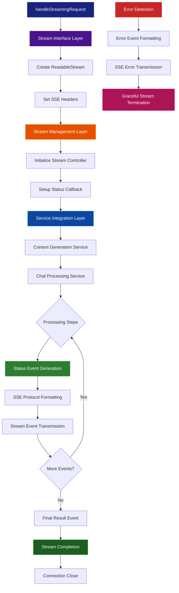

# Streaming Service Documentation

## Table of Contents

- [Overview](#overview)
- [Architecture Layers](#architecture-layers)
- [SSE Flow Diagram](#sse-flow-diagram)
- [Design Patterns](#design-patterns)
- [Protocol Implementation](#protocol-implementation)
- [Stream Lifecycle](#stream-lifecycle)
- [Error Handling](#error-handling)
- [Usage Examples](#usage-examples)

## Overview

The Streaming Service provides real-time response delivery capabilities using Server-Sent Events (SSE). It transforms traditional request-response patterns into live, progressive data streams with comprehensive status tracking and error recovery.

**Location:** `netlify/services/streaming/`

**Core Capabilities:**

- Real-time Server-Sent Events (SSE) implementation
- Live status updates during processing
- Progressive response delivery
- Robust connection management and error recovery

## Architecture Layers

The streaming service implements a layered architecture for reliable real-time communication:

```
┌─────────────────────────────────────────────────────────┐
│                🌊 Stream Interface Layer                │
│  ┌─────────────────┐    ┌─────────────────────────────┐ │
│  │ SSE Handler     │────│ Response Headers            │ │
│  │ (Entry Point)   │    │ (Protocol Setup)            │ │
│  └─────────────────┘    └─────────────────────────────┘ │
└─────────────────────────────────────────────────────────┘
                              │
                              ▼
┌─────────────────────────────────────────────────────────┐
│               📡 Stream Management Layer                │
│  ┌─────────────────┐    ┌─────────────────────────────┐ │
│  │ ReadableStream  │────│ Event Formatting            │ │
│  │ Controller      │    │ (SSE Protocol)              │ │
│  └─────────────────┘    └─────────────────────────────┘ │
└─────────────────────────────────────────────────────────┘
                              │
                              ▼
┌─────────────────────────────────────────────────────────┐
│                🔧 Service Integration Layer             │
│  ┌─────────────┐ ┌─────────────┐ ┌─────────────────────┐ │
│  │ Chat        │ │ Embedding   │ │ Status Tracking     │ │
│  │ Service     │ │ Service     │ │ Callbacks           │ │
│  └─────────────┘ └─────────────┘ └─────────────────────┘ │
└─────────────────────────────────────────────────────────┘
```

## SSE Flow Diagram



## Design Patterns

### 1. Observer Pattern - Status Broadcasting

- **Subject**: Service execution pipeline
- **Observers**: SSE status callbacks and client connections
- **Implementation**: Real-time event emission during processing
- **Benefits**: Decoupled monitoring, multiple subscriber support

### 2. Strategy Pattern - Event Formatting

- **Context**: Stream event processing
- **Strategies**: Status events, final events, error events
- **Implementation**: Type-based event formatting and transmission
- **Benefits**: Flexible event types, extensible protocol

### 3. Template Method Pattern - Stream Lifecycle

- **Template**: SSE connection workflow
- **Steps**: Initialize → Process → Stream → Complete/Error → Close
- **Benefits**: Consistent stream management, predictable lifecycle

### 4. Facade Pattern - Streaming Interface

- **Purpose**: Simplified interface to complex SSE implementation
- **Implementation**: Single `handleStreamingRequest` function
- **Benefits**: Easy integration, hidden complexity

### 5. Producer-Consumer Pattern - Data Flow

- **Producer**: Service processing pipeline
- **Consumer**: SSE stream transmission
- **Implementation**: ReadableStream with controlled data flow
- **Benefits**: Backpressure handling, efficient memory usage

## Protocol Implementation

### SSE Protocol Specification

The service implements the Server-Sent Events specification with proper formatting and headers:

```typescript
// Required Headers
{
  "Content-Type": "text/event-stream",
  "Cache-Control": "no-cache",
  "Connection": "keep-alive"
}

// Event Format
data: {"type":"status","status":{...}}\n\n
data: {"type":"final","result":{...}}\n\n
data: {"type":"error","error":"..."}\n\n
```

### Event Types Architecture

| Event Type | Purpose            | Data Structure        | Client Action         |
| ---------- | ------------------ | --------------------- | --------------------- |
| **status** | Progress updates   | `ChatStatus` object   | Update UI progress    |
| **final**  | Complete result    | `ChatResponse` object | Display result, close |
| **error**  | Error notification | Error message string  | Handle error, close   |

## Stream Lifecycle

### Connection Phases

```
Initialize → Process → Stream → Complete → Cleanup
     ↓         ↓        ↓        ↓         ↓
   Setup    Generate  Transmit  Finalize  Close
  Headers   Events    Events    Result   Stream
```

### State Management

1. **Initialization**: ReadableStream creation and header setup
2. **Processing**: Service coordination with status callbacks
3. **Streaming**: Real-time event transmission to client
4. **Completion**: Final result delivery or error handling
5. **Cleanup**: Connection termination and resource cleanup

### Memory Management

- **Stream Control**: Automatic backpressure handling
- **Event Buffering**: Minimal memory footprint with immediate transmission
- **Resource Cleanup**: Automatic garbage collection on stream closure

## Error Handling

### Error Recovery Strategy

```
Service Errors → Error Event Emission → Graceful Stream Termination
     ↓                    ↓                        ↓
  Error Detection → SSE Error Format → Connection Close
```

### Error Categories

| Error Type          | Source                  | Handling Strategy      | Client Impact          |
| ------------------- | ----------------------- | ---------------------- | ---------------------- |
| **Service Failure** | Chat/Embedding services | Error event + close    | Receives error message |
| **Stream Error**    | ReadableStream issues   | Immediate termination  | Connection lost        |
| **Protocol Error**  | SSE formatting          | Error event + close    | Receives error details |
| **Network Error**   | Client connection       | Auto-detection + close | Connection timeout     |

### Graceful Degradation

- **Partial Results**: Send available data before error termination
- **Error Context**: Include helpful error information in events
- **Connection Recovery**: Allow client-side reconnection strategies
- **Fallback Options**: Graceful failure with actionable information

## Usage Examples

### Basic Streaming Request

```typescript
import { handleStreamingRequest } from "@/netlify/services/streaming";

async function basicStreamingExample() {
  const streamingData = { query: "What are the best restaurants in Tokyo?" };

  // Create streaming response
  const response = await handleStreamingRequest(streamingData);

  // Response is ready for HTTP transmission
  return response;
}
```

### Integration with Endpoint

```typescript
// In netlify/functions/chat.ts
import { handleStreamingRequest } from "../services/streaming";

const handler = async (req: Request) => {
  const body = await req.json();

  // Check if streaming is requested
  if (body.streaming) {
    return handleStreamingRequest({ query: body.query });
  }

  // Handle standard request...
};
```

### Client-Side SSE Consumption

```javascript
// Browser EventSource API
function consumeStreamingResponse(query) {
  const eventSource = new EventSource(
    `/api/chat?query=${encodeURIComponent(query)}&streaming=true`
  );

  eventSource.onmessage = (event) => {
    const data = JSON.parse(event.data);

    switch (data.type) {
      case "status":
        console.log("Progress:", data.status.description);
        updateProgressUI(data.status);
        break;

      case "final":
        console.log("Complete:", data.result.answer);
        displayFinalResult(data.result);
        eventSource.close();
        break;

      case "error":
        console.error("Error:", data.error);
        handleError(data.error);
        eventSource.close();
        break;
    }
  };

  eventSource.onerror = (error) => {
    console.error("Stream error:", error);
    eventSource.close();
  };

  return eventSource;
}
```

### Custom SSE Client Implementation

```javascript
// Fetch API with ReadableStream
async function customSSEClient(query, onStatus, onComplete, onError) {
  try {
    const response = await fetch("/api/chat", {
      method: "POST",
      headers: { "Content-Type": "application/json" },
      body: JSON.stringify({ query, streaming: true }),
    });

    if (!response.ok) {
      throw new Error(`HTTP ${response.status}`);
    }

    const reader = response.body.getReader();
    const decoder = new TextDecoder();

    while (true) {
      const { done, value } = await reader.read();
      if (done) break;

      const chunk = decoder.decode(value);
      const lines = chunk.split("\n");

      for (const line of lines) {
        if (line.startsWith("data: ")) {
          try {
            const data = JSON.parse(line.slice(6));

            switch (data.type) {
              case "status":
                onStatus(data.status);
                break;
              case "final":
                onComplete(data.result);
                return;
              case "error":
                onError(new Error(data.error));
                return;
            }
          } catch (parseError) {
            console.warn("Failed to parse SSE data:", parseError);
          }
        }
      }
    }
  } catch (error) {
    onError(error);
  }
}
```

### React Streaming Hook

```javascript
import { useState, useEffect, useRef } from "react";

function useStreamingChat() {
  const [status, setStatus] = useState(null);
  const [result, setResult] = useState(null);
  const [error, setError] = useState(null);
  const [isStreaming, setIsStreaming] = useState(false);
  const eventSourceRef = useRef(null);

  const startStream = async (query) => {
    setIsStreaming(true);
    setError(null);
    setResult(null);
    setStatus(null);

    await customSSEClient(
      query,
      (statusUpdate) => setStatus(statusUpdate),
      (finalResult) => {
        setResult(finalResult);
        setIsStreaming(false);
      },
      (err) => {
        setError(err.message);
        setIsStreaming(false);
      }
    );
  };

  const stopStream = () => {
    if (eventSourceRef.current) {
      eventSourceRef.current.close();
      setIsStreaming(false);
    }
  };

  useEffect(() => {
    return () => {
      if (eventSourceRef.current) {
        eventSourceRef.current.close();
      }
    };
  }, []);

  return {
    startStream,
    stopStream,
    status,
    result,
    error,
    isStreaming,
  };
}
```

### Error Handling Patterns

```javascript
// Robust streaming with retries
async function robustStreamingClient(query, maxRetries = 3) {
  let attempt = 0;

  while (attempt < maxRetries) {
    try {
      await customSSEClient(
        query,
        (status) => console.log("Status:", status.description),
        (result) => console.log("Result:", result.answer),
        (error) => {
          console.error("Stream error:", error);
          throw error;
        }
      );
      return; // Success
    } catch (error) {
      attempt++;

      if (attempt >= maxRetries) {
        console.error("Max retries exceeded:", error);
        throw error;
      }

      // Exponential backoff
      const delay = Math.pow(2, attempt) * 1000;
      console.log(`Retry ${attempt} after ${delay}ms`);
      await new Promise((resolve) => setTimeout(resolve, delay));
    }
  }
}
```

### Stream Monitoring and Analytics

```javascript
// Monitor streaming performance
class StreamingAnalytics {
  constructor() {
    this.metrics = {
      totalStreams: 0,
      successfulStreams: 0,
      errorStreams: 0,
      averageStreamDuration: 0,
      totalEvents: 0,
    };
  }

  trackStream(query) {
    const startTime = Date.now();
    let eventCount = 0;

    this.metrics.totalStreams++;

    return customSSEClient(
      query,
      (status) => {
        eventCount++;
        this.metrics.totalEvents++;
        console.log(`[${eventCount}] ${status.description}`);
      },
      (result) => {
        const duration = Date.now() - startTime;
        this.metrics.successfulStreams++;
        this.updateAverageDuration(duration);

        console.log("Stream completed:", {
          duration: `${duration}ms`,
          events: eventCount,
          success: true,
        });
      },
      (error) => {
        const duration = Date.now() - startTime;
        this.metrics.errorStreams++;

        console.error("Stream failed:", {
          duration: `${duration}ms`,
          events: eventCount,
          error: error.message,
        });
      }
    );
  }

  updateAverageDuration(duration) {
    const total =
      this.metrics.averageStreamDuration * (this.metrics.successfulStreams - 1);
    this.metrics.averageStreamDuration =
      (total + duration) / this.metrics.successfulStreams;
  }

  getMetrics() {
    return {
      ...this.metrics,
      successRate:
        (
          (this.metrics.successfulStreams / this.metrics.totalStreams) *
          100
        ).toFixed(2) + "%",
      averageEvents: (
        this.metrics.totalEvents / this.metrics.totalStreams
      ).toFixed(2),
    };
  }
}

// Usage
const analytics = new StreamingAnalytics();
analytics.trackStream("Plan a trip to Japan");
```

### Testing SSE Endpoints

```bash
#!/bin/bash
# Test streaming endpoint with curl

echo "Testing SSE endpoint..."

curl -N -X POST http://localhost:8888/.netlify/functions/chat \
  -H "Content-Type: application/json" \
  -d '{"query": "What are the best attractions in Paris?", "streaming": true}' \
  --no-buffer | while IFS= read -r line; do
    if [[ $line == data:* ]]; then
      echo "Event: ${line#data: }"
    fi
  done
```
