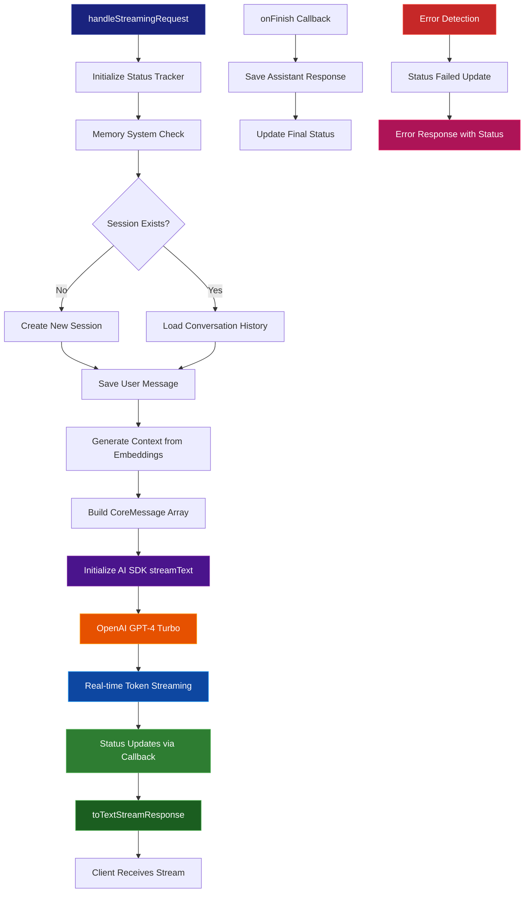

# Streaming Service Documentation

## Table of Contents

- [Overview](#overview)
- [Architecture Overview](#architecture-overview)
- [AI SDK Core Integration](#ai-sdk-core-integration)
- [Stream Flow Diagram](#stream-flow-diagram)
- [Implementation Details](#implementation-details)
- [Status Tracking](#status-tracking)
- [Memory Integration](#memory-integration)
- [Error Handling](#error-handling)
- [Usage Examples](#usage-examples)

## Overview

The Streaming Service provides real-time response delivery using **AI SDK Core** for streaming text generation. It integrates with the existing memory system, embedding generation, and status tracking while maintaining compatibility with AI SDK UI components.

**Location:** `netlify/services/streaming/`

**Core Capabilities:**

- AI SDK Core streaming with `streamText()` function
- AI SDK UI compatibility via `toTextStreamResponse()`
- Integrated status tracking with real-time progress updates
- Memory system integration for conversation history
- Embedding-based context generation
- Robust error handling and recovery

## Architecture Overview

The streaming service now implements a simplified architecture built on AI SDK Core:

```
┌─────────────────────────────────────────────────────────┐
│                � AI SDK Core Integration               │
│  ┌─────────────────┐    ┌─────────────────────────────┐ │
│  │ streamText()    │────│ toTextStreamResponse()      │ │
│  │ (Core Function) │    │ (UI Compatibility)          │ │
│  └─────────────────┘    └─────────────────────────────┘ │
└─────────────────────────────────────────────────────────┘
                              │
                              ▼
┌─────────────────────────────────────────────────────────┐
│               � Status & Memory Integration            │
│  ┌─────────────────┐    ┌─────────────────────────────┐ │
│  │ ChatStatus      │────│ Memory System               │ │
│  │ Tracker         │    │ (Session & History)         │ │
│  └─────────────────┘    └─────────────────────────────┘ │
└─────────────────────────────────────────────────────────┘
                              │
                              ▼
┌─────────────────────────────────────────────────────────┐
│                🔧 Service Integration Layer             │
│  ┌─────────────┐ ┌─────────────┐ ┌─────────────────────┐ │
│  │ OpenAI      │ │ Embedding   │ │ Context             │ │
│  │ GPT-4 Turbo │ │ Service     │ │ Generation          │ │
│  └─────────────┘ └─────────────┘ └─────────────────────┘ │
└─────────────────────────────────────────────────────────┘
```

## AI SDK Core Integration

### Core Dependencies

```typescript
import { openai } from "@ai-sdk/openai";
import { CoreMessage, streamText } from "ai";
```

The service leverages AI SDK Core's `streamText()` function which provides:

- **Native Streaming**: Built-in streaming capabilities optimized for LLM responses
- **Model Integration**: Direct OpenAI GPT-4 Turbo integration
- **Type Safety**: Full TypeScript support with `CoreMessage` types
- **UI Compatibility**: Seamless integration with AI SDK UI components

### Stream Response Format

The service returns an AI SDK UI compatible response using `toTextStreamResponse()`:

```typescript
return result.toTextStreamResponse({
  headers: {
    "x-session-id": currentSessionId || "",
    "x-status-steps": JSON.stringify(status.getSteps()),
  },
});
```

This ensures compatibility with AI SDK UI hooks like `useChat` while providing custom headers for session tracking and status information.

## Stream Flow Diagram



## Implementation Details

### Function Signature

```typescript
export async function handleStreamingRequest(
  data: {
    query: string;
    sessionId?: string;
  },
  onStatusUpdate?: (status: ChatStatus) => void
): Promise<Response>;
```

### Core Implementation

```typescript
// 1. Status tracking initialization
const status = new ChatStatusTracker(onStatusUpdate);

// 2. Memory system integration
if (data.sessionId !== undefined) {
  // Create or load session
  // Save user message
  // Load conversation history
}

// 3. Context generation
const contextText = await generateContext(data);

// 4. Message array construction
const messages: CoreMessage[] = [
  { role: "system", content: TRAVEL_ASSISTANT_SYSTEM_PROMPT },
  ...conversationHistory,
  { role: "user", content: data.query },
  { role: "assistant", content: contextText },
];

// 5. AI SDK Core streaming
const result = await streamText({
  model: openai("gpt-4-turbo"),
  messages,
  temperature: 0.7,
  onFinish: async (result) => {
    // Save assistant response to memory
    if (currentSessionId && result.text) {
      await saveChatMessage({
        session_id: currentSessionId,
        role: "assistant",
        content: result.text,
      });
    }
  },
});

// 6. Return AI SDK UI compatible response
return result.toTextStreamResponse({
  headers: {
    "x-session-id": currentSessionId || "",
    "x-status-steps": JSON.stringify(status.getSteps()),
  },
});
```

### Key Features

1. **AI SDK Core Integration**: Uses `streamText()` for native streaming
2. **Memory System**: Automatic session management and conversation history
3. **Context Generation**: Embedding-based context from knowledge base
4. **Status Tracking**: Real-time progress updates via callback system
5. **Error Handling**: Comprehensive error catching with status updates
6. **UI Compatibility**: Returns AI SDK UI compatible streaming response

## Status Tracking

### Status Integration

The service integrates with the existing `ChatStatusTracker` system:

```typescript
const status = new ChatStatusTracker(onStatusUpdate);

// Status updates during processing
status.executing(1, ChatStatusMessages.ANALYZING_QUERY);
status.completed(1, "Chat session created");
status.executing(2, "Generating context from embeddings");
status.completed(2, "Context generated");
status.executing(3, ChatStatusMessages.WAITING_OPENAI);
status.completed(3, ChatStatusMessages.RESPONSE_COMPLETE);
```

### Status Messages

The service uses predefined status messages from `ChatStatusMessages`:

- `ANALYZING_QUERY`: Initial query analysis
- `WAITING_OPENAI`: Waiting for OpenAI response
- `RESPONSE_COMPLETE`: Streaming completion
- `ERROR_OCCURRED`: Error handling

### Custom Headers

Status information is included in response headers:

```typescript
{
  "x-session-id": currentSessionId || "",
  "x-status-steps": JSON.stringify(status.getSteps())
}
```

## Memory Integration

### Session Management

The service automatically handles chat sessions:

```typescript
// Create new session if none exists
if (!currentSessionId) {
  currentSessionId = generateSessionId();
  const title = generateSessionTitle(data.query);
  await createChatSession({
    session_id: currentSessionId,
    title,
  });
}

// Save user message
await saveChatMessage({
  session_id: currentSessionId,
  role: "user",
  content: data.query,
});
```

### Conversation History

Recent conversation history is loaded and included in the context:

```typescript
const conversationHistory = currentSessionId
  ? (await getRecentMessages(currentSessionId, 8)).map((msg) => ({
      role: msg.role as "user" | "assistant",
      content: msg.content,
    }))
  : [];
```

### Response Persistence

Assistant responses are automatically saved after streaming completion:

```typescript
onFinish: async (result) => {
  if (currentSessionId && result.text) {
    await saveChatMessage({
      session_id: currentSessionId,
      role: "assistant",
      content: result.text,
    });
  }
};
```

## Error Handling

### Error Recovery Strategy

```
Service Errors → Status Update → Error Response → Client Notification
     ↓               ↓              ↓                ↓
  Error Detection → Status Failed → JSON Error → Connection Close
```

### Error Implementation

```typescript
try {
  // Main streaming logic...
} catch (error) {
  status.failed(-1, ChatStatusMessages.ERROR_OCCURRED(String(error)), {
    error,
  });
  return new Response(
    JSON.stringify({
      error: error instanceof Error ? error.message : "Unknown error",
      steps: status.getSteps(),
    }),
    {
      status: 500,
      headers: { "Content-Type": "application/json" },
    }
  );
}
```

### Error Categories

| Error Type              | Source                  | Handling Strategy         | Response Format       |
| ----------------------- | ----------------------- | ------------------------- | --------------------- |
| **Memory System Error** | Session/message storage | Status update + JSON      | 500 with error object |
| **Embedding Error**     | Context generation      | Status update + JSON      | 500 with error object |
| **AI SDK Error**        | streamText() failure    | Status update + JSON      | 500 with error object |
| **Network Error**       | OpenAI API connectivity | Automatic retry in AI SDK | Handled by AI SDK     |

### Error Response Format

```typescript
{
  "error": "Error message string",
  "steps": [
    {
      "step": 1,
      "status": "completed",
      "description": "Chat session created"
    },
    {
      "step": -1,
      "status": "failed",
      "description": "Error occurred: [error message]",
      "data": { "error": "..." }
    }
  ]
}
```

## Usage Examples

### Basic Integration with Netlify Function

```typescript
// netlify/functions/chat/index.ts
import { handleStreamingRequest } from "../../services/streaming";

export const handler = async (req: Request) => {
  const body = await req.json();

  // Status callback for real-time updates
  const onStatusUpdate = (status: ChatStatus) => {
    console.log(`Step ${status.step}: ${status.description}`);
  };

  // Handle streaming request
  return handleStreamingRequest(
    {
      query: body.query,
      sessionId: body.sessionId,
    },
    onStatusUpdate
  );
};
```

### Frontend Integration with Custom Streaming

```typescript
// Frontend implementation without AI SDK UI hooks
async function sendStreamingMessage(query: string, sessionId?: string) {
  const response = await fetch("/.netlify/functions/chat", {
    method: "POST",
    headers: { "Content-Type": "application/json" },
    body: JSON.stringify({
      query,
      sessionId,
      streaming: true,
    }),
  });

  if (!response.ok) {
    throw new Error(`HTTP error! status: ${response.status}`);
  }

  // Extract session ID and status from headers
  const responseSessionId = response.headers.get("x-session-id");
  const statusSteps = JSON.parse(
    response.headers.get("x-status-steps") || "[]"
  );

  console.log("Status steps:", statusSteps);

  // Read streaming response
  const reader = response.body?.getReader();
  if (!reader) throw new Error("No response body");

  const decoder = new TextDecoder();
  let content = "";

  while (true) {
    const { done, value } = await reader.read();
    if (done) break;

    const chunk = decoder.decode(value);
    content += chunk;

    // Update UI with streaming content
    updateMessageDisplay(content);
  }

  return { content, sessionId: responseSessionId };
}
```

### React Component with AI SDK Core Streaming

```jsx
"use client";

import { useState } from "react";

export default function StreamingChat() {
  const [messages, setMessages] = useState([]);
  const [input, setInput] = useState("");
  const [isLoading, setIsLoading] = useState(false);

  const handleSubmit = async (e) => {
    e.preventDefault();
    if (!input.trim() || isLoading) return;

    const userMessage = {
      id: Date.now().toString(),
      role: "user",
      content: input.trim(),
    };

    setMessages((prev) => [...prev, userMessage]);
    setInput("");
    setIsLoading(true);

    try {
      const response = await fetch("/.netlify/functions/chat", {
        method: "POST",
        headers: { "Content-Type": "application/json" },
        body: JSON.stringify({
          query: userMessage.content,
          streaming: true,
        }),
      });

      if (!response.ok) throw new Error(`HTTP error! ${response.status}`);

      const reader = response.body?.getReader();
      const decoder = new TextDecoder();

      const assistantMessage = {
        id: (Date.now() + 1).toString(),
        role: "assistant",
        content: "",
      };

      setMessages((prev) => [...prev, assistantMessage]);

      while (true) {
        const { done, value } = await reader.read();
        if (done) break;

        const chunk = decoder.decode(value);

        setMessages((prev) => {
          const newMessages = [...prev];
          const lastMessage = newMessages[newMessages.length - 1];
          if (lastMessage.role === "assistant") {
            lastMessage.content += chunk;
          }
          return newMessages;
        });
      }
    } catch (error) {
      console.error("Streaming error:", error);
    } finally {
      setIsLoading(false);
    }
  };

  return (
    <div className="flex flex-col h-screen max-w-2xl mx-auto">
      <div className="flex-1 overflow-y-auto p-4 space-y-4">
        {messages.map((message) => (
          <div
            key={message.id}
            className={`p-4 rounded ${
              message.role === "user"
                ? "bg-blue-600 text-white ml-8"
                : "bg-gray-800 text-white mr-8"
            }`}
          >
            <div className="font-semibold mb-2">
              {message.role === "user" ? "You" : "Assistant"}
            </div>
            <div>{message.content}</div>
          </div>
        ))}
      </div>

      <form onSubmit={handleSubmit} className="p-4 flex space-x-2">
        <input
          value={input}
          onChange={(e) => setInput(e.target.value)}
          placeholder="Ask me anything..."
          disabled={isLoading}
          className="flex-1 p-3 border rounded"
        />
        <button
          type="submit"
          disabled={isLoading || !input.trim()}
          className="px-6 py-3 bg-blue-600 text-white rounded"
        >
          Send
        </button>
      </form>
    </div>
  );
}
```

### Using with AI SDK UI Components

While the service returns AI SDK UI compatible responses, direct integration with `useChat` may require additional configuration:

```typescript
// Potential integration with useChat hook
import { useChat } from "ai/react";

export default function AISDKChat() {
  const { messages, input, handleInputChange, handleSubmit } = useChat({
    api: "/.netlify/functions/chat",
    streamMode: "text", // Use text streaming mode
    onResponse: (response) => {
      // Access custom headers
      const sessionId = response.headers.get("x-session-id");
      const statusSteps = response.headers.get("x-status-steps");
      console.log("Session ID:", sessionId);
      console.log("Status:", statusSteps);
    },
  });

  return (
    <div>
      {messages.map((message) => (
        <div key={message.id}>
          <strong>{message.role}:</strong> {message.content}
        </div>
      ))}

      <form onSubmit={handleSubmit}>
        <input value={input} onChange={handleInputChange} />
        <button type="submit">Send</button>
      </form>
    </div>
  );
}
```

### Testing the Streaming Endpoint

```bash
#!/bin/bash
# Test AI SDK Core streaming endpoint

echo "Testing AI SDK Core streaming..."

curl -N -X POST http://localhost:8888/.netlify/functions/chat \
  -H "Content-Type: application/json" \
  -d '{
    "query": "What are the best restaurants in Tokyo?",
    "streaming": true
  }' \
  --no-buffer | while IFS= read -r line; do
    echo "Received: $line"
  done
```

### Monitoring and Status Tracking

```typescript
// Enhanced status monitoring
class StreamingMonitor {
  private sessions = new Map<string, any>();

  async monitorStream(query: string) {
    const startTime = Date.now();
    let statusUpdates = [];

    const onStatusUpdate = (status: ChatStatus) => {
      statusUpdates.push({
        timestamp: Date.now(),
        step: status.step,
        description: status.description,
        status: status.status,
      });

      console.log(`[${status.step}] ${status.description}`);
    };

    try {
      const response = await handleStreamingRequest({ query }, onStatusUpdate);

      const sessionId = response.headers.get("x-session-id");
      const finalSteps = JSON.parse(
        response.headers.get("x-status-steps") || "[]"
      );

      this.sessions.set(sessionId, {
        query,
        startTime,
        duration: Date.now() - startTime,
        statusUpdates,
        finalSteps,
        success: true,
      });

      return { response, sessionId, statusUpdates };
    } catch (error) {
      console.error("Stream monitoring failed:", error);
      return { error, statusUpdates };
    }
  }

  getSessionMetrics(sessionId: string) {
    return this.sessions.get(sessionId);
  }

  getAllSessions() {
    return Array.from(this.sessions.values());
  }
}

// Usage
const monitor = new StreamingMonitor();
const result = await monitor.monitorStream("Plan a trip to Japan");
console.log("Session metrics:", monitor.getSessionMetrics(result.sessionId));
```
