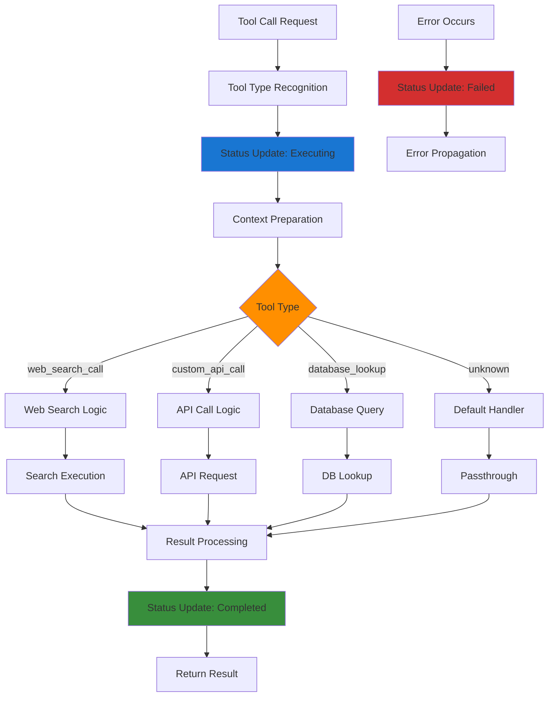

# Tools Service Documentation

## Table of Contents

- [Overview](#overview)
- [Architecture Components](#architecture-components)
- [Tool Execution Flow](#tool-execution-flow)
- [Service Dependencies](#service-dependencies)
- [Supported Tools](#supported-tools)
- [Tool Integration](#tool-integration)
- [Error Handling](#error-handling)
- [Performance Considerations](#performance-considerations)
- [Extension Patterns](#extension-patterns)

## Overview

The tools service provides extensible tool execution capabilities for AI-powered applications, particularly enabling OpenAI function calling with custom tool implementations. It manages tool discovery, execution orchestration, and result processing while maintaining comprehensive status tracking and error recovery.

## Architecture Components

### 🔧 Service Layer: `netlify/services/tools/`

Core tool execution functionality for AI function calling and custom operations.

**Components:**

- `tools.ts` - Tool execution engine and supported tool definitions
- `index.ts` - Service exports and public API

### 🎯 Core Functions & Exports

**`executeToolCall(toolCall, context, statusTracker)`**

- Main tool execution orchestrator
- Context-aware tool processing
- Integrated status tracking and error handling

**`openAITools`**

- Tool definitions for OpenAI function calling
- Available tool configurations
- Integration with OpenAI API capabilities

### 🛠️ Tool Categories

**Web Search Tools**

- `web_search_call`: Custom web search implementation
- `web_search_preview`: OpenAI native web search
- `web_search_preview_2025_03_11`: Updated OpenAI web search

**API Integration Tools**

- `custom_api_call`: External API interaction
- `database_lookup`: Database query operations

## Tool Execution Flow



## Service Dependencies

### Internal Dependencies

- **Status Service**: Progress tracking and error reporting (`../status`)
- **Chat Types**: Tool call interfaces and response structures

### External Integrations

- **OpenAI API**: Function calling and tool definitions
- **Web Search APIs**: Custom search implementations
- **Database Systems**: Query execution and data retrieval
- **External APIs**: Third-party service integrations

## Supported Tools

### Native OpenAI Tools

- **web_search_preview**: Standard OpenAI web search capability
- **web_search_preview_2025_03_11**: Enhanced OpenAI web search

### Custom Tool Implementations

#### Web Search (`web_search_call`)

- Custom web search logic implementation
- Query processing and result aggregation
- Configurable search parameters
- **Execution Time**: ~1000ms (simulated)

#### API Integration (`custom_api_call`)

- External service API calls
- Request/response processing
- Result formatting and enrichment
- **Execution Time**: ~500ms (simulated)

#### Database Operations (`database_lookup`)

- Database query execution
- Record retrieval and processing
- Result validation and formatting
- **Execution Time**: ~300ms (simulated)

### Default Handler

- Fallback for unknown tool types
- Passthrough behavior for unrecognized tools
- Graceful degradation without failures

## Tool Integration

### OpenAI Function Calling

```typescript
// Tool definition for OpenAI
const openAITools = [
  { type: "web_search_preview" },
  { type: "web_search_preview_2025_03_11" },
];

// Integration with OpenAI API
const response = await callOpenAI(input, openAITools);
```

### Chat Service Integration

```typescript
// Tool execution in chat pipeline
const toolCall = response.output?.[0];
if (toolCall?.type) {
  const toolResult = await executeToolCall(
    toolCall,
    { query: userQuery, contextText: context },
    statusTracker
  );
}
```

### Context-Aware Execution

- **Query Context**: User's original query for tool operations
- **Content Context**: Relevant background information
- **Status Tracking**: Progress monitoring throughout execution

## Error Handling

### Tool Execution Errors

- **Individual Tool Failures**: Isolated error handling per tool
- **Status Integration**: Failed status updates with error details
- **Error Propagation**: Controlled error bubbling to calling services

### Graceful Degradation

- **Unknown Tools**: Default passthrough behavior
- **Timeout Handling**: Configurable execution timeouts
- **Retry Logic**: Automated retry for transient failures

### Error Recovery

- **Partial Success**: Continue execution with available results
- **Fallback Tools**: Alternative tool selection on primary failure
- **Error Context**: Comprehensive error information preservation

## Performance Considerations

### Execution Times

- **Web Search**: 1000ms average execution time
- **API Calls**: 500ms average execution time
- **Database Lookups**: 300ms average execution time
- **Status Overhead**: Minimal performance impact

### Resource Management

- **Concurrent Tools**: Sequential execution prevents resource conflicts
- **Memory Usage**: Minimal footprint with efficient result handling
- **API Rate Limits**: Built-in respect for external service limits

### Optimization Strategies

- **Tool Caching**: Cache results for repeated tool calls
- **Parallel Execution**: Execute independent tools concurrently
- **Smart Routing**: Route to fastest available tool variant
- **Result Compression**: Minimize data transfer for large results

## Extension Patterns

### Adding New Tools

```typescript
// Extend the executeToolCall function
case "new_tool_type":
  statusTracker.executing(3, "Executing new tool");
  const result = await customToolLogic(context);
  statusTracker.completed(3, "New tool completed");
  return result;
```

### Custom Tool Categories

- **Data Processing Tools**: Text analysis, transformation
- **External Service Tools**: Third-party API integrations
- **Computation Tools**: Mathematical operations, calculations
- **Media Tools**: Image processing, file manipulation

### Tool Configuration

- **Dynamic Tool Loading**: Runtime tool discovery and registration
- **Configuration Management**: Tool-specific settings and parameters
- **Version Management**: Multiple tool versions and compatibility

### Best Practices

- Always integrate with status tracking for visibility
- Implement proper error handling and recovery
- Use meaningful tool names and descriptions
- Maintain consistent input/output formats
- Document tool capabilities and limitations
