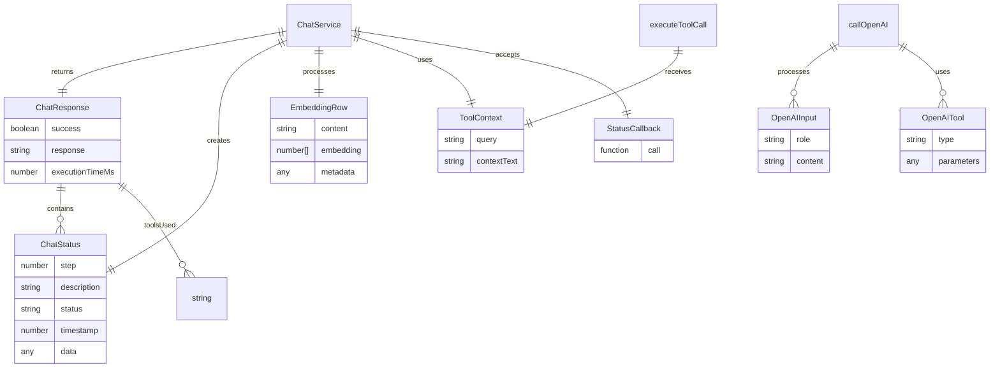
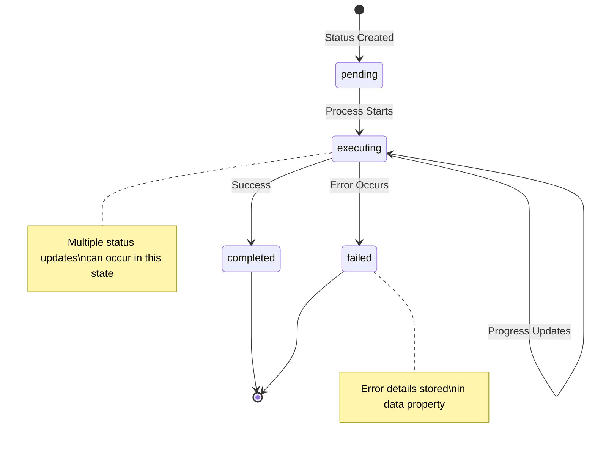
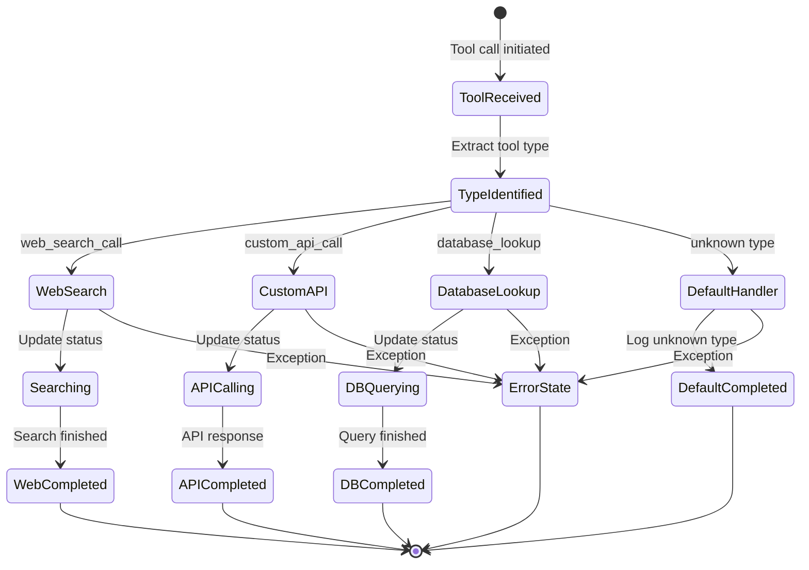
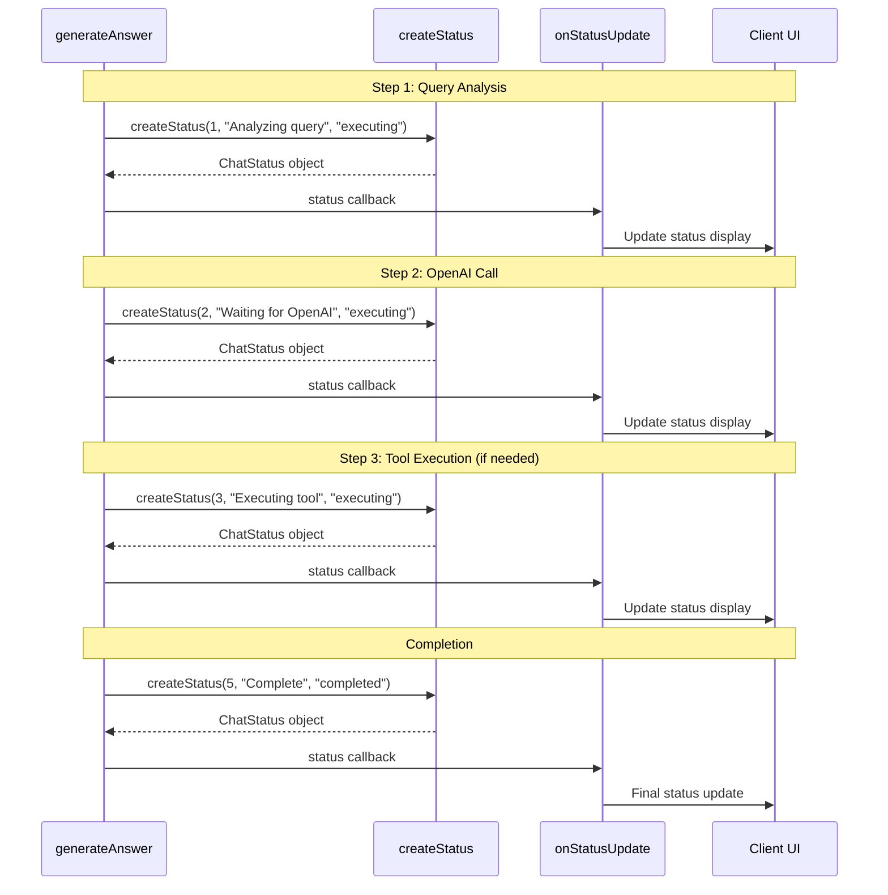
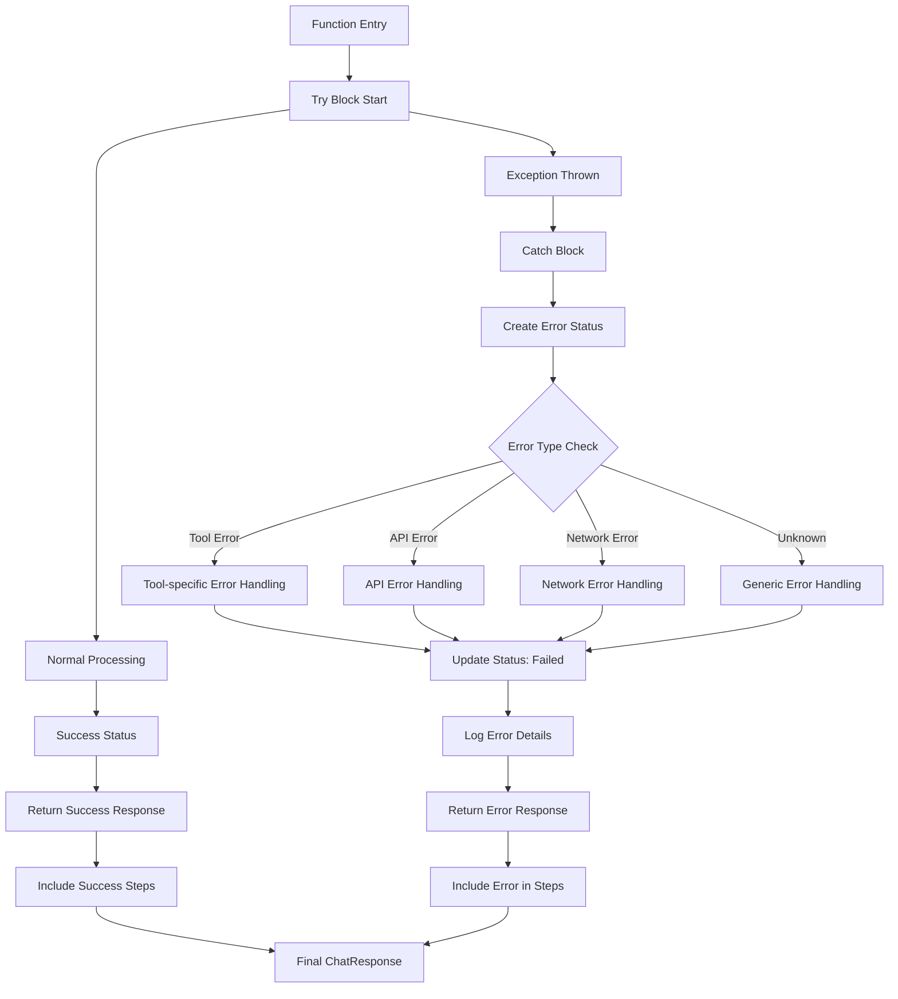

# Type System and Interface Documentation

## TypeScript Interface Relationships



## Status State Machine



## Tool Execution State Flow



## Function Signature Mappings

```typescript
// Core Functions with Status Tracking
interface ChatServiceFunctions {
  // Main entry point with optional status callback
  generateAnswer(
    query: string,
    contextText: string,
    onStatusUpdate?: (status: ChatStatus) => void
  ): Promise<ChatResponse>;

  // Tool execution with status updates
  executeToolCall(
    toolCall: any,
    context: ToolContext,
    onStatusUpdate?: (status: ChatStatus) => void
  ): Promise<any>;

  // OpenAI API wrapper
  callOpenAI(input: any[], tools: any[], store?: boolean): Promise<any>;

  // Status creation helper
  createStatus(
    step: number,
    description: string,
    status: ChatStatus["status"],
    data?: any
  ): ChatStatus;

  // Context formatting utility
  buildContextPrompt(rows: EmbeddingRow[]): string;

  // Backward compatibility wrapper
  generateSimpleAnswer(query: string, contextText: string): Promise<string>;
}
```

## Status Update Patterns



## Error Handling Pattern



## Integration Points

The enhanced chat system integrates at these key points:

1. **Type Safety**: All interfaces ensure type safety across the system
2. **Status Callbacks**: Optional callbacks allow real-time UI updates
3. **Error Boundaries**: Comprehensive error handling with status tracking
4. **Tool Extensibility**: Switch-based tool system for easy additions
5. **Performance Tracking**: Built-in timing and metrics collection
6. **Backward Compatibility**: Wrapper functions maintain existing API contracts

This type system provides a robust foundation for the enhanced chat functionality while maintaining flexibility for future extensions.
