# UI Streaming Client Documentation

## Table of Contents

- [Overview](#overview)
- [Architecture Components](#architecture-components)
- [Streaming Client Flow](#streaming-client-flow)
- [Design Patterns Implementation](#design-patterns-implementation)
- [Component Dependencies](#component-dependencies)
- [Key Features](#key-features)
- [Event Types & Data Models](#event-types--data-models)
- [Error Handling](#error-handling)
- [Performance Considerations](#performance-considerations)
- [Integration Patterns](#integration-patterns)
- [Usage & Implementation Guide](#usage--implementation-guide)

## Overview

The UI Streaming Client provides a modular, real-time communication system for streaming chat responses using Server-Sent Events (SSE). It implements a clean separation of concerns with independent components for connection management, data buffering, event parsing, and UI updates, making it easy to understand, maintain, and extend.

## Architecture Components

### 🌐 Connection Layer: `StreamConnection`

Manages HTTP connections and establishes streaming channels with the server.

**Responsibilities:**

- HTTP request initialization with streaming parameters
- Response validation and error handling
- Stream reader acquisition and management

### 📊 Buffer Management: `StreamBuffer`

Handles incoming data chunks and assembles complete messages from fragmented data.

**Responsibilities:**

- Text decoding from byte streams
- Line-based message extraction
- Buffer state management and cleanup

### 🔧 Event Processing: `EventParser`

Converts raw text lines into structured event objects for application consumption.

**Responsibilities:**

- SSE format parsing (`data: {json}`)
- JSON deserialization and validation
- Error-tolerant message processing

### 🎯 Stream Orchestration: `StreamProcessor`

Coordinates all components and manages the complete streaming lifecycle.

**Responsibilities:**

- Component coordination and workflow management
- Stream lifecycle management (connect → process → cleanup)
- Event distribution to handlers

### 📢 Event Handling: `EventHandler`

Processes different event types and updates the user interface accordingly.

**Responsibilities:**

- Event type routing and processing
- UI state updates and rendering
- Progress tracking and result display

## Streaming Client Flow

```mermaid
graph TD
    A[User Query Input] --> B[Stream Connection<br/>🏭 Factory Pattern]
    B --> C[HTTP Request Setup<br/>🚀 Proxy Pattern]
    C --> D[Stream Reader Acquisition<br/>🔌 Adapter Pattern]
    D --> E[Data Chunk Reading<br/>🔄 Iterator Pattern]

    E --> F[Buffer Management<br/>🏗️ Builder Pattern]
    F --> G[Line Extraction<br/>📋 Command Pattern]
    G --> H[Event Parsing<br/>⚡ Strategy Pattern]
    H --> I[Event Classification<br/>🎭 State Pattern]

    I --> J{Event Type<br/>⚖️ Strategy Pattern}
    J -->|status| K[Status Update<br/>📊 Observer Pattern]
    J -->|final| L[Final Result<br/>🎯 Template Method]
    J -->|error| M[Error Handling<br/>🔗 Chain of Responsibility]

    K --> N[UI Progress Update<br/>📢 Mediator Pattern]
    L --> O[Result Display<br/>🎨 Decorator Pattern]
    M --> P[Error Display<br/>💾 Memento Pattern]

    Q[Stream Completion] --> R[Cleanup Process<br/>🧹 Facade Pattern]
    R --> S[Resource Release<br/>💨 Flyweight Pattern]

    T[Buffer Cache<br/>🔍 Singleton Pattern] --> F
    U[Event Queue<br/>📮 Observer Pattern] --> I

    style B fill:#1a365d,color:#fff
    style F fill:#2d3748,color:#fff
    style H fill:#744210,color:#fff
    style J fill:#c53030,color:#fff
    style N fill:#2f855a,color:#fff
    style O fill:#d69e2e,color:#fff
    style M fill:#e53e3e,color:#fff
    style T fill:#553c9a,color:#fff
```



## Design Patterns Implementation

### 🏭 Factory Pattern - Stream Connection

Creates appropriate connection instances based on endpoint configuration and streaming requirements.

### 🚀 Proxy Pattern - HTTP Request Management

Controls access to server endpoints with additional concerns like headers, authentication, and error handling.

### 🔌 Adapter Pattern - Stream Reader Interface

Adapts browser's ReadableStream API to application-specific streaming interface and data models.

### 🔄 Iterator Pattern - Data Chunk Processing

Provides sequential access to streaming data chunks without exposing underlying stream mechanics.

### 🏗️ Builder Pattern - Buffer Assembly

Incrementally constructs complete messages from fragmented data chunks and partial line segments.

### 📋 Command Pattern - Line Processing

Encapsulates line extraction and processing operations as objects for execution and potential replay.

### ⚡ Strategy Pattern - Event Parsing

Dynamically selects parsing strategies based on SSE format variations and content types.

### 🎭 State Pattern - Event Classification

Manages different event processing states (parsing, routing, handling) with appropriate behaviors.

### 📊 Observer Pattern - Status Broadcasting

Notifies multiple UI components when status updates, progress changes, or events occur.

### 🎯 Template Method - Result Processing

Defines standard result handling workflow with customizable steps for different result types.

### 🔗 Chain of Responsibility - Error Recovery

Passes error handling through chain of recovery strategies until appropriate handler is found.

### 📢 Mediator Pattern - UI Coordination

Centralizes communication between streaming components and UI elements to reduce coupling.

### 🎨 Decorator Pattern - UI Enhancement

Dynamically adds visual capabilities (animations, formatting, metadata) to UI elements.

### 💾 Memento Pattern - Error State Capture

Preserves error context and application state for debugging and recovery operations.

### 🧹 Facade Pattern - Cleanup Orchestration

Provides simplified interface for complex cleanup operations across multiple components.

### 💨 Flyweight Pattern - Resource Optimization

Shares common data structures and DOM elements to minimize memory usage during streaming.

### 🔍 Singleton Pattern - Buffer Management

Ensures single instance of buffer cache manager across streaming operations.

## Component Dependencies

### Internal Dependencies

- **Browser APIs**: Fetch API, ReadableStream, TextDecoder
- **DOM APIs**: Document manipulation and event handling
- **TypeScript**: Type safety and interface definitions

### External Integrations

- **Netlify Functions**: Server-side streaming endpoints
- **Chat Service**: Backend response generation and status tracking
- **UI Framework**: React/Next.js components for rendering

## Key Features

### 🔄 Real-time Communication

- Server-Sent Events (SSE) for bidirectional streaming
- Non-blocking UI updates during long operations
- Automatic reconnection on connection failures
- Progressive result rendering

### 📊 Progress Tracking

- Step-by-step execution visibility
- Real-time status updates with timestamps
- Execution time monitoring
- Tool usage tracking

### 🛡️ Robust Error Handling

- Connection failure recovery
- Malformed data tolerance
- Graceful degradation strategies
- Comprehensive error reporting

### 🎨 Modular Architecture

- Independent, testable components
- Clean separation of concerns
- Easy component replacement
- Extensible event handling

## Event Types & Data Models

### Status Events

Real-time progress updates during query processing:

- Step number and description
- Current execution status
- Timestamp information
- Optional metadata payload

### Final Result Events

Complete response data with execution summary:

- Generated response content
- Total execution time
- Tools used during processing
- Complete step history

### Error Events

Comprehensive error information for debugging:

- Error message and context
- Stack trace information
- Recovery suggestions
- Affected component identification

## Error Handling

### Connection Errors

- Network connectivity issues
- Server unavailability
- Timeout handling
- Automatic retry mechanisms

### Data Processing Errors

- Malformed JSON tolerance
- Partial message recovery
- Buffer overflow protection
- Encoding error handling

### UI Update Errors

- DOM element validation
- Rendering error isolation
- State consistency maintenance
- Fallback display options

## Performance Considerations

### Memory Management

- **Buffer Optimization**: Automatic buffer cleanup and size limits
- **Event Queuing**: Efficient event processing to prevent memory leaks
- **DOM Updates**: Batched updates to minimize reflow operations

### Network Efficiency

- **Connection Reuse**: Persistent connections for multiple queries
- **Data Compression**: Efficient parsing of streaming data
- **Bandwidth Optimization**: Minimal overhead for status updates

### UI Responsiveness

- **Non-blocking Operations**: Asynchronous processing throughout
- **Progressive Rendering**: Immediate UI feedback for better UX
- **Smooth Animations**: CSS-based transitions for status changes

## Integration Patterns

### React Component Integration

```typescript
// Hook-based integration
const useStreamingChat = (query: string) => {
  const [status, setStatus] = useState<StreamEvent[]>([]);
  const [result, setResult] = useState<string | null>(null);

  // Stream processing logic
};
```

### Event-driven Architecture

```typescript
// Custom event handlers
const customEventHandler = (event: StreamEvent) => {
  // Application-specific event processing
};
```

### State Management Integration

```typescript
// Redux/Zustand integration
const streamingSlice = {
  // State management for streaming operations
};
```

## Usage & Implementation Guide

### Basic Streaming Setup

**1. Initialize Streaming Client**:

```typescript
import {
  StreamProcessor,
  queryWithStreaming,
} from "@/lib/packages/sse-streaming-client";

// Simple usage
await queryWithStreaming("What's the weather like?");
```

**2. Custom Event Handling**:

```typescript
const processor = new StreamProcessor();

await processor.processQuery(userQuery, (event) => {
  switch (event.type) {
    case "status":
      updateProgressBar(event.status);
      break;
    case "final":
      displayResult(event.result);
      break;
    case "error":
      showError(event.error);
      break;
  }
});
```

### React Component Implementation

**Chat Component with Streaming**:

```tsx
"use client";

import { useState } from "react";
import {
  StreamProcessor,
  StreamEvent,
} from "@/lib/packages/sse-streaming-client";

export function StreamingChat() {
  const [query, setQuery] = useState("");
  const [status, setStatus] = useState<StreamEvent[]>([]);
  const [result, setResult] = useState<string>("");
  const [isStreaming, setIsStreaming] = useState(false);

  const handleSubmit = async (e: React.FormEvent) => {
    e.preventDefault();
    if (!query.trim() || isStreaming) return;

    setIsStreaming(true);
    setStatus([]);
    setResult("");

    const processor = new StreamProcessor();

    try {
      await processor.processQuery(query, (event) => {
        if (event.type === "status" && event.status) {
          setStatus((prev) => [...prev, event]);
        } else if (event.type === "final" && event.result) {
          setResult(event.result.response);
        }
      });
    } catch (error) {
      console.error("Streaming failed:", error);
    } finally {
      setIsStreaming(false);
    }
  };

  return (
    <div className="streaming-chat">
      <form onSubmit={handleSubmit}>
        <input
          value={query}
          onChange={(e) => setQuery(e.target.value)}
          placeholder="Ask a question..."
          disabled={isStreaming}
        />
        <button type="submit" disabled={isStreaming}>
          {isStreaming ? "Processing..." : "Send"}
        </button>
      </form>

      {/* Status Updates */}
      <div className="status-updates">
        {status.map((event, index) => (
          <div key={index} className={`status-${event.status?.status}`}>
            Step {event.status?.step}: {event.status?.description}
          </div>
        ))}
      </div>

      {/* Final Result */}
      {result && (
        <div className="result">
          <h3>Response:</h3>
          <p>{result}</p>
        </div>
      )}
    </div>
  );
}
```

### Advanced Configuration

**Custom Stream Configuration**:

```typescript
// Configure streaming with custom settings
const processor = new StreamProcessor();

// With error recovery
await processor.processQuery(
  userQuery,
  (event) => {
    handleEvent(event);
  },
  {
    retryAttempts: 3,
    timeout: 30000,
    bufferSize: 1024 * 1024,
  }
);
```

**Error Handling Patterns**:

```typescript
// Comprehensive error handling
try {
  await queryWithStreaming(userQuery);
} catch (error) {
  if (error instanceof NetworkError) {
    showRetryOption();
  } else if (error instanceof ParseError) {
    logParsingIssue(error);
  } else {
    showGenericError();
  }
}
```

### CSS Styling for Status Updates

**Status Animation Styles**:

```css
.status-updates {
  max-height: 300px;
  overflow-y: auto;
  padding: 1rem;
  border: 1px solid #e2e8f0;
  border-radius: 0.5rem;
}

.status-starting {
  color: #3182ce;
  opacity: 0.8;
}

.status-in_progress {
  color: #d69e2e;
  font-weight: 500;
}

.status-completed {
  color: #38a169;
}

.status-error {
  color: #e53e3e;
  font-weight: 600;
}

/* Smooth transitions */
.status-updates > div {
  transition: all 0.3s ease;
  margin-bottom: 0.5rem;
  padding: 0.5rem;
  border-radius: 0.25rem;
  background: #f7fafc;
}
```

### Testing Strategies

**Unit Testing Components**:

```typescript
// Test individual components
describe("StreamProcessor", () => {
  it("should handle successful streaming", async () => {
    const processor = new StreamProcessor();
    const events: StreamEvent[] = [];

    await processor.processQuery("test query", (event) => {
      events.push(event);
    });

    expect(events).toHaveLength(3);
    expect(events[0].type).toBe("status");
  });
});
```

**Integration Testing**:

```typescript
// Test complete streaming workflow
describe("Streaming Integration", () => {
  it("should complete full streaming cycle", async () => {
    // Mock server responses
    // Test complete user journey
    // Verify UI updates
  });
});
```
